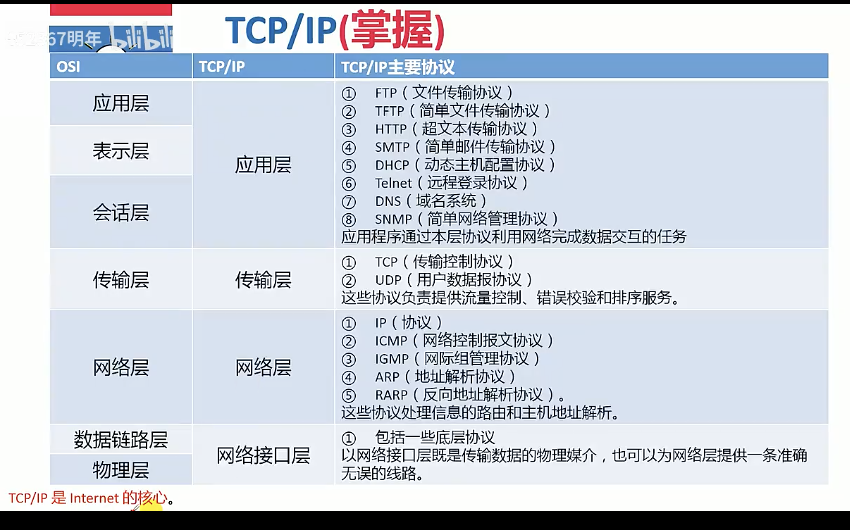

## 2.1 信息技术及其发展

### 2.1.1 计算机软硬件（了解）

计算机硬件(Computer Hardware)是指计算机系统中由电子、机械和光电元件组成的各种物理装置的总称。

计算机软件(Computer Software)是指计算机系统中的程序及其文档，程序是计算任务的处理对象和处理规则的描述；文档是为了方便于了解程序所需的阐明性资料。

在许多情况下，计算机在某些功能既可以由硬件实现，也可以由软件来实现。由此硬件和软件在一定意义上来说没有绝对严格的界线。

### 2.1.2 计算机网络（掌握）

从网络的作用范围可将网络类别划分为 个人局域网(Personal Area Network, PAN)、局域网(Local Area Network, LAN)、城域网(Wide Area Network, WAN)、广域网(Wide Area Network, WAN)、公用网(Public Network)、专用网(Private Network)。

#### OSI七层网络模型（掌握）

OSI：开放系统互连参考模型

| 层         | 作用                                                                                                                                                                                                  |
| ---------- | ----------------------------------------------------------------------------------------------------------------------------------------------------------------------------------------------------- |
| 应用层     | 负责对软件提供接口以使程序能使用网络服务，如事务处理程序、文件传送协议和网络管理等                                                                                                                    |
| 表示层     | 如同应用程序和网络之间的翻译官，在表示层，数据将按照网络能理解的方案进行格式化，表示层管理数据的解密加密数据转换、格式化和文本压缩                              |
| 会话层     | 负责在网络中两节点之间建立和维持通信，以及提供交互会话的管理功能，如三种数据流方向的控制，即一路交互、两路交替和两路同时会话模式                                                   |
| 传输层     | 负责确保数据可靠、顺序、无错地从A点传输到B点。如提供简历、维护和拆除传送连接的功能；选择网络层提供最合适的服务；在系统之间提供可靠的透明的数据传送，提供端到端的错误恢复和流量控制 |
| 网络层     | 主要功能是将网络地址(例如，IP地址)翻译成对应的物理地址(例如，网卡地址)并决定如何将数据从发送方路由到接收方；网络层还可以实现拥塞控制、网络互连等功能            |
| 数据链路层 | 它控制网络层与物理层之间的通信。它的主要功能是将从网络层收到的数据分割成特定的可被物理层传输的帧。该层的作用包括：物理地址寻址、数据的成帧、流量控制、数据的检错、重发等。         |
| 物理层     | 该层包括物理连网媒介，如电缆连线连接器。该层的协议产生并检测电压以便发送和接收携带数据的信号。                                                                                     |

#### 广域网协议（了解）

广域网协议是在OSI参考模型的最下面三层操作，定义了在不同广域网介质上的通信。广域网协议主要包括：PPT点对点协议、ISDN综合业务数字网、xDSI(DSL数字用户线路的统称：HDSL、SDSL、MVL、ADSL)、DDN数字专线、x.25、FR帧中继、ATM异步传输模式。

#### IEEE 802协议族（掌握）

IEEE 802 规范定义了网卡如何访问传输介质（如光缆、双绞线、无线等），以及如何在传输介质上传输数据的方法，还定义了传输信息的网络设备之间连接的建立、维护和拆除的途径。

IEEE 802 规范包括：

- 802.1 802协议概论
- 802.2 逻辑链路控制层LLC协议
- 802.3 以太网的CSMA/CD载波监听多路访问/冲突检测协议
- 802.4 令牌总线Token Bus协议
- 802.5 令牌环Token Ring协议
- 802.6 城域网MAN协议
- 802.7 FDDI宽带技术协议
- 802.8 光纤技术协议
- 802.9 局域网上的语音/数据集成规范
- 802.10 局域网安全互操作标准
- 802.11 无线局域网WLAN标准协议

#### TCP/IP (掌握)

| OSI    | TCP/IP | TCP/IP主要协议     |
| ------ | ------ | ------------------ |
| 应用层 | 应用层 | FTP (文件传输协议) |

<!--  -->
