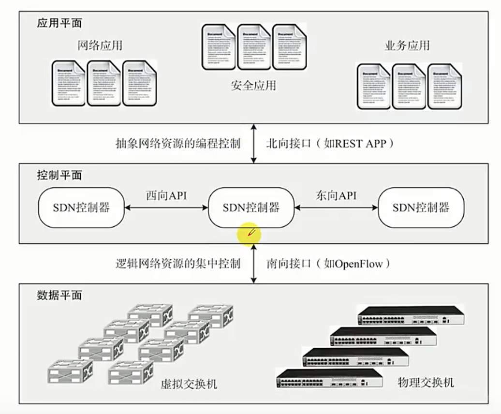
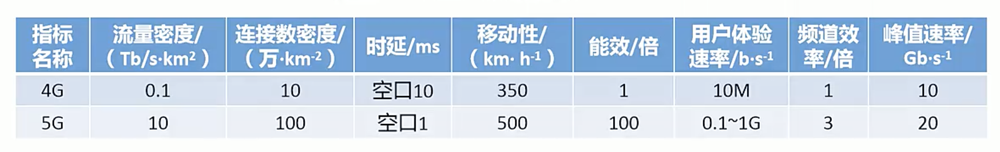
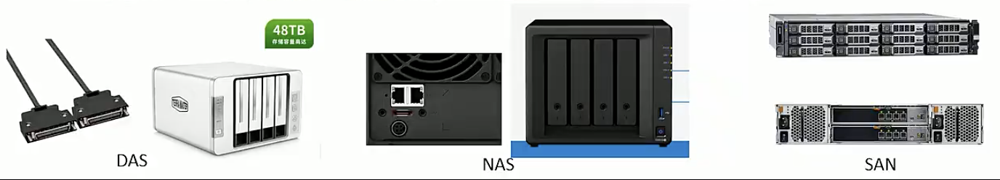
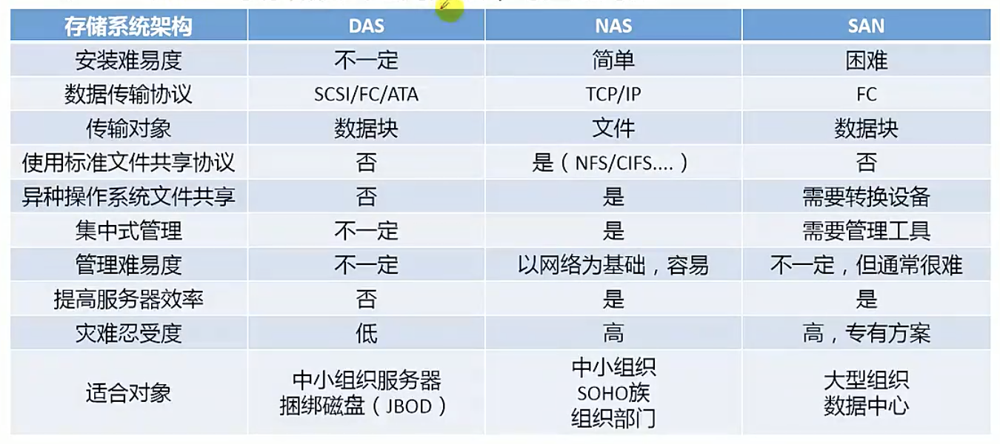
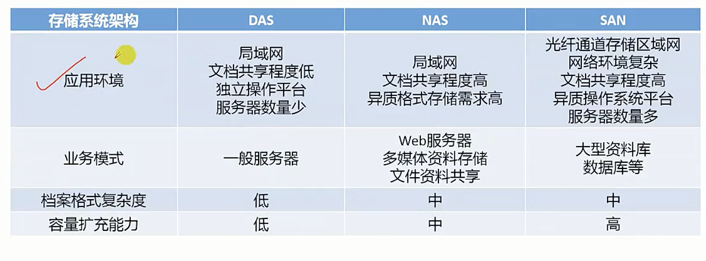
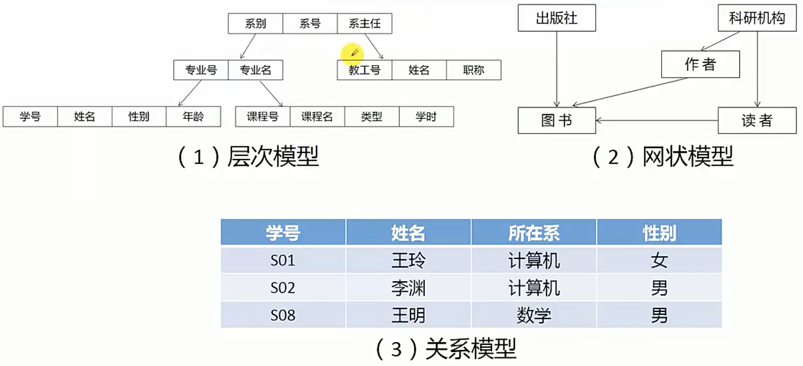
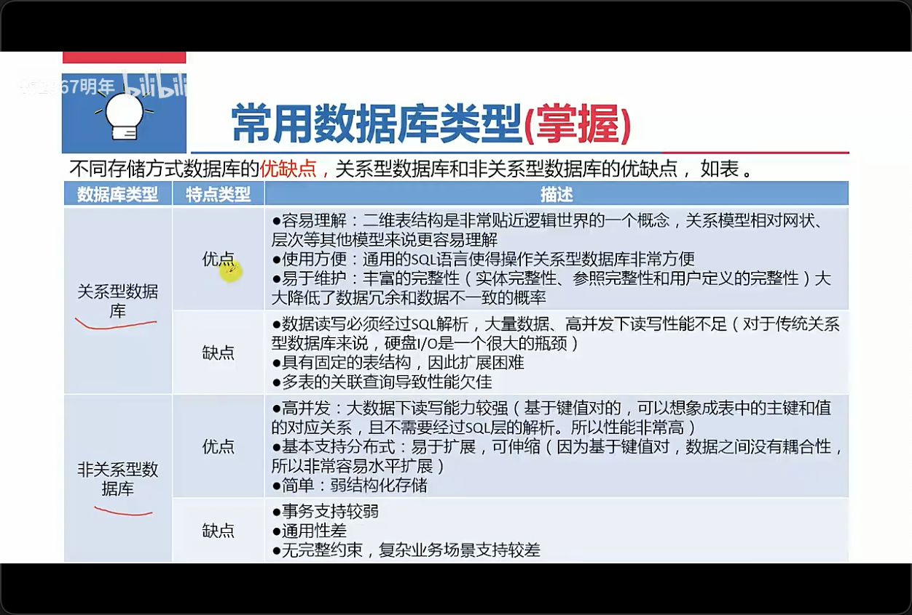
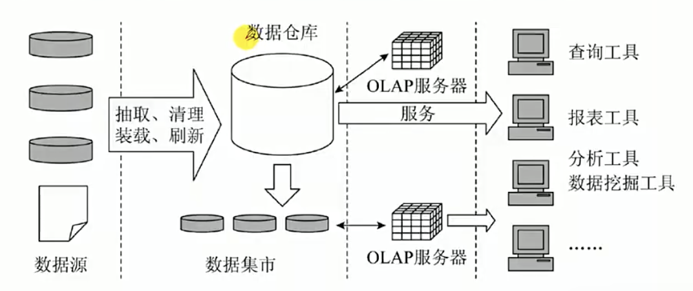

## 2.1 信息技术及其发展

### 2.1.1 计算机软硬件（了解）

计算机硬件(Computer Hardware)是指计算机系统中由电子、机械和光电元件组成的各种物理装置的总称。

计算机软件(Computer Software)是指计算机系统中的程序及其文档，程序是计算任务的处理对象和处理规则的描述；文档是为了方便于了解程序所需的阐明性资料。

在许多情况下，计算机在某些功能既可以由硬件实现，也可以由软件来实现。由此硬件和软件在一定意义上来说没有绝对严格的界线。

### 2.1.2 计算机网络（掌握）

从网络的作用范围可将网络类别划分为[[个人局域网(Personal Area Network, PAN)、局域网(Local Area Network, LAN)、城域网(Wide Area Network, WAN)、广域网(Wide Area Network, WAN)、公用网(Public Network)、专用网(Private Network)]]。

#### OSI七层网络模型（掌握）

OSI：开放系统互连参考模型

| 层         | 作用                                                                                                                                                                                   |
| ---------- | -------------------------------------------------------------------------------------------------------------------------------------------------------------------------------------- |
| 应用层     | 负责对软件提供接口以使程序能使用网络服务，如事务处理程序、文件传送协议和网络管理等                                                                                                     |
| 表示层     | 如同应用程序和网络之间的[[翻译官]]，在表示层，数据将按照网络能理解的方案进行格式化，表示层管理数据的[[解密加密数据转换、格式化和文本压缩]]                                             |
| 会话层     | [[负责在网络中两节点之间建立和维持通信，以及提供交互会话的管理功能]]，如三种数据流方向的控制，即一路交互、两路交替和两路同时会话模式                                                   |
| 传输层     | 负责确保数据可靠、顺序、无错地从A点传输到B点。如[[提供简历、维护和拆除传送连接的功能；选择网络层提供最合适的服务；在系统之间提供可靠的透明的数据传送，提供端到端的错误恢复和流量控制]] |
| 网络层     | 主要功能是将[[网络地址(例如，IP地址)翻译成对应的物理地址(例如，网卡地址)并决定如何将数据从发送方路由到接收方]]；网络层还可以实现[[拥塞控制、网络互连]]等功能                           |
| 数据链路层 | 它控制网络层与物理层之间的通信。它的主要功能是将从网络层收到的数据分割成特定的可被物理层传输的帧。该层的作用包括：[[物理地址寻址、数据的成帧、流量控制、数据的检错、重发]]等。         |
| 物理层     | 该层包括[[物理连网媒介，如电缆连线连接器]]。该层的协议产生并检测电压以便发送和接收携带数据的信号。                                                                                     |

#### 广域网协议（了解）

广域网协议是在OSI参考模型的最下面三层操作，定义了在不同广域网介质上的通信。广域网协议主要包括：PPT点对点协议、ISDN综合业务数字网、xDSI(DSL数字用户线路的统称：HDSL、SDSL、MVL、ADSL)、DDN数字专线、x.25、FR帧中继、ATM异步传输模式。

#### IEEE 802协议族（掌握）

IEEE 802 规范定义了网卡如何访问传输介质（如光缆、双绞线、无线等），以及如何在传输介质上传输数据的方法，还定义了传输信息的网络设备之间连接的建立、维护和拆除的途径。

IEEE 802 规范包括：

- 802.1 802协议概论
- 802.2 逻辑链路控制层LLC协议
- [[802.3 以太网的CSMA/CD载波监听多路访问/冲突检测协议]]
- 802.4 令牌总线Token Bus协议
- 802.5 令牌环Token Ring协议
- 802.6 城域网MAN协议
- 802.7 FDDI宽带技术协议
- 802.8 光纤技术协议
- 802.9 局域网上的语音/数据集成规范
- 802.10 局域网安全互操作标准
- [[802.11 无线局域网WLAN标准协议]]

#### TCP/IP (掌握)

[[TCP/IP 是 Internet 的核心]]

<table  b-1 b-white border-collapse text-center>
  <thead>
    <tr>
      <th>OSI</th>
      <th>TCP/IP</th>
      <th>TCP/IP主要协议</th>
    </tr>
  </thead>
  <tbody>
    <tr>
      <td>应用层</td>
      <td rowspan="3">应用层</td>
      <td rowspan="3">
        ① FTP（文件传输协议） 
        ② TFTP（简单文件传输协议） 
        ③ HTTP（超文本传输协议） 
        ④ SMTP（简单邮件传输协议） 
        ⑤ DHCP（动态主机配置协议） 
        ⑥ Telnet（远程登录协议） 
        ⑦ DNS（域名系统） 
        ⑧ SNMP（简单网络管理协议） 
        应用程序通过对本层协议利用网络完成数据交互的任务
      </td>
    </tr>
    <tr>
      <td>表示层</td>
    </tr>
    <tr>
      <td>会话层</td>
    </tr>
    <tr>
      <td>传输层</td>
      <td>传输层</td>
      <td>
        ① TCP（传输控制协议） 
        ② UDP（用户数据报协议） 
        这些协议负责数据流量管理、错误校验和排列服务。
      </td>
    </tr>
    <tr>
      <td>网络层</td>
      <td>网络层</td>
      <td>
        ① IP（协议） 
        ② ICMP（网络控制报文协议） 
        ③ IGMP（网际组管理协议） 
        ④ ARP（地址解析协议） 
        ⑤ RARP（反向地址解析协议） 
        这些协议负责数据的路由和主机地址解析。
      </td>
    </tr>
    <tr>
      <td>数据链路层</td>
      <td rowspan="2">网络接口层</td>
      <td rowspan="2">
		①包括一系列底层协议
		 
        网络接口层是传输数据的物理媒质，也可以为网络层提供一条准确定义的线路。
      </td>
    </tr>
	<tr>
      <td>物理层</td>
    </tr>
  </tbody>
</table>

#### 应用层协议（掌握）

应用层协议，这些协议主要有FTP、TFTP、HTTP、SMTP、DHCP、Telnet、DNS、SNMP等。

- FTP（文件传输协议）：运行在TCP之上。FTP在客户机和服务器之间建立两条TCP连接一条用于传送控制信息（使用21号端口），另一条用于传送文件内容（使用20号端口）。
- TFTP（简单文件传输协议）：建立在UDP之上，提供不可靠的数据传输服务使用场景：局域网内向嵌入式设备上传文件。
- HTTP（超文本传输协议）：用于从WWW服务器传输超文本到本地浏览器的传输协议。
- SMTP（简单邮件传输协议）：建立在TCP之上，是一种提供可靠且有效的电子邮件传输的协议。
- DHCP（动态主机配置协议）：建立在UDP之上，实现自动分配IP地址。
- Telnet（远程登录协议）：是登录和仿真程序，建立在TCP之上，他的基础功能是允许用户登录进入远程计算机系统
- DNS（域名系统）：是实现域名解析，建立在UDP之上。
- SNMP（简单网络管理协议）：由一组网络管理的标准组成，包含一个应用层协议、数据库模型和一组资源对象。该协议能够支持网络管理系统，用以检测连接到网络上设备是否有任何引起管理上关注的情况。

#### 传输层协议（掌握）

传输层主要有两个传输协议，分别是TCP和UDP，这两个协议负责提供流量控制，错误校验和排序服务。

- TCP提供了一个可靠的，面向连接的，全双工的数据传输服务。TCP一般用于传输数据量比较少，且对可靠性要求高的场合。
- UDP是一种不可靠的，无连接的协议，可以保证应用程序进程的通信，与TCP相比，UDP是一种无连接，它的错误检测功能要弱得多，UDP协议一般用语传输数据量大，对可靠性要求不是很高，但要求速度块的场合。

#### 网络层协议（掌握）

网络层中的协议主要有IP、ICMP、IGMP、ARP、RARP等。

- IP（网络互连协议），所提供的服务是无连接和不可靠的。
- ICMP（Internet Control Message Protocol，网络控制报文协议），一种专门用语发送错报文的协议，即传送的数据可能丢失、重复、延迟、或乱序传递，所以需要一种尽量避免差错并能发生差错时报告的机制，这就是ICMP的功能。
- IGMP（Internet Group Management Protocol，网际组管理协议），允许Internet中的计算机参加多播，是计算机用做向相邻多路由器报告多目组成员的协议。
- ARP（Address Resolution Protocol，地址解析协议），用于动态地完成IP到物理地址的转换。
- RARP（Reverse Address Resolution Protocol，反向地址解析协议），用于动态完成物理地址向IP地址的转换。

#### 软件定义网络（掌握）

软件定义网络（Software-Defined Network，SDN）是一种[[新型的网络架构]]，是[[网络虚拟化]]的一种实现方式，它可以通过[[软件编程]]的形式定义和控制网络，其通过将网络设备的[[控制面]]与[[数据面]]分离开来，从而实现了[[网络流量]]和[[灵活控制]]，使网络变得更加智能，为核心网络及应用的创新提供了良好的平台。

利用分层的思想，SDN将[[数据]]与[[控制]]相分离。

[[在控制层]]，包括具有逻辑中心化和可编程的控制器，可掌握全局网络信息，方便运营商和科研人员管理配置网络和部署新协议等

[[在数据层]]，包括哑交换机（与传统的二层交换机不同，专指用于转发数据的设备），仅提供简单的数据转发功能，可以快速处理匹配的数据包，适应流量日益增长的需求。两层之间采用[[开放的统一接口（如OpenFlow等）]]进行交互。

#### 软件定义网络（掌握）

SDN的整体架构由上到下（由南到北）分为[[数据平面、控制平面、和应用平面]]。其中，数据平面由交换机等网络通用硬件组成，各个网络设备之间通过不同规则形成的SDN数据通路连接；控制平面包含了逻辑上为中心的SDN控制器，它掌握着全局网络信息，负责各种转发规则的控制；应用平面包含着各种基于SDN的网络应用，用户无需关心底层细节就可以编程，部署新应用。

- [[SDN中的接口具有开放性，以控制器为逻辑中心]]
- [[南向接口负责与数据平面进行通信]]，采用的是OpenFlow协议（基于流Flow的概念来匹配转发规则）
- [[北向接口负责与应用平面进行通信]]，通过北向接口编程来调节所需的各种网络资源，实现对网络的快速配置和部署
- [[东西向接口负责多控制器之间的通信]]，东西向接口使控制器具有可扩展性，为负载均衡和性能提升提供了技术保障

#### 第五代移动通信技术（掌握）

第五代移动通信技术（5th Generation Mobile Communication Technology，5G），是具有[[高速率、低时延、大连接]]特点的新一代移动通信技术。

国内电信联盟（ITU）定义了5G的八大标准，与4G的对比如表2-1所示：

5G国际技术标准重点满足灵活多样的物联网需要，在正交频分多址（Orthogonal Frequency Division Multiple Access, OFDMA）和多入多出（Multiple Input Multiple Output, MIMO）基础技术上，5G为支持三大应用场景，采用了灵活的全新系统设计。

在频段方面，与4G支持中低频不同，考虑到中低频资源有限，5G同时支持[[中低频]]和[[高频]]频段，其中[[中低频满足覆盖和容量需求]]，高频满足在[[热点区域提升容量的需求]]。

为了支持低时延、高可靠，5G采用[[短帧]]、快速反馈、多层/多站数据重传等技术。

5G的三大应用场景：[[增强移动宽带(eMBB)、超高可靠低时延通信(uRLLC)、海量机器类通信(mMTC)]]。

- [[增强移动宽带]]主要面向移动互联网流量爆炸式增长，为移动互联网用户提供更加极致的应用体验；
- [[超高可靠低时延通信]]主要面向工业控制、远程医疗、自动驾驶等对低时延和可靠性具有极高要求的垂直行业应用需要求；
- [[海量机器类通信]]主要面向智慧城市、智能家居、环境监测等以传感器和数据采集为目标的应用需求。

### 2.1.3 存储与数据库（掌握）

#### 存储技术

存储分类根据服务器类型分为：封闭系统的存储和开放系统的存储。封闭系统主要指大型机等服务器。开放系统指基于[[麒麟、欧拉、UNIX、Linux等操作系统]]的服务器。

开放系统的存储分为：内置存储和外挂存储。

外挂存储根据连接的方式分为[[直连式存储]](Direct-Attached Storage，DAS)和[[网络化存储]](Fabric-Attached Storage，NAS)。

网络化存储根据[[传输协议]]又分为[[网络接入存储(Network-Attached Storage，NAS)]]和[[存储区域网络]](Storage Area Network，SAN)。

DAS、NAS、SAN等存储模式之间的技术与应用对比：

#### 存储虚拟化（掌握）

[[存储虚拟化（Storage Virtualization）是“云存储”的核心技术之一]]，它把来自一个或多个网络的存储资源整合起来，向用户提供一个抽象的逻辑视图，用户可以通过这个视图中的统一逻辑接口来访问被整合的存储资源。用户在访问数据时并不知道真实的物理位置。它带给人们直接的好处是提高了存储利用率，降低了存储成本，简化了大型、复杂、异构的存储环境的管理工作。

[[存储虚拟化使存储设备能够转换为逻辑数据存储]]。

#### 绿色存储（掌握）

[[绿色存储（Green Storage）技术是指从节能环保的角度出发，用来设计生产能效更佳的存储产品，降低数据存储设备的功耗，提高存储设备每瓦性能的技术]]。

[[绿色存储技术的核心]]是设计运行温度更低的处理器和更有效率的系统，生产更低能耗的存储系统或组件，降低产品所产生的电子碳化合物，其最终目的是提高所有网络存储设备的能源效率，用最少的存储容量来满足业务需求，从而消耗最低的能源。

#### 数据结构模型（掌握）

[[数据结构模型]]是数据库系统的核心。

常见的数据结构模型有三种：[[层次模型、网状模型和关系模型]]，层次模型和网状模型又统称为格式化数据模型。

1. 层次模型：

层次模型是数据库系统最早使用的一种模型，它用[[“树”结构]]表示实体集之间的关联，其中实体集（用矩形框表示）为结点，而树中各节点之间的连线表示它们之间的关联。

2. 网状模型：

网状数据库系统采用网状模型作为数据的组织方式。网状模型用[[网状结构]]表示实体类型及其实体之间的联系。网状模型是一种可以灵活地描述事务及其之间关系的数据库模型。

3. 关系模型：

关系模型是在关系结构的数据库中用[[二维表格的形式]]表示实体以及实体之间的联系的模型。

数据库根据存储方式可以分为[[关系型数据库]]（SQL）和[[非关系型数据库]]（Not Only SQL, NoSQL）。

1. 关系型数据库：

关系数据库是在一个给定的应用领域中，所有实体及实体之间的集合。关系型数据库支持事务的ACID原则，即[[原子性(Atomicity)、一致性(Consistency)、隔离性(Isolation)、持久性(Durability)]]。这四种原则保证在事务过程当中数据的正确性。

2. 非关系型数据库：

非关系型数据库是[[分布式的、非关系型的、不保证遵循ACID原则的数据存储系统]]。NoSQL数据库[[不需要固定的表结构]]，通常也不存在连接操作。在大数据存取上具有关系型数据库无法比拟的性能优势。

常见的非关系数据库分为：

- [[键值数据库]]：类似传统语言中使用的哈希表。可以通过Key来添加、查询或者删除数据库，因为使用Key主键访问，会获得很高的性能及扩展性。Key/Value模型对于信息系统来说，其优势在于[[简单、易部署、高并发。
- [[列存储(Column-Oriented)数据库]]：将数据库在[[列族中]]，一个列族存储经常被一起查询，比如人们经常会查询某个人的姓名和年龄，而不是薪资。这种情况下姓名和年龄会被放到一个列族中，薪资会被放到另一个列族中。这种数据库通常用来[[应对分布式存储海量数据]]。
- [[面向文档(Document-Oriented)数据库]]：文档型数据库可以看作是键值数据库的升级版，允许之间嵌套键值，而且文档型数据库比键值数据库的查询效率更高。面向文档数据库会将数据以文档形式存储。
- [[图形数据库]]：允许人们将数据以图的方式存储。实体会作为顶点，而实体之间的关系则会作为边。比如有三个实体：Steve Jobs、Apple和Next，则会有两个Founded by的边将Apple和Next连接到Steve Jobs。

#### 常用数据库类型（掌握）

不同存储方式数据库的优缺点，关系型数据库和非关系型数据库的优缺点，如下：

1. 关系型数据库：

- 优点：

  - 容易理解：二维表结构是非常贴近逻辑世界的一个概念，关系型相对网状、层次等其他模型来说更容易理解
  - 使用方便：通用的SQL语言使得操作关系型数据库非常方便
  - 易于维护：丰富的完整性（实体完整性、参考完整性和用户定义的完整性）大大降低了数据冗余的和谁不一致的概率

- 缺点：
  - 数据读写必须经过SQL解析，大量数据、高并发下读写性能不足（对于传统关系型数据库来说，硬盘IO是一个很大的瓶颈）
  - 具有固定的表结构，因此扩展困难
  - 多表的关联查询导致性能欠佳

2. 非关系型数据库：

- 优点：
  - 高并发：大数据下读写能力较强（基于键值对的，可以想象成表中的主键和值的对应关系，且不需要经过SQL层解析，所以性能非常高）
  - 基本支持发分布式：易于扩展，可伸缩（因为基于键值对，数据之间没有耦合性，所以非常容易水平扩展）
  - 简单：若结构化存储
- 缺点
  - 事务支持较弱
  - 通用性差
  - 无完整约束，复杂业务场景支持较差

#### 数据仓库（掌握）

为了满足中高层[[管理人员预测、决策分析的需要]]，在传统数据库的基础上产生了能够[[满足预测、决策分析需要的数据环境----数据仓库]]。

数据仓库是一个面向主题的、集成的、非易失的且随时间变化的数据集合，用于支持管理决策。常见的数据仓库的体系结构如图。

| 数据仓库结构                     | 说明                                                                                                                                                                                                    |
| -------------------------------- | ------------------------------------------------------------------------------------------------------------------------------------------------------------------------------------------------------- |
| 数据源                           | 它是数据仓库系统的[[基础]]，使整个系统的数据源                                                                                                                                                          |
| 数据的存储与管理                 | 它是整个数据仓库系统的[[核心]]                                                                                                                                                                          |
| 联机分析处理   (OLAP) 服务器 | OLAP对分析需要的数据进行有效集成，按多为模型予以组织，以方便进行多角度、多层次的分析，并发现趋势。其具体体现可以分为： 基于关系数据库的ROLAP 基于多为数据组织的MOLAP<ba/>基于混合数据组织的HOLP |
| 前段工具                         | 前段工具主要包括各种查询工具、报表工具、分析工具、数据挖掘工具以及各种基于数据仓库集市的应用开发工具。其中数据分析工具主要针对OLAP服务器，[[报表工具、数据挖掘工具]]主要针对数据仓库。                  |

### 2.1.4 信息安全-信息安全基础（掌握）

信息安全强调信息（数据）本身的安全属性，主要包括以下内容：

- [[机密性(Confidentiality)]]：[[信息不被未授权者知晓的属性]]
- [[完整性(Integrity)]]：[[信息是正确的、真实的、未被篡改的、完整无缺的属性]]
- [[可用性(Availability)]]：[[信息可以随时正常使用的属性]]

信息必须依赖其存储、传输、处理及应用的载体（媒介）而存在，因此针对信息系统，安全可以划分为[[四个层次]]：[[设备安全、数据安全、内容安全、行为安全]]

信息系统一般由计算机系统、网络系统、操作系统、数据库系统和应用系统组成。与此对应，信息系统安全[[主要包括计算机设备安全、网络安全、操作系统安全、数据库系统安全和应用系统安全等]]

网络安全技术主要包括：[[防火墙、入侵监测与防护、VPN、安全扫描、网络蜜罐技术、用户和实体行为分析技术等]]

#### 加密解密（掌握）

发信者将明文数据加密成密文，然后将密文数据送入网络传输或存入计算机文件，而且只给合法收信者分配密钥。合法收信者接受到密文后，实行与加密变换相逆的变换，去掉密文的伪装并恢复出明文，这一过程称为解密（Decryption）。解密在解密密钥的控制下进行。用于解密的一组数学变换称为解密算法。

加密技术包括两个元素：[[算法和密钥]]。

| 密码体制           | 数据加密技术               | 典型代表 | 特点                                                       |
| ------------------ | -------------------------- | -------- | ---------------------------------------------------------- |
| [[对称密钥体制]]   | 对称加密（私人密钥加密）   | DES      | 加密密钥和解密密钥相同                                     |
| [[非对称密钥体制]] | 非对称加密（公开密钥加密） | RSA      | 加密密钥和解密密钥不同，加密密钥可以公开而解密密钥需要保密 |

#### 安全行为分析技术（掌握）

虽然大多数的攻击可能来自组织以外，但最严重的损害往往是由内部人员造成的，只有管理好内部威胁，才能保证信息和网络安全。

[[用户实体行为分析（User and Entity Behavior Analysis，UEBA）提供了用户画像及基于各种分析方法的异常检测]]，结合基本分析方法（利用签名的规则、模式匹配、简单统计、阅值等）和高级分析方法（监督和无监督的机器学习等），用打包分析来评估用户和其他实体（主机、应用程序、网络、数据库等），[[发现与用户或实体标准画像或行为异常的活动所相关的潜在事件]]。

UEBA以用户和实体为对象，利用大数据，结合规则以及机器学习模型，并且通过定义此类基线，对用户和实体行为进行分析和异常检测，尽可能快速地感知内部用户和实体的可疑或非法行为。

从架构上看，UEBA系统通常包括[[数据获取层、算法分析层和场景应用层]]。

#### 网络安全态势感知（掌握）

网络安全态势感知(Network Security Situation Awareness)是在大规模网络环境中，对能够引起网络态势发生变化的安全要素进行获取、理解、显示，并据此[[预测未来的网络安全发展趋势]]。安全态势感知不仅是一种安全技术，也是一种新兴的安全概念。它是[[一种基于环境的、动态的、整体的洞悉安全风险的能力]]。安全态势感知的前提是[[安全大数据]]，其在安全大数据的基础上进行数据整合、特征提取等，然后应用一系列态势评估算法生成网络的整体态势状况，应用**态势预测算法**预测态势的发展状况，并使用数据可视化技术，将态势状况和预测情况展示给安全人员，方便安全人员直观便捷地了解网络当前状态及预期的风险。

网络安全态势感知的关键技术主要包括：[[海量多远异构数据的汇聚融合技术、面向多类型的网络安全威胁评估技术、网络安全态势评估与决策支撑技术、网络安全态势可视化等]]。

## 2.2 新一代信息技术及应用

### 物联网（掌握）

物联网（The Internet of Things，IoT）是指[[通过信息传感设备，按约定的协议将任何物品与互联网相连接，进行信息交换和通信，以实现智能化识别、定位、跟踪、监控和管理的网络]]。

#### 技术基础

物联网架构可分为三层：[[感知层、网络层和应用层]]。[[感知层]]由各种传感器构成，包括温度传感器，二维码标签、RFID标签和读写器，摄像头，GPS等感知终端。感知层是物联网识别物体、采集信息的来源。[[网络层]]由各种网络，包括互联网、广电网、网络管理系统和[[云计算平台]]等组成，是整个物联网的中枢，负责传递和处理感知层获取的信息。[[应用层]]是物联网和用户的接口，它与行业需求结合以实现物联网的智能应用。

#### 关键技术

物联网关键技术主要涉及[[传感器技术、传感网]]和[[应用系统框架]]等。

1. 传感器技术

传感器是一种[[检测装置]]，它能“感受”到被测量的信息。它是实现自动检测和自动控制的首要环节，也是[[物联网获取物理世界信息的基本手段]]。

[[射频识别技术]](Radio Frequency Identification，[[RFID]])是物联网中使用的一种传感器技术，在物联网发展中备受关注。RFID可通过无线电信号识别特定目标并读写相关数据，而无需识别系统与特定目标之间建立机械或光学接触。RFID技术让物品能够“开口说话”。这就赋予了物联网一个特性----可跟踪性，即可以随时掌握物品的准确位置及其周建环境。

2. 传感网

[[微机电系统]](Micro-Electro-Mechanical Systems, MEMS)是由[[微传感器]]、[[微执行器]]、[[信号处理和控制电路]]、[[通信接口和电源]]等部件组成的一体化的[[微型器件系统]]。其目标是把信息的获取、处理和执行集成在一起，组成具有多功能的微型系统，集成于大尺寸系统中，从而大幅地提高系统的自动化、智能化和可靠性水平。MEMS赋予了普通物体新的“生命”，它们有了属于自己的数据传输通路、存储功能、操作系统和专门的应用程序，从而形成一个庞大的传感网，是物联网能够通过物品来实现对人的监控和保护。未来，衣服可以通过[[传感网“告诉”洗衣机放多少水和洗衣粉最经济]]；[[文件夹会“检查”人们忘带了什么重要文件]]；[[食品蔬菜的标签会向顾客的手机介绍“自己”是否真正“绿色安全”]]。

3. 应用系统框架

物联网应用系统框架是一种以机器终端智能交互为核心的、网络化的应用与服务。它将使[[对象实现智能化的控制]]，涉及5个重要的技术部分：[[机器、传感器硬件、通信网络、中间件和应用]]。该框架基于[[云计算平台]]和[[智能网络]]，可以依据传感器网络获取的数据进行决策，改变对象的行为控制和反馈。智能化的住宅在主人上班时，传感器自动关闭水电和门窗，定时向主人的手机发送消息，汇报安全情况。

#### 云计算（掌握）

1. 技术基础

云计算是一种基于互联网的[[计算方式]]，通过这种方式将网络上配置为共享的软件资源、计算资源、存储资源和信息资源，[[按需求]]提供给网上的终端设备和终端用户。

云计算实现了“[[快速、按需、弹性]]”的服务，用户可以随时通过宽带网络接入“云”并获取服务，按照实际需求获取或释放资源，根据需求对资源进行动态扩展。

按照云计算服务提供资源层次，可以分为：

[[基础设施即服务（IaaS）]]向用户提供[[计算机能力、存储空间]]等基础设施反面的服务。

[[平台即服务（PaaS）]]向用户提供虚拟的[[操作系统、数据库管理系统、Web应用]]等平台化的服务。

[[软件即服务（SaaS）]]向用户提供应用软件（[[如CRM、办公软件]]等）、[[组件]]、[[工作流]]等虚拟化软件的服务，SaaS一般采用[[Web技术]]和[[SOA架构]]。

2. 关键技术

云计算关键技术主要涉及[[虚拟化技术、云存储技术、多租户和访问控制管理、云安全技术]]等。

(1) 虚拟化技术

虚拟化技术是一个广义术语，在计算机领域通常是指[[计算元件在虚拟的基础上而不是真实的基础上运行]]。虚拟化技术可以扩大硬件的容量，简化软件的重新配置过程。CPU的虚拟化技术可以单CPU模拟多CPU并行，允许一个平台同事运行多个操作系统，并且应用程序都可以在相互独立的空间内运行而互不影响，从而显著提高计算机的工作效率。

虚拟化技术与多任务以及超线程技术是完全不同的。[[多任务]]是指在一个操作系统中多个程序同时并行运行，而在[[虚拟化技术]]中，则可以同时运行多个操作系统，而且每一个操作系统中都有多个程序运行，每一个操作系统都运行在一个虚拟的CPU或者虚拟主机上。[[超线程技术]]只是单CPU模拟双CPU来平衡程序运行性能，这两个模拟出来的CPU是不能分离的，只能协同工作。

[[容器]](Container)技术是一种全新意义上的虚拟化技术，属于操作系统虚拟化的范畴，也就是由操作系统提供虚拟化的支持。目前最受欢迎的容器环境是[[Docker]]。容器技术将单个操作系统的资源划分到孤立的组中，以便更好地在孤立的组之间平衡有冲突的资源使用需求。

(2) 云存储技术

[[分布式文件系统]]作为云存储技术中的重要组成部分，在维持兼容性的基础上，对系统复制和容错功能进行提升。

(3) 多租户和访问控制管理

[[访问控制管理]]是云计算应用的核心问题之一。云计算访问控制的研究主要集中在[[云计算访问控制模型]]、[[基于ABE密钥体制的云计算访问控制]]、[[云中多租户及虚拟化访问控制研究]]。

云中多租户及虚拟化访问控制是云计算的典型特征。

(4) 云安全技术

云安全研究主要包含两个方面的内容，[[一是云计算技术本身的安全保护工作]]，涉及相应的数据完整性及可用性、隐私保护性以及服务可用性等方面的内容；[[二是借助于云服务的方式来保障客户端用户的安全防护需求]]，通过云计算技术来实现互联网安全，涉及基于云计算的病毒防治、木马检测技术等。

在云安全技术的研究方面，主要包含：

- 云计算安全性
- 保障云基础设施的安全性
- 云安全技术服务

### 大数据（掌握）

大数据(Big Data)值无法在一定时间范围内用常规软件工具进行捕捉、管理和处理的数据集合，是具有更强的决策力、洞察发现力和流程优化能力的海量、高增长率和多样化的信息资产。

#### 技术基础

大数据是具有[[体量大、结构多样、时效性强]]等特征的数据，处理大数据需要采用[[新型计算架构和智能算法等新技术]]。大数据从数据源到最终价值实现一般需要[[经过数据准备、数据存储与管理、数据分析和计算、数据治理和知识展现等过程]]，涉及数据模型、处理模型、计算理论以及与其分布计算、分布存储平台技术、数据清洗和挖掘技术、流式计算和增量处理技术、数据质量控制等方面的研究。一般来说，大数据主要特征包括：

- [[数据海量]]：大数据的数据体量巨大，从TB级别跃升到PB级别(1PB=1024TB)、EB级别(1EB=1024PB)，甚至达到ZB级别(1ZB=1024EB)。
- [[数据类型多样]]：大数据的数据类型繁多，一般分为结构化数据和非结构化数据。相对于以往便于存储的以文本为主的结构化数据，非结构化数据越来越多，包括网络日志、音频、视频、图片、地理位置信息等，这些多类型的数据对数据的处理能力提出了更高的要求。
- [[数据价值密度低]]：数据价值密度的高低与数据总量的大小成反比。以视频为例，一部1小时的视频，在连续不间断的监控中，有用的数据可能仅有一二秒。如何通过强大的机器算法更迅速地完成数据的价值“提纯”，成为目前大数据背景下亟待解决的难题。
- [[数据处理速度快]]：为了从海量的数据中快速挖掘数据价值，一般要求要对不同类型的数据进行快速地处理，这是大数据区分于传统数据挖掘的最显著特征。

#### 关键技术

大数据技术架构主要包含[[大数据获取技术、分布式数据处理技术]]和[[大数据管理技术]]，以及[[大数据应用和服务技术]]。

(1) 大数据获取技术

目前，大数据获取的研究主要集中在[[数据采集、整合和清洗]]三个方面。数据采集技术实现数据源的获取，然后通过整合和清理技术保证数据质量。

(2) 分布式数据处理技术

分布式计算式随着分布式系统的发展而兴起的，其核心是将任务分解成许多小的部分，分给多台计算机进行处理，通过并行工作的机制，达到节约整体计算时间，提高计算效率的目的。目前，主流的分布式计算系统有Hadoop、Spark、Storm。

[[Hadoop常用于离线的复杂的大数据处理]]，[[Spark常用于离线的快速打大数据处理]]，[[而Storm常用于在线的实时的大数据处理]]。

(3) 大数据管理技术

大数据管理技术主要集中在大数据存储、大数据协同和安全隐私等方面。

(4) 大数据应用和服务技术

大数据应用和服务技术主要包括分析应用技术和可视化技术。

### 区块链（掌握）

区块链技术具有[[多中心化存储、隐私保护、防篡改等特点，提供了开放分散和容错的事务机制]]，成为新一代匿名在线支付、汇款和数字资产交易的核心，被广泛应用于各大交易平台，为金融、监管机构、科技创新、农业以及政治等领域带来了深刻的变革。

#### 技术基础

区块链概念可以理解为以[[非对称加密算法]]为基础，以改进的默克尔树(Merkle Tree)为数据结构，使用[[共识机制、点对点网络、智能合约]]等技术结合而成的一种分布式存储数据库技术。区块链分为[[公有链(Public Blockchain)、联盟链(Consortium Blockchain)、私有链(Private Blockchain)和混合链(Hybrid Blockchain)]]四大类。

一般来说，区块链的典型特征包括：

- [[多中心化]]：链上数据的验证、核算、存储、维护和传输等过程依赖分布式系统结构，运用数学方法代替中心化组织机构在多个分布式结点之间构建信任关系，从而建立可信用的分布式系统。
- [[多方维护]]：激励机制可确保分布式系统中的所有结点均可参与数据区块的验证过程，并通过共识机制选择特定节点将新产生的区块加入到区块链中。
- [[时序数据]]：区块链运用带有时间戳信息的链式结构来存储数据信息，微数据信息添加时间维度的属性，从而实现数据信息的可追溯性。
- [[智能合约]]：区块链技术能够为用户提供灵活可变的脚本代码，以支持其创建新型的智能合约。
- [[不可篡改]]：在区块链系统中，因为相邻区块间后序区块可对前序区块进行验证，若篡改某一区块的数据信息，则需递归修改该区块及其所有后序区块的数据信息，然后每一次哈希的重新计算代价是巨大的，且须在有限时间内完成，因此可保障链上数据的不可篡改性。
- [[开放共识]]：咋区块链网络中，每台物理设备均可作为该网络中的一个节点，任意节点可自由加入且拥有一份完整的数据拷贝。
- [[安全可信]]：数据安全可通过基于非对称加密技术对链上数据进行加密来实现，分布式系统中各节点通过区块链共识算法所形成的算力来抵御外部攻击、保证链上数据不被篡改和伪造，从而具有较高的保密性、可信性和安全性。

#### 关键技术

(1)  分布式账本

[[分布式账本是区块链技术的核心之一]]。分布式账本的核心思想是：交易记账由分布在不同地方的多个节点共同完成，而且每一个节点保存一个唯一、真实账本的副本，它们可以参与监督交易合法性，同时也可以共同为其作证；账本里的任何改动都会在所有的副本中被反映出来，反应时间会在几分钟甚至几秒内，记账节点足够多，理论上除非所有节点被破坏，所以整个分布式账本系统是非常稳健的，从而保证了账目数据的安全性。

(2)  加密算法

区块数据的加密是区块链研究和关注的重点，其主要作用是保证区块数据在网络传输、存储和修改过程中的安全。区块链系统中的加密算法一般分为散列(哈希)算法和非对称加密算法。

(3)  共识机制

区块链的共识机制的思想是：在没有中心点总体协调的情况下，当某个记账节点提议区块数据增加或减少，并把该提议广播给所有的参与节点，所有节点要根据一定的规则和机制，对这一提议是否能够达到一致进行计算和处理。