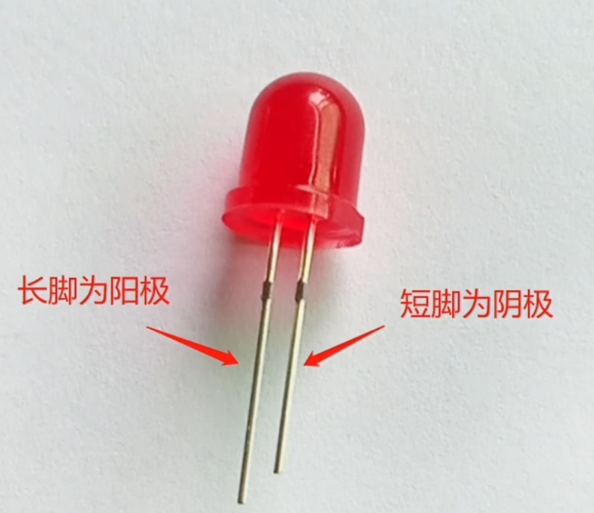

# 嵌入式开发

## GPIO 引脚

GPIO 引脚，负责输入/输出电压，开发板上 D 开头的引脚都是这种引脚，比如 D2，D4，D15 等

## LED


长脚为阳极，短脚为阴级

电流从阳极流入阴极

阳极接电，阴极接地

- 那为什么供电引脚连的阳极，而电阻连的阴极，这样不是电流通过的时候没有先经过电阻吗？

## 数码管


### 共阴数码管

- 电路接线

公共端 com 连接一个电阻接地，其余的 abcdefg 段连接开发板的引脚，给高电平时亮，低电平时不亮

- 代码

```c
int pins[8] = {14, 27,33,25,26,12,13,32};
// 提前缓存数字亮起来引脚的电平为1，即是高电平
int nums[][8] = {
// a b c d e f g dp
  {0,0,0,0,0,0,0,0},//空
  {0,1,1,0,0,0,0,0},//1
  {1,1,0,1,1,0,1,0},//2
  {1,1,1,1,0,0,1,0},//3
  {0,1,1,0,0,1,1,0},//4
  {1,0,1,1,0,1,1,0},//5
  {1,0,1,1,1,1,1,0},//6
  {1,1,1,0,0,0,0,0},//7
  {1,1,1,1,1,1,1,0},//8
  {1,1,1,1,0,1,1,0},//9
  {1,1,1,1,1,1,0,0},//9
};

void setup() {
  // 将引脚设置为输出端
  for(int i = 0; i < 8; i++){
    pinMode(pins[i], OUTPUT);
  }
}

void loop() {
  // 数字 1-0
  for(int i = 0; i < 11; i++){
    // 设置引脚电平
    for(int j = 0; j < 8; j++){
      digitalWrite(pins[j], nums[i][j]);
    }
    delay(1000);
  }
}
```

## 4 位数码管



### 4 位同时显示某一个数字

```c
// g   f   a  b   e   d   c   dp
int pins[8] = {13, 12, 14, 27, 26, 25, 33, 32};
int segs[4] = {16, 4, 2, 15};

int nums[][8] = {
  {1,1,1,1,1,1,0,0},//0
  {0,1,1,0,0,0,0,0},//1
  {1,1,0,1,1,0,1,0},//2
  {1,1,1,1,0,0,1,0},//3
  {0,1,1,0,0,1,1,0},//4
  {1,0,1,1,0,1,1,0},//5
  {1,0,1,1,1,1,1,0},//6
  {1,1,1,0,0,0,0,0},//7
  {1,1,1,1,1,1,1,0},//8
  {1,1,1,1,0,1,1,0},//9
};

void setup() {
  for(int i = 0; i < 8; i++){
    pinMode(pins[i], OUTPUT);
    digitalWrite(pins[i], LOW);

    if(i < 4) {
      pinMode(segs[i], OUTPUT);
      digitalWrite(segs[i], HIGH);
    }
  }
}

void set_seg(int order, int index){
  for (int i = 0; i < 4; i++) {
    digitalWrite(segs[i], HIGH);
  }

  for(int i = 0; i < 8; i++){
    digitalWrite(pins[i], nums[index][i]);
  }

  digitalWrite(segs[order], LOW);
}

void loop() {
  for (int i = 0; i < 4; i++) {
    set_seg(i, num);
    delay(5); // 短暂延迟，避免闪烁
  }
}
```

### 4 位数码管同时从 0 显示到 9

将上面 **4 位同时显示某一个数字** 的 loop 函数函数中改为下面代码：

- 错误示范

下面的代码中，看似是循环了 0-9 的数字，将 4 位数码管分别设置为从 0-9 显示，每一位数字延时显示 500 毫秒。

实际的效果确实，数码管的第四位显示正常，而前三位一直闪烁。

原因是在 for 循环调用 set_seg 时，前三位数码管显示的实际延时时间只有 5 毫秒，只有最后一位数码管显示了 500 毫秒，导致前三位数码管看起来像是在闪烁。

```c
void loop() {
  for (int num = 0; num < 10; num++) {
    for (int i = 0; i < 4; i++) {
      set_seg(i, num);
      delay(5); // 短暂延迟，避免闪烁
    }
    delay(500); // 显示完一个数字后延迟一段时间
  }
}
```

- 正确代码

使用 millis() 计时器在 500 毫秒内反复轮流显示每个段位置，使其看起来像是同时显示，从而避免了闪烁问题。实际上分开显示的，只是肉眼看起来像同时显示

```c
void loop() {
  for (int num = 0; num < 10; num++) {
    unsigned long startTime = millis();

    while (millis() - startTime < 500) {
      for (int i = 0; i < 4; i++) {
        set_seg(i, num);
        delay(5);
      }
    }
  }
}
```

- 关键点
  - 多路复用技术：快速切换显示不同的数码管位置，利用人眼的视觉暂留效应，使其看起来像是同时显示的。
  - 避免闪烁：通过适当的延时和快速循环切换，确保每个位段有足够的显示时间，从而避免闪烁问题。

### 实现计数器

从 0 开始显示，直到 9999

- 实现

使用 count 计数，将数字转换位数码管 4 位对应显示的数字，和上面一样使用多路复用技术，让数字同时显示出来，每次 loop 执行加 1，就是实现了从 0 开始计数。

```c
int count = 0;

int* get_number(int sum){
  static int arr[4];
  for(int i = 3; i >= 0; i--){
     arr[i] = sum % 10;
     sum /= 10;
  }
  return arr;
}

void loop() {
  if(count > 9999) return;

  unsigned long startTime = millis();
  int* arr = get_number(count);

  while (millis() - startTime < 500) {
    for (int i = 0; i < 4; i++) {
      set_seg(i, arr[i]);
      delay(5);
    }
  }

  count = count + 1;
}
```

### 实现秒表

其实与计数器同理，给定一个 count 值，不停的递减显示就可以。

```c
void display_count(int count) {
  if(count > 9999) return;

  Serial.println(count);

  unsigned long startTime = millis();
  int* arr = get_number(count);

  while (millis() - startTime < 500) {
    for (int i = 0; i < 4; i++) {
      set_seg(i, arr[i]);
      delay(5);
    }
  }
}

int num = 9999;

void loop() {
  if(num == 0) return;
  display_count(num);
  num = num - 1;
}
```
