# Building a Better Hammer - The Story of Nuxt 4

## 简介

我们将探讨Nuxt 4的新功能，以及我们为使其成为“更好的锤子”而做出的架构决策，无论您面对的是哪种类型的项目。我的目标是对任何人都有用的东西，即使他们不使用 Nuxt。因此，要思考框架哲学，并用引擎盖下的东西激励人们。

## 内容

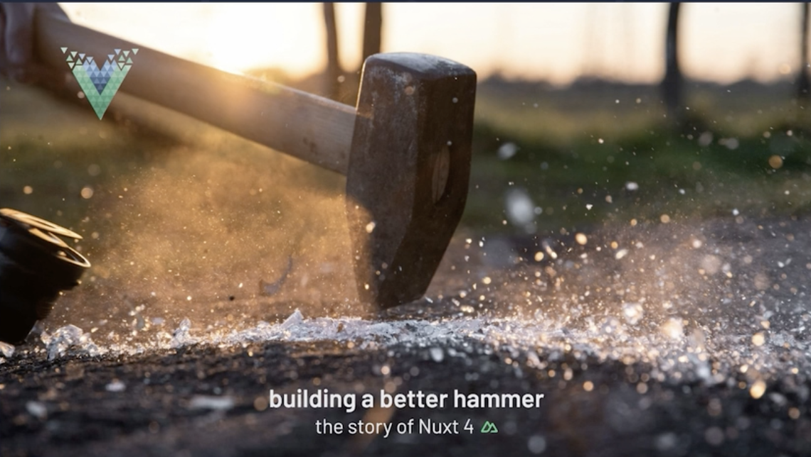

很高兴今天能在这里，和大家聊聊打造更好的锤子，Nuxt 4 的故事。

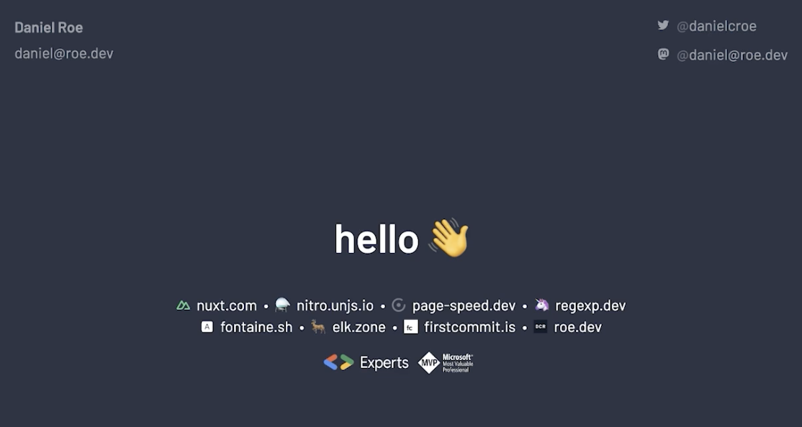

我叫 Daniel Rowe。我目前领导 Nuxt 核心团队。我还参与了一些其他开源项目。我有幸成为一名全职开源维护者。除了 Nuxt，我还参与了 Nitro 的建设。

PageSpeed.dev 是一个有趣的小项目，用于以可共享的方式查询 Google PageSpeed 洞察和 Core Web Vitals API。

RegExp.dev。Magic RegExp 是一个使正则表达式类型安全的库，但在构建时被编译掉。

Fontane 有助于减少网络字体的累积布局变化并改善您的核心网络生命力。ElkZone 是 Mastodon 的客户。

FirstCommit.is 将找到某人的第一个 GitHub 提交，您可以在我的网站 Rowe.dev 上找到所有这些以及更多信息。

好吧，我现在基本就是这个样子。只有我的猫 Bali 被关在了房间外，但没错，每当我在家时，她通常都会阻止我编写大量代码。她非常可爱，但当她想要拥抱时，她非常需要拥抱。

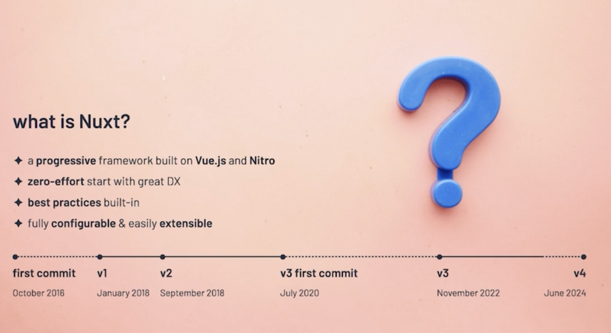

今天我谈论的是 Nuxt，构建更好的 Nuxt，并展望 Nuxt 4 的未来。

如果您不熟悉 Nuxt，那么我认为 Nuxt 的关键在于，从我的角度来看，它是一个用于构建全栈 Web 应用程序的框架，它基于 Vue 和 Nitro 构建，作为服务器组件。

对我来说，关键在于它是渐进式的。因此，我们的想法是，从尽可能多地内置最佳实践开始，然后随着您的成长而适应您。因此，如果您想改变，您可以改变。如果您需要自定义它，您也可以。

因此，这是一个有望改善开发人员体验的平台，使其感觉直观，但不会限制您进行更改。Nuxt 最初由 Sebastian Chopin 于 2016 年 10 月创建。您可以看到该项目的简短时间表。因此，版本 1 和 2 在 2016 年 10 月之后很快就问世了。我们于 2020 年开始开发版本 3。

Vue 已升级至版本 3，这是一次重大的突破性变化。Webpack 已升级至版本 5，这又是一个重大变化。在构建版本 3 的过程中，Vite 问世了，这是一个全新的构建器，具有令人惊叹的 DX。

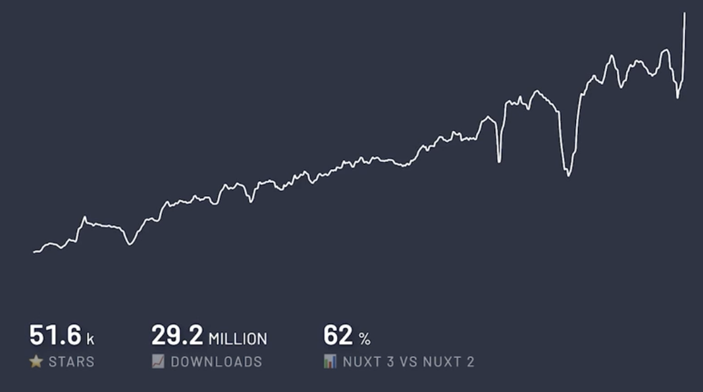

因此，第 3 版花了很长时间。它于 2022 年 11 月发布。现在我们正在开发第 4 版，我们预计它将于 2024 年 6 月发布。Nuxt，我们做这些数字只是为了说明，这些数字在某种程度上是虚荣指标。它们并不十分准确，因为这只是来自 NPM 或 GitHub 的统计数据，但我们有 51,500 颗星，2900 万次下载，而且我们看到采用率正在增加。因此，现在 62% 的 Nuxt 安装是在 Nuxt 3 上，而不是 Nuxt 2 上。

顺便说一句，这些都是实时数据。所以每次我看到这张幻灯片时，都会有一点不同。我们有大量的人将 Nuxt 打造成为今天的样子。老实说，这个数字比 NPM 下载量重要得多，因为 Nuxt 很大程度上是社区和生态系统的产物。所以我们没有得到大公司的赞助。所有构建 Nuxt 的团队都是开源维护者，我们的社区也是如此。

我们的方向、我们创造的东西以及我们如何构建，很大程度上取决于我们作为社区事业的需要。老实说，这是 Nuxt 和与开源社区的人们合作最美好的事情之一。这就是我们作为社区一员所拥有的友谊和情谊。社区有超过 680 名贡献者。

我想谈谈打造一把更好的锤子，Nuxt 4 的故事。当我说打造一把更好的锤子时，你可能会想到，我本意是，对于一个拿着锤子的人来说，所有东西看起来都像钉子。我认为这是不可避免的。当你作为一名网络工匠获得技能或对工具箱中某个特定工具的理解或认识时，你可能会忍不住想用它来做所有事情。

一般来说，这不是一个好主意。我们本质上是为了某个目的而构建事物的人。我们有实现这一目标的工具。所以我们可以使用不同的工具。我们可以使用不同的库、不同的框架。这完全没问题。顺便说一句，我非常不想说 Nuxt 应该是所有人的万能工具。但我确实想让 Nuxt 更易用、更可扩展，让它成为一把更好的锤子。这样你就可以用它做更多的事情，它可以用于钉子、螺丝和其他不同种类的东西。它应该可以在许多不同的情况下使用。

那么为什么呢？为什么我希望情况如此？首先，它可以减少认知负荷。因此，如果你知道某些东西是如何工作的，并且该工具足够灵活，可以根据你的需求调整输出，那么你就不必更改输入，这将极大地改变你作为开发人员的体验。你不必选择新工具，因为你现有的工具足够灵活，可以适应你这次需要。你还可以释放惯例的力量。因此，在一个项目中，例如，一个企业项目中，当有新人加入时，你不必让他们以特定的方式完成这个特定的项目。它会按预期工作。

这就是约定的力量，无论是在 Nuxt 还是在其他项目中。例如，我认为 Tailwind CSS 的成功就是因为约定。这意味着对于进入 Tailwind CSS 项目的新开发人员来说，他们不需要确切了解 CSS 是如何设置的。他们几乎知道。他们知道它是如何工作的。他们知道样式是如何构建的以及如何将它们添加到 HTML 中，无论是 React 项目还是 Vue 项目，或者介于两者之间的任何项目。

但我非常不想要的，我试图让 Nuxt 变得更好的原因，并不是要统治世界。这不是零和游戏。我们也不会试图打败其他框架。我认为这是我喜欢 Vue 和 Nuxt 社区的原因之一，因为我们不是这样的。我们不想这样做。我们试图做的是创造一些很酷、很神奇的东西，并在这个过程中让人们的生活变得更好。这并不是要打倒别人或排挤他们。我非常希望我们不会把自己与所使用的工具联系起来，但我确实想让 Nuxt 成为一种更好的工具，可以满足各种目的。

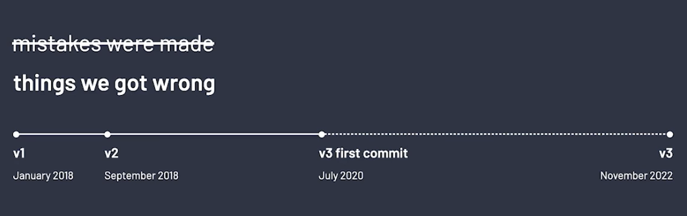

所以在通往 Nuxt 4 的道路上，实际上是在通往 Nuxt 3 的道路上，我会说犯了错误。实际上，这不是一个很好的说法。相反，我们可能犯了一些错误。我想，如果你看一下我们迄今为止主要发布的小图表，你大概就能看出我们犯了什么错误。最明显的是，我们花了太长时间才发布第 3 版。从某种程度上来说，这不是任何人的错。我们花了这么长时间有很多原因，有充分的理由，但我认为这仍然是我们犯了错误，我们作为核心团队认识到情况确实如此。

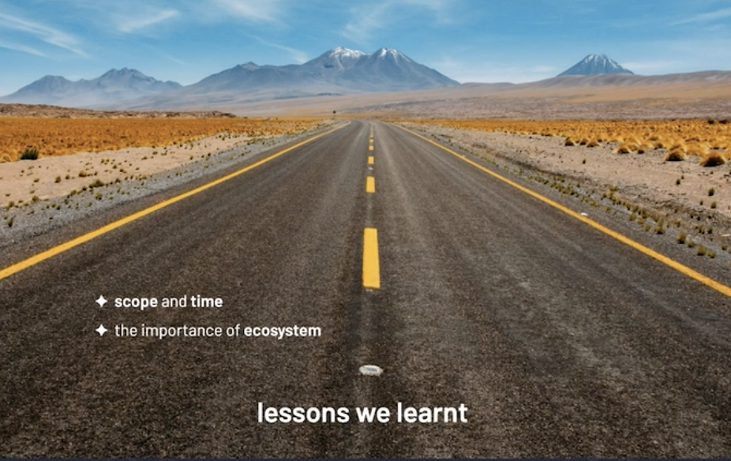

我想简单说一下我们从中学到的一些东西。首先，范围和时间并不是同时可交付的。你不可能同时交付你想要的完整愿景，并在你预测的时间内完成。哦，我想有时你可以，但如果你不能，你必须确定其中之一。你不可能同时交付。如果你试图这样做，可能会增加巨大的压力。这就是我们现在有固定时间发布时间表的原因之一。几乎每周，我们都会发布一个补丁。每个月，我们都会发布一个包含功能的小版本。每年，我们都致力于发布一个主要版本。这就是我们现在推出 NUXT 4 的原因。我们了解了生态系统的重要性，并将依赖 NUXT 的下游库与我们一起带走。

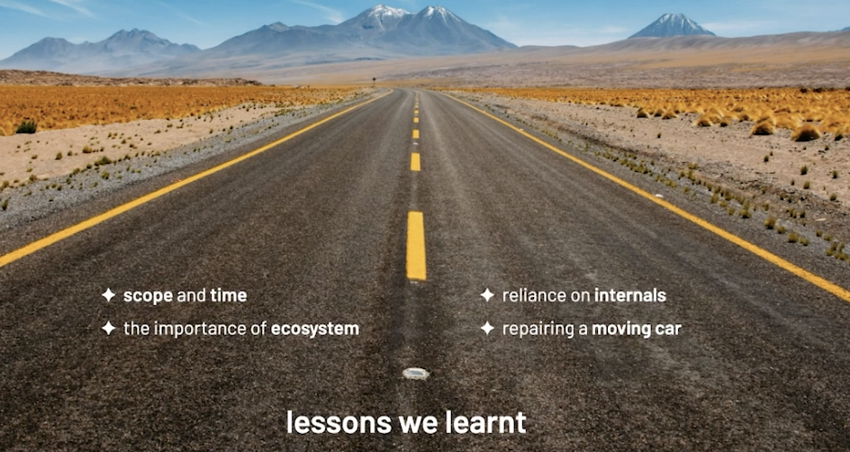

因此，Vue core升级花了很长时间，因为所有依赖它的软件包，其中包括 NUXT。然后 NUXT 本身也有很多依赖它的软件包和模块。它们也都必须加入。我们学到了一个教训，依赖 NUXT 这样的项目的内部结构会使其很难改变，因为当引入重大更改时，这些内部结构是首先改变的东西。这意味着整个生态系统都被破坏了，这就是我们推出 NUXT Kit 的原因，但稍后会详细介绍。我们了解到修理行驶中的汽车，在试图让汽车保持行驶的同时更换发动机可能是一个坏主意。所以，所有这些都是我们非常希望在 NUXT 4 中改变的事情。我希望这些事情对于任何致力于做出重大改变的项目来说都是有意义的。这些都是我们通过艰苦努力学到的东西。

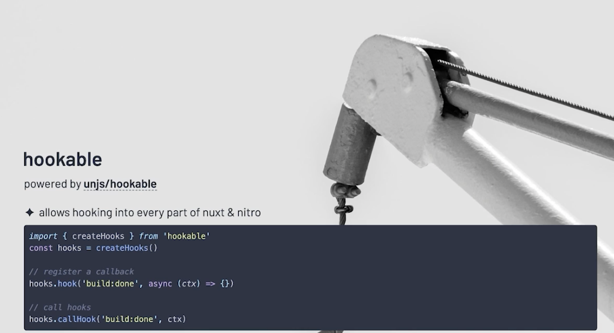

以下是我们打算做的几件事。首先，我们依赖模块生态系统。我想谈谈模块生态系统的几件事，它们可以帮助我们向 NUXT 4 迈进。首先，它是深度可挂钩的。因此，它可以挂钩到 NUXT 和 Nitro 的每个部分，从构建到运行时代码。这一切都由 hookable 提供支持，这是 Puya Parsa 开发的非常棒的 AP​​I。

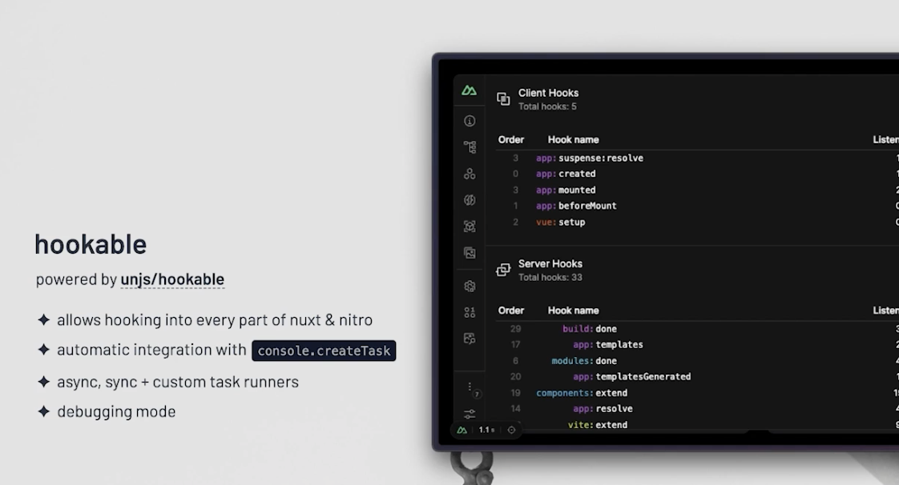

请检查一下。它支持 Go DX 的很多不同功能，包括开发人员工具集成和控制台创建任务集成，这非常有助于浏览器正确显示日志。而且 NUXT 也是可插入的。因此，如果我们可以做到这一点，您可以在 NUXT 中使用的不同功能都是可交换的。无论是捆绑器，我希望很快看到 RSPack 支持 NUXT，还是我们构建的仍然是核心 NUXT 模块的临时模块。

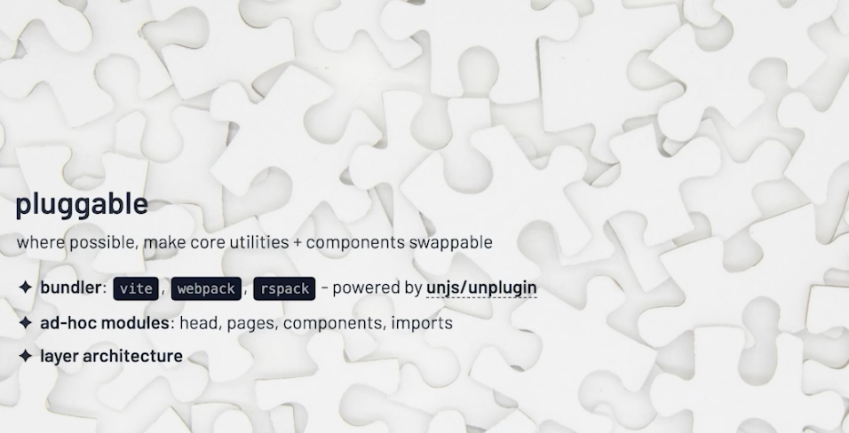

它们实际上是可插入的，可以交换，或者是我们最终向最终用户公开的层架构。我们的目标是，根据您的需要，NUXT 的很多功能都应该能够进行调整和移动。而所有这些，我们都旨在让您能够轻松地在 NUXT 上进行构建。

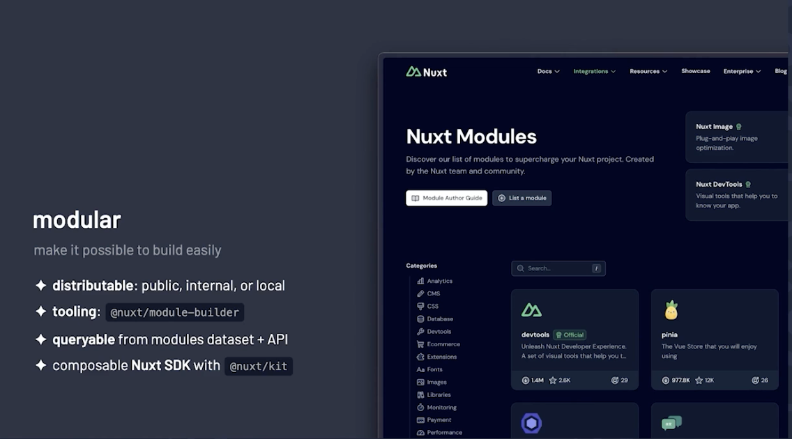

因此，模块可以在本地 mono 存储库或内部注册表中创建和分发，也可以发布到 NPM。我们提供工具来实现构建模块。它们可以从 NUXT 模块数据集中查询，这只是 NPM 上的一个存储库。我们也有它的 API。我们有一个可组合的 NUXT SDK。因此，人们可以为 NUXT 3 构建一个模块，当我们发布 NUXT 4 时，只要它仍在使用来自该套件 SDK 的任何可组合实用程序，该模块就应该继续工作。这是一些统计数据。因此，这些模块是已在注册表中注册的模块。我们有超过 205 个模块。

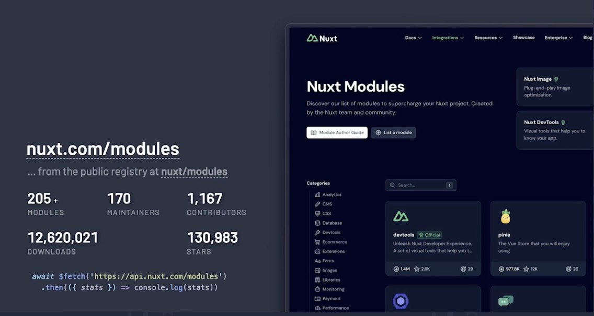

我想，截至今天，我们有 170 名维护者、超过 1,000 名贡献者、130,000 个星标和 1200 万次下载。您可以通过这种方式自己查看统计数据。这只是开发人员体验的快速演示。因此，如果我启动一个在后台运行的项目，并打开开发工具，我就可以看到很多有关我的项目的信息。

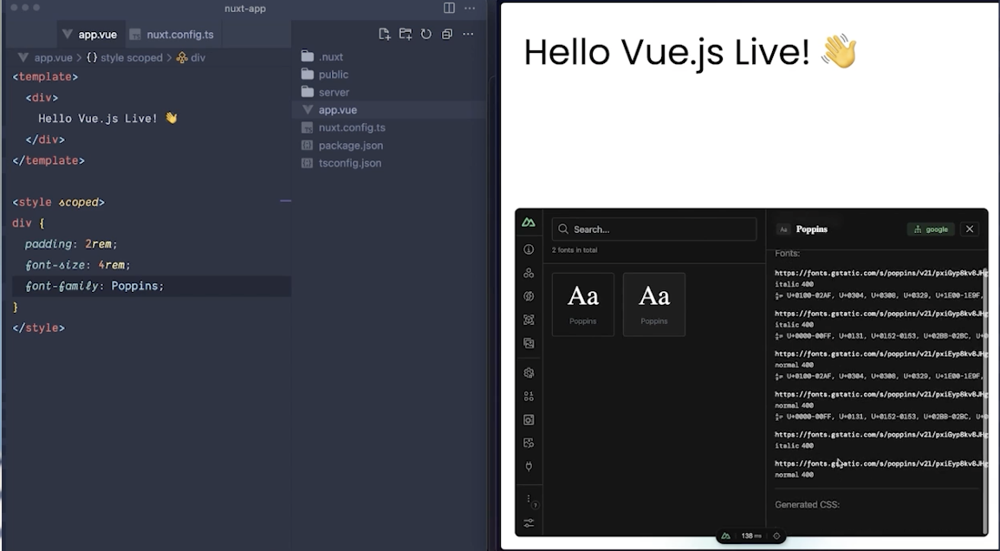

我不会详细介绍所有这些细节，但我可以打开模块面板并搜索以安装新模块。我可以安装字体模块，这个模块相对较新。我大概在一个月前或几个月前才构建它，我和一些贡献者一直在快速推进它。所以我们可以在后台安装 NUXT 字体模块，NUXT 将自行重新启动，模块已添加到我的配置中，现在我可以做一些事情了。您还会看到这里有一个小型开发工具面板，显示我们没有使用自定义 Web 字体。

我可以启用 poppins。然后我们立即更新了开发工具，我们有一些关于将在此项目中使用的字体的信息。它们现在也在项目中本地代理。当您构建它时，它将成为您项目的一部分，不会有第三方请求。我们还注入了一些神奇的 CSS，以便在页面加载时获得零或尽可能少的布局偏移。因此，我们的目标是让使用 NUXT 的人们获得尽可能简单和顺畅的整个体验。因此，任何可以创建的模块，无论它集成了什么提供商或旨在解决什么功能，我们都希望它能够改善开发人员的体验并尽可能减少认知负荷和摩擦。我们也非常希望优先考虑用户的选择。

因此，当您开始与 NUXT 集成或在其基础上构建时，您会注意到的一件事是，我们拥有大量可交换的集成。无论是我们的 NUXT 图像组件（支持 20 多种不同的图像提供程序），还是 KV 和缓存集成或数据库集成（它们本身支持大量不同的后端）。目标是 NUXT 希望公开以一致方式工作的单一原语，无论您使用哪个提供程序。因此，我们有超过 90 个提供商，目标是用户可以根据自己的需求进行选择，而不是基于 NUXT 给他们的任何限制。这确实深深植根于我们的 DNA 中。

我绝不希望选择，任何用户问我要部署到哪个提供商或使用哪个数据库时，答案都依赖于 NUXT。它应该始终取决于用户的需求和他们想要做什么，无论是从他们的角度来看是定价还是 DX，但不应该让 NUXT 限制他们。因此，我们始终希望 NUXT 专注于用户的自由和独立性。我认为这正是我们的目标，也是我们作为一个项目想要达到的目标。

因此，展望 NUXT 4，危险在于 NUXT 是一个既定的框架。我们有一大批依赖我们的用户。其中包括不希望他们的产品被破坏的企业，包括需要快速构建并希望事情正常运转的机构或独立黑客。因此，我们实现这一目标的方法之一就是专注于稳定性。因此，我们有我所说的可靠的发布时间表，我们可以在每次发布之前针对生态系统 CI 进行测试，生态系统 CI 取自 VEET 项目。 Dominic 率先推出了生态系统 CI，这是一种测试下游依赖项的方法，以确保最新版本不会破坏它们。

所以我们在每次发布之前都会这样做。这意味着我们可以非常高兴地推出具有开创性的产品，无论是服务器组件还是构建缓存、内联根规则或 NUXT 模块联合。我们可以致力于构建这些产品、测试它们，并确保用户项目不会受到影响，但人们可以选择加入它们。我们还可以通过测试实用程序向我们的最终用户公开我们在 NUXT 中使用的许多测试功能。他们实际上也可以测试它们。我们正在与生态系统 CI 合作，因此我们改善了 NUXT 的体验，但 Vue 也使用生态系统 CI，并且 NUXT 包含在其中。或者 VTest 使用生态系统 CI，并且 NUXT 测试实用程序包含在其中。我们彼此深度集成。当我们发布其中一些功能时，我们会在未来这样做，并提供命名空间，以便人们可以选择加入未来的改进，也可以选择恢复以前的行为。

我很快就会发布一个下游测试操作，这样人们就可以从相同类型的生态系统 CI 体验中受益，但不需要他们的存储库是开源的。我们的目标是公开增量代码迁移。例如，当我们发现一个可能改进的重大变化时，我们可以通过 PR 在整个模块生态系统中推出该变化。无论用户使用的是 NUXT 3 还是 NUXT 4，它都将向前和向后兼容。我们已经对 NUXT 4 中的三种不同变化做了同样的事。我们希望我们计划发布的其他重大变化也是如此。选择人们很容易。我们还计划在实际发布 NUXT 4 时附带代码模块，以使迁移变得简单明了。如果您维护下游库，请随时打开 PR 将其添加到 NUXT 生态系统 CI 并对其进行测试，我们保证不会破坏它，至少不会在事先通知您的情况下破坏它。我们的目标是致力于遵守基准标准。

Web 平台 DX 是一个很棒的项目。例如，我建议您查看 MDN 上的基准情况。我们计划构建一些令人兴奋的新事物，我现在不会深入讨论。但所有这些都建立在我们由生态系统 CI 和其他项目保证的稳定性平台上。我们还可以查看有多少人使用我们构建的一些新功能。这确实有助于我们决定优先考虑哪些功能。顺便说一句，这完全是自愿加入的。如果您想让我们知道，您必须同意。但我强烈建议您这样做，因为这对团队真的很有帮助。我们重视这一点。

那么 NUXT 4 呢？我认为首先要说的是，它与炒作无关。因此，我们的目标是遵循 SEMVA，这意味着我们每周都会修复错误和补丁。我们每个月都会在矿工中添加新功能。因此，NUXT 4 不会是我们一直保留的功能。它们每个月都会发布。NUXT 4 是关于深思熟虑的、突破性的变化。因此，我们有机会在需要时以选择加入和退出的方式更改 API。它会改变默认值，但不会破坏您的项目。因此，我希望 NUXT 4 尽可能不要炒作。我希望它成为我们专注于良好迁移体验的机会，并在某种程度上证明我们可以交付主要版本，而不会像许多人在版本 3 发布中那样经历痛苦。

有些事情我可以透露。因此，我们将推出一种新的目录结构，您可以选择恢复以前的默认目录结构。在浅层反应式负载、非反应式运行时配置等方面，将有更多性能更高的默认值，也许，更多地使用本机浏览器缓存并实施一些最佳实践。因此，绝对解析并构建监视钩子或从我们的数据提取可组合项中删除待处理的布尔值。如果您有兴趣，您可以在 NUXT 存储库上找到带有 4.x 标签的即将发生的变化。如果您想提供帮助，我们将非常高兴。所以希望我们最近发布了更好的文档体验。

Sebastian 和 Anthony 对此非常投入。您可以加入 Discord。有一个贡献频道，您可以在那里直接给我发消息。如果您参与其中并愿意参与，有一个 nuxters.nuxt.com，它将为您提供 Discord 上的特殊角色和一张您可以分享的小卡片。如果您有兴趣或想参与开源，无论是 Nuxt 还是其他项目，请随时联系我。我提供了一个日历，可供您进行 10 分钟的聊天。特别是如果您认为您不确定自己是否会受到欢迎，或者您看起来不像项目中其他贡献者，并且感觉您可能是从外面进来的，请不要有这种感觉。

请预约电话。我很乐意亲自告诉您，我们非常欢迎您，并且非常欢迎您。如果您能为您的旅程提供任何帮助，无论是在 Nuxt 还是在其他项目中，我都很乐意这样做。所以请查看 Nuxt 文档。在 Twitter 上关注我们。加入 Discord。您可以期待 Nuxt 4 即将发布，目标是 2024 年 6 月。

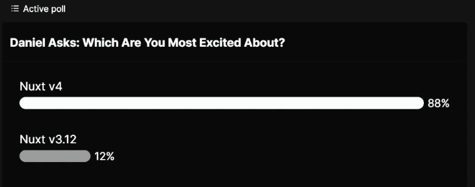

## 问答

非常感谢。今天能来到这里真是太高兴了。首先，让我们试着讨论一下投票结果。我们可以看到，之前有 88% 的人对 Nuxt 感到兴奋。但我认为有 12% 的人对 3.12 感到兴奋。那么您对此有什么期望？

嗯，老实说，我以为可能会有更多人对 3.12 感到兴奋。因为老实说，这就是我们要发布的东西……公平地说，在我演讲之前问这个问题是不公平的，因为希望演讲结束后，您现在会认为 3.12 可能是这些功能即将推出的地方。所以这就是我……我想我对 3.12 非常兴奋。这就是我想要的……我希望看到更多人对此感到兴奋。因为……是的。是的，但实际上，我也是这么想的。现在它就像是面向未来的 Nuxt 4，新版本将稳定我们拥有的一切。所以这真的很酷。

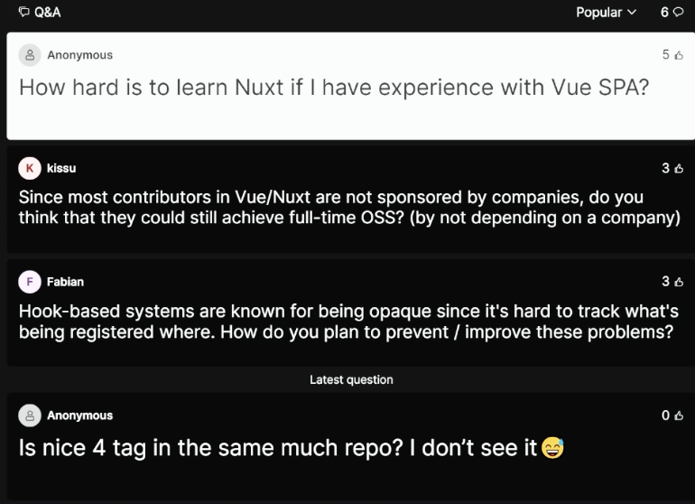

让我们试着讨论一下观众提出的一些问题。调查最多的问题是，如果我有 Vue 单页应用经验，学习 Nuxt 有多难？你怎么看，丹尼尔？

所以大多数情况下，如果你想将现有的 Vue 单页应用迁移到 Nuxt，你需要做的就是删除代码。所以如果你有一个 app.vue 文件，你基本上可以把它复制过来。如果你有基于页面的路由，你可以把它们复制到你的页面目录中。Nuxt 在顶层做了很多事情。但这几乎都是可选的。所以如果你不使用它，如果你只有现有的设置，它应该可以正常工作。如果你遇到任何问题，请联系我，因为我很乐意提供帮助。但我认为这应该是一个非常非常直接的迁移。然后你基本上可以根据需要使用其他 Nuxt 功能。所以这应该是一个非常直接的迁移。它添加了一些东西，而不是不应该禁用你正在使用的任何功能。

有道理。是的。让我们看看问这个问题的人是否可以尝试一下，然后让我们知道进展如何。

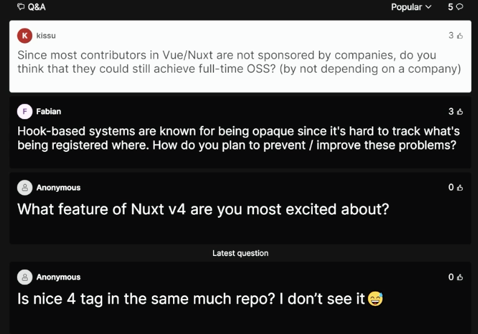

实际上，我们还有一个 Kishu 问的问题。由于 Vue 和 Nuxt 中的大多数贡献者都没有得到公司的赞助，你认为他们是否仍然可以通过不依赖公司来实现全职开源软件？

当然。我的意思是，我想说的一件事是，你知道，如果你在开源领域工作，无论你通过什么途径让它发挥作用都是好的。所以我不想对它是如何运作的做出任何判断。我们都在以许多不同的方式前进。所以如果这是由一家公司赞助的，那也很好。碰巧框架是独立的，我认为这很棒。这并不意味着个人贡献者需要这样做。那么，全职从事开源工作是否可行？我认为是的。对我来说是可能的，我认为对其他人来说也是可能的。但我不会把这作为主要目标。我的意思是，我并不渴望全职从事开源工作。我这样做，我很高兴我能做到，但这不是我想要实现的目标。我想说，对于任何全职从事开源工作的人来说，你的目标可能不如追求你真正喜欢的事情并尽可能多地做那样令人满意。我认为你更有可能通过这种方式获得赞助。

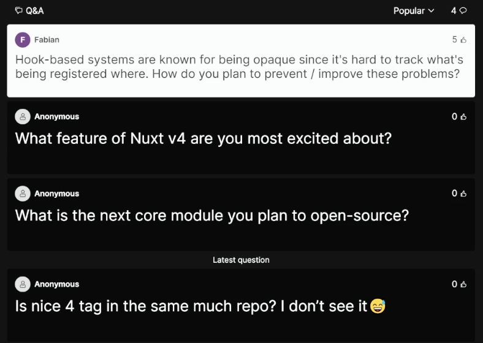

好吧，让我们继续下一个问题。所以我们有一个关于谈话主题的问题，他们问基于钩子的系统以不透明而闻名，因为很难跟踪正在注册的内容，或者你计划如何在未来四年内防止和改善这些问题？

因此，我们目前正在做的事情之一是在 DevTools 中公开钩子。我想我有一张小截图。现在，它没有提供钩子注册位置的好处。但是，JavaScript 中最令人惊奇的、正在广泛使用的功能之一是异步本地存储。我们已经在 Nuxt 中使用它来跟踪渲染页面时发生的日志。因此，您会注意到，如果您有在渲染页面时触发的服务器端日志，我们会将它们打包并记录在控制台上。我们可以使用相同的技术来跟踪钩子的添加或注册位置，可能是在哪个模块中，也可能是在应用程序的哪个部分中。因此，如果出现行为不当的钩子，我们实际上可以将其追溯到其来源。这将是我希望看到的事情，至少在 DevTime 中是这样的。很好。这真的很酷。好吧，Backstage 告诉我时间已经到了。非常感谢 Daniel 的所有回答。当然，我很确定，我们在 Discord 中已经为您回答了其他问题。所以谢谢你。我会去的。再见。谢谢。
