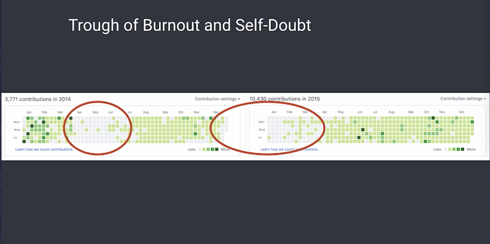
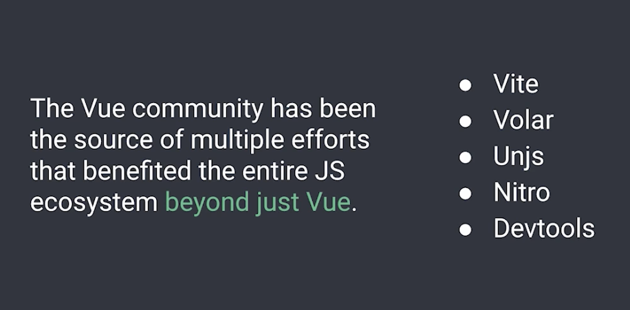
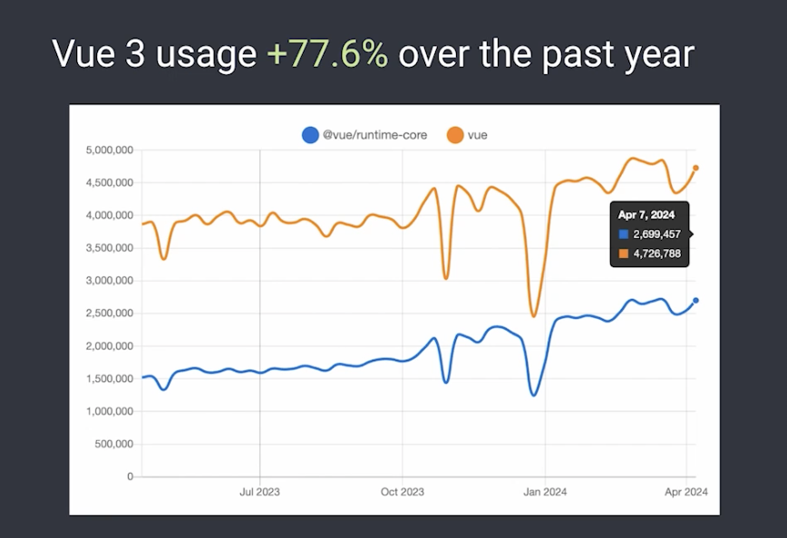
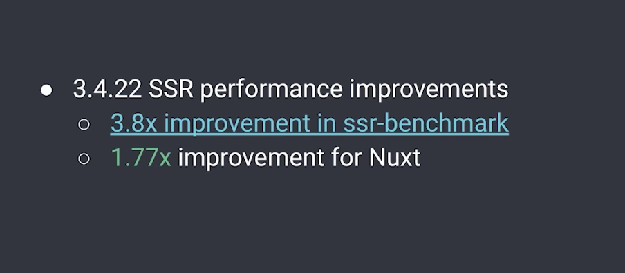

# Vue 10 年：过去与未来

Vue 于 2014 年首次公开发布，今年已经 10 岁了！在这次演讲中，我们将一起回顾它如何从不起眼的起点开始变化和发展，讨论一些挑战和经验，以及我们如何看待它的未来。

大家好，欢迎来到 Vue.js Live 2024。我是 Evan Yew，Vue 和 Vite 的创建者。今天，我非常高兴与大家分享 Vue.js 的 10 年回顾。是的，你没听错。Vue 已经有 10 年的历史了。

听起来前端世界已经存在很长时间了。当然，Vue 不再是一项新技术，但在这次演讲中，我们将了解它的一些历史，还将了解我们正在对 Vue 做些什么，以保持它的活力。

好的，让我们开始吧。首先，Vue 的一些数据。以下是 GitHub 上 Vue.js/Vue 和 Vue.js/Core 的综合统计数据。我们今天在两个存储库中有超过 9,326 次提交。我们已经发布了 493 多个版本的 Vue。

我们在全球拥有超过 200 万用户、25 万个 GitHub 星星、每周 490 万次 npm 下载量，以及 jsdeliver 上每月超过 10 亿次 CDN 请求。

我们还想谈谈 Vue 的一些技术影响，因为尽管每天都在使用它，但今天的很多新用户可能并不熟悉它的历史，以及 Vue 最初的想法是什么，以及哪些想法影响了其他技术，对吧？早在 2014 年，Vue 就是第一个实现基于深度跟踪的反应性的 JavaScript 框架。

现在，基于跟踪的反应性是一种可以追溯到 Knockout.js 和 Meteor Tracker 的范式。这是一项比 Vue 更古老的技术，但 Vue 是第一个将这一原则应用于深层对象的框架。

因此，你可以让一个对象发生变异，而一切都会正常运作，而 Vue 是第一个做到这一点的框架。Vue 也是第一个将单文件组件的理念与构建工具相结合的框架。单文件组件的理念并不一定是新的。事实上，我在 Google 工作时有一个内部项目，它是我的灵感来源。

但 Vue 是第一个将这个想法与名为 Browserify Backend 的构建工具相结合的框架，后来，我们还支持了 Webpack。但单文件组件与构建工具结合的能力，其独特之处在于我们可以在这些脚本块或模板或样式块中使用其他语言。

所以你当时可以使用 CoffeeScript，今天你主要可以使用 TypeScript，你可以使用 SAS、LASP、预处理器，你可以使用 PostCSS 来处理你的 CSS，你甚至可以使用 POD（当时称为 Jade），在文本中使用模板的不同模板。Vue 是第一个支持这种用法的框架。

Composition API 是第一个将 Signo 样式的反应性（也是我们之前讨论过的基于跟踪的反应性）与现代组件模型相结合的框架。因此，您可以在脚本设置语法中使用 Vue refs 和现代组件模型，Vue 是第一个将该模型实际结合到我们今天都熟悉的模型组件模型中的框架。

Vue 也是第一个以反应性转换的形式探索由编译器驱动的 Signos 反应性糖的框架，这是一个实验性的提案，我们运行了一段时间，但最终我们认为这不是 Vue 的最佳方向。

然而，我们实际上非常高兴地看到这个方向正在被其他框架采纳，例如 Svelte 5，它实际上也在探索这个方向。所以它可能更适合 Svelte，但我们相信 Vue 凭借其自己的范式处于一个相当不错的位置。

现在，Vue 在支持模板和虚拟 DOM 渲染功能方面也是独一无二的。这实现了非常好的平衡，既为喜欢模板语法的用户提供了熟悉感，又为喜欢 HTML 样式模板的用户提供了更流畅的开发体验。但同时，在高级用例和库作者中，您仍然可以跳过模板层并直接手动编写渲染函数，这为您在执行高级功能时提供了更大的灵活性。

最后，Vue 率先提出了渐进式框架的概念，即框架不是单片的，框架可以由单独的部分组成，但具有连贯的设计，您可以根据对框架的需求逐步采用和使用。我相信 Vue 是第一个率先提出这个想法的，也是唯一一个真正很好地实现了这个想法的。

现在，回顾过去，以下是 Vue 所做的简要时间表。我们在 2013 年发布了第一个版本，名为 Vue.js。那是 Vue.js 这个名字第一次出现。但公开发布是在 2014 年 2 月。

很长一段时间以来，它都是我的一个副业，我花了很长时间来完善它，直到我感到满意，并有信心与世界分享它。2015 年 10 月，我们发布了 1.0 版。为了推动它向 1.0 版迈进，我实际上休息了很长时间。

在 1.0 版之后，模板语法基本确定了。在 2.0 版中，我们进行了重大重写，我们实现了使用虚拟 DOM 的渲染，并于 2016 年 10 月发布。2016 年也是我开始全职开发 Vue 的一年。现在，Vue 3 的工作实际上是在 2018 年 9 月开始的。那是很久以前的事了。

但是，由于变化的规模及其对生态系统的影响规模，3.0 的开发时间比预期的要长得多。Vue 2 已经得到了非常广泛的应用，3.0 的开发工作对我们来说是一个学习过程。其中肯定有起有落，有错误，也有教训。

因此，3.0 于 2020 年 9 月软启动，并最终于 2022 年 1 月成为默认版本。整个过程花了几年时间。但我们真的很高兴生态系统终于接受了 Vue 3，我们稍后会看到一些统计数据。因此，Vue 2 已于 2023 年 12 月正式终止使用。我们非常鼓励仍在使用 Vue 2 的用户考虑升级，或者您应该寻求相关支持以保持您的 Vue 2 版本正常运行。

现在，这真的是一个怀旧的时刻，我仍然在某处发布这篇博客文章，谈论 Vue.js 发布的第一周，我很高兴在第一周就获得了几百个 GitHub 星星，这对我来说是一个很大的成就。

但在首次发布之后，是的，有一些时刻，有起有落，现实打击了我。所以我不知道是否有人听说过技术采用周期。每当一项新技术出现时，都会有一个技术触发器。有一个膨胀的期望高峰。然后是幻灭的考验，启蒙的斜坡，最后你到达生产力的高原。现在，我想说，随着时间的推移，当你进入开源时，有一个非常相似的过程。现在，当你第一次进入开源时，你会感到非常兴奋，兴奋和产出的高峰。当我推动首次发布时，我几乎每天都在 Vue 上工作，也在推动 1.0，推动 2.0。那是我可以整天致力于此的时刻。

但当出现错误、问题，或者有人批评我们所做的设计决策时，我们也会感到精疲力竭和自我怀疑。我必须随着时间的推移适应这些评论。我必须了解哪些决策才是真正正确的。你需要很长时间才能意识到你无法取悦任何人，有时你不得不做出艰难的决定。最终，我们到达了重新平衡的斜坡，并达到了生产力的高原。

但显然，当你需要度过这些精疲力竭的时期时，会面临挑战。这就是我所说的鸿沟。对于许多开源维护者来说，跨越这个鸿沟是你必须经历的主要挑战。

如果你正在从事开源项目，肯定会有这样的时刻。你要知道，你必须学会​​调整如何应对这种情况，你需要学会在你的目标、你的生活、你的工作和开源之间找到平衡。我真的希望每个从事开源工作的人都能走出鸿沟，达到这种平衡的生产力高原。所以这里有一些图表。如果你看看我的 GitHub 贡献图表，你会发现肯定有倦怠和自我怀疑的时刻。

所以我想对此持非常开放的态度。我想让大家知道，即使在一些最成功的开源项目背后，维护者也是人，对吧？所以他们会有需要调整的时候。有时他们需要休息一下，他们需要寻找灵感，他们需要去充电并再次找到动力。所以这种情况发生，这是正常的。我想让开源维护者对此正常化，这样我们就不会感到压力，我希望看到很少有维护者同事精疲力竭。

如果没有 AmazingView 社区的支持，我们不可能完成这一目标。所以我在这里说了三次这个词，因为它非常重要。如果我是史蒂夫……咳咳！抱歉。删掉这部分。好的。谢谢。我在这里说了三次这个词，因为它非常重要。

View 社区是我最引以为豪的一件事。View 是关于人的，它是我所知道的最多元化、最包容、最热情、最开放的社区，充满了令人惊叹和美妙的人。如果没有社区，我永远不会有精力和毅力继续致力于 View 并突破那些鸿沟或倦怠期。所以如果没有你们，View 就不会有今天。因此，我向我们的团队成员、贡献者、生态系统库维护者、社区合作伙伴、会议和聚会组织者、View 倡导者和赞助商表示最深切的感谢。

现在，让我们谈谈可持续性和独立性，我认为这也是 View 真正独特的另一个方面。View 是目前唯一保持独立的主流框架，即不由单一公司主导。

你可能会问，为什么这很重要？我认为原因是我们不受单一实体的财政支持的限制，这意味着我们不会因为一个大支持者希望我们走某种路而改变技术方向，对吗？我们所有的赞助商、所有的财政支持者都是分散的，他们对项目的技术决策没有很强的影响力。

因此，该项目能够完全考虑用户的利益，每个用户的意见都会得到平等的考虑。View 生态系统的另一个重要方面是协作思维。由于独立性，View 生态系统是独一无二的，它催生了许多值得注意的努力，最终受益的不仅仅是框架本身。如果一切都是为了利益，情况就会大不相同。

View 社区是多项努力的源泉，这些努力使整个 JavaScript 生态系统受益。仅举几例，我们有 Vite、Bolar、Un.js、Nitro 和一些正在开发的跨框架开发工具。所有这些都来自 View 和 Vite 社区成员。

最后，让我们来看看 View 的现状和未来。在过去一年中，View 3 的使用量增长了 77.6%，这对于 View 3 来说是一个非常强劲的增长，而且它还占据了 View 总下载量的更大比例，现在占 MPM 总使用量的 58.3% 以上。

许多传统的 View 2 应用程序显然仍在运行，人们仍将继续使用它。因此，很高兴看到 View 3 的百分比随着时间的推移而不断增长。现在，3.4 是当前的次要版本，于 2023 年 12 月发布。3.4 中的主要旗舰功能是完全重写的姿势，速度比以前快两倍。

因此，我想强调的一点是，即使 View 是一个已有 10 年历史的框架，View 3 本身也已有近 6 年的历史，代码库也有 6 年的历史，但我们仍然发现这里和那里有很多改进空间。我们始终会继续挖掘这些机会，为我们的用户体验寻找性能提升和体验改进。

现在，3.4 还提供了一个更高效的反应系统，减少了计算机属性中大量不必要的计算。我们还稳定了定义模型并发布了 VBind（同名简写）。这两者都极大地改善了开发人员的体验。

现在，3.4 中最近最值得注意的变化是在最近的一个补丁中，我们发布了一些非常重要的服务器端渲染性能改进。现在这主要是由 Twitter 上流传的公共基准测试引发的。

现在这主要是由 Twitter 上流传的公共基准测试引发的。通过检查基准测试，我能够识别出一些优化导致 View 在原始基准测试中表现不佳的情况。

因此，现在这些变化已经出现在 3.4.22 中，我们看到仅 View 的基准测试就提高了 3.8 倍。对于 Nuxt，还有一个非常非常明显的 1.77 倍的改进。Daniel 还提交了一个拉取请求，优化了使用异步数据时的 Nuxt 使用情况，避免在获取数据时使用深度数据结构，这将成为 Nuxt 4.0 中的默认设置，这再次大大提高了基准测试中的性能。因此，如果您正在使用 Nuxt，或者您正在使用带有 View 的服务器端渲染或其他方法，请确保升级到最新版本。

那么让我们来谈谈 3.5 及以后版本的计划。首先，我们将提供更多反应效率改进。因此，GitHub 上当前的次要分支是 3.5 的开发分支，已经合并了两个非常重要的反应系统拉取请求。PR 编号 10407 再次重写了反应系统。因此，内部跟踪数据结构已重构，内存使用率提高了 56%。

因此，内存使用非常重要，因为在数据密集型应用程序中，垃圾收集实际上会降低性能。因此，使用更少的内存对于高度动态的应用程序大有裨益。

现在，9511 在跟踪大型反应数组时可提供 10 倍的增益。现在，当您拥有非常非常大的数组并将其放入深层数据结构中时，这实际上是相当常见的性能瓶颈来源。现在，这个 PR 实际上提供了一种更智能的方法来避免在遍历这些较大的数组时跟踪不必要的依赖关系，并在这些情况下提供非常非常显着的增益。

我们还考虑将反应性 props 稳定到结构中，因为我们在 RFC 讨论中看到了非常积极的反馈。但在最终这样做之前，我们鼓励您在 RFC 中发表意见，以帮助我们做出最终决定。2.5 中还计划进行 SSR 改进，但主要改进是稳定 Suspense。

已经处于实验阶段很长时间了，我们非常期待稳定它。然后是一些小型 API，例如 useID，生活质量改进，例如内置 HTML 嵌套有效性检查，可帮助您捕获意外将 div 放在 pea 内或将 pea 放在 div 内的情况。我们还将研究使用异步组件作为边界的内置惰性补水的可能性。

现在，很多人可能对 vapor 模式的状态感到好奇。现在，我们在 vapor 模式方面取得了很大进展。如果您不知道的话，它已经可以运行以执行 MVC。所以您可以在操场上尝试一下。

所以，如果您稍后下载幻灯片，您应该能够找到链接并尝试一下。或者您可以转到 GitHub 上的核心 vapor 存储库并查看它。您应该能够在那里找到链接。vapor 模式的当前阶段重点是组件实现。好消息是我们快到了。

所以如果你看看这里的链接问题，我们已经涵盖了组件的很多部分，只剩下一些事情了。一旦我们完成组件，下一阶段的重点将是 vapor 和虚拟 DOM 之间的互操作，即能够编译和嵌入 vapor 组件到您当前的应用程序中。这将是下一个重要的里程碑。

Vapor 模式是团队的努力。它由 Kevin 领导，我们有很多优秀的贡献者帮助 vapor。看到这一点真的很令人兴奋，因为这是一个非常先进的实现，我很高兴看到，通过设定最初的方向，很多社区成员正在加紧帮助我们在当前的 Vue 核心工作的同时开展 vapor 工作。

最后，我们希望获得更多的开发经验。因此，我在 Vue 之外所做的一些工作是通过投资较低级别的工具链来进一步改进 Vite。很多人可能都知道，我们已经启动了一个名为 Rodown 的新 Rust 软件包，旨在在未来支持 Vite。Rodown 现在是开源的，我们看到了出色的性能。

我们目前已经完成了基本捆绑、基本块拆分和源映射支持。在实现所有这些之后，我们能够运行一些基准测试，目前我们的速度比 ES 构建快 1.5 到 2 倍，这非常令人印象深刻。我们还在为 OXC 做出贡献，OXC 是较低级别的语言工具链，基于 Rust 的 JavaScript，我们在 Rodown 内部使用。我们与 OXC 团队保持着非常紧密的合作关系。

我们还有团队成员致力于在 Nuxt 和 Vue 开发工具之间提取可重用层，并可能在未来使用相同的工具包来支持其他类型的开发工具。并且我们也对VolR V2，即Vue语言工具进行了持续的改进。

因此，VolR V2 附带了对混合模式的支持，这使我们能够使用单个 TypeScript 语言服务器来支持推断整个项目，包括 TS 和 Vue 文件。

现在，这在内存和性能方面非常非常高效，但是存在许多极端情况，并且仍有一些我们需要稳定的粗糙边缘。但我们在这个方向的表现上看到了非常非常大的希望。

好的，最后是原生 Signos。这是我想额外谈一下的事情。如果您不知道，有一个 TC39 提案将 Signos 添加为原生 JavaScript 语言功能，现在处于第 1 阶段。如果您不熟悉该术语，Signos 是类似于 Vue refs 的反应性原语。

因此，如果您使用过 Vue refs，那么您就使用过 Signos。 Vue 团队从一开始就参与了该提案的讨论，我们正在尝试使用原生 Signal 驱动的 addVue 斜线反应性版本的可能性，这是为 Vue 提供动力的低级反应性引擎。

通过使用原生 Signos，我们应该能够减少需要维护和打包的代码，因此在 Vue 代码库中需要维护的代码更少，需要发送给最终用户的代码也更少。

由于原生 Signos 可以用原生语言实现，因此性能和内存消耗应该会更好，并且有可能实现跨框架互操作，例如跨框架 Vue 使用。如果我们可以在多个框架中使用 Vue，那将是一个梦想。

因此，我们期待未来能够实现这一点，并且我们正在与提案中的其他参与者合作，以确保在实际实施时实现高度可互操作的实现。今天就讲到这里，但我们还远远没有完成。

Vue 已经有 10 年的历史了，但还有很多事情要做。在 Vue 2.3 过渡期间，我们经历了一段分裂时期，但现在 Vue 2 已正式结束生命周期，Vue 3 生态系统正蓬勃发展，拥有比以往更高质量的实用程序、组件库、自定义渲染器和元框架。我们将在未来几年提供更多支持。

我们经历了 JavaScript 炒作周期。Vue 是为了帮助您完成工作，而不是向您推销付费服务。我们很自豪地说我们坚持这一说法。我们可能不是当今最流行的解决方案，但我们会一直存在，并且我们将始终不断改进，一次做一件事。谢谢。

## 问答环节

那么您当前的版本和构建工具框架是什么？我看到 52% 的人仍在使用 Vue 3 和 Vite SPA。排名第二的是 Nuxt 3。这很好，至少截至今天，每个人都已迁移到 Vue 3。不幸的是，不是每个人都这样。我确实看到 Vue 2 SPA 占 9% 左右。哦，它刚刚被 Vue 3 超越，其他设置也是如此。不错。16%，仍然是 Vue 2。我的意思是，它仍然比一年前好，所以，是的。是的。好的，现在让我们回到问答环节，最后，为 Vue4 感到抱歉。

你好，我是一名 React 开发人员。最近，我开始学习 Vue.js。所以我的问题是如何成为 Vue 专家？你对 Vue.js 初学者有什么建议？

当然，所以我认为这应该会更容易一些，因为你已经了解 React。Composition API 与 React hooks 有很多相似之处。所以你应该感到宾至如归。事实上，在跟踪依赖项、传递依赖项数组方面应该不用担心，在 Vue 中你不需要担心这些。所以我认为你要做的第一件事就是阅读文档，我认为最大的问题是——许多概念，比如状态流、组件模型，事实上，这些主流框架之间非常相似。

所以你应该很快就能掌握这些。我认为如果你想要更高级，请阅读一些源代码，例如 Vue.use 之类的库。这实际上是我真正推荐的一件事。

看看人们如何将这些常用实用程序提取到可重用的 Vue 可组合项（又名钩子）中。我认为这是更好地了解 Vue 反应性工作原理的一种非常好的方法。

好的。所以投票最多的问题是，第一个问题已经存在很长时间了，但仍被警告为实验性的，可能会发生变化。这仍然正确吗？

它仍然是实验性的。我们计划很快稳定它。事实上，我认为 API 不会有太大变化。所以主要是确保它 - 如果你想改变任何东西，它可能不会对最终用户产生太大影响。

你可能会有一个广泛的 ETA 吗？比如 2025 年或年底？今年。希望是今年。很好。也许在 VS Code 上快速更新 Vue.js 插件。

是的。所以我知道最近的 2.0 版本存在一些用户遇到的问题。
因此，有些问题实际上是由于 VS Code 中的错误造成的。然后最近出现了一个问题，如果您 - 检查您的 VS Code Vue 扩展版本。如果它是 2.0，则它停留在旧版本上。执行新的搜索以安装旧版本并安装 2.0.14 或更高版本，以便您获得持续的自动升级。

因此，我们正在尝试与 VS Code 联系以解决此问题。所以它甚至不像 Vue.js 问题。完美。所以再次感谢您提出所有这些问题，Evan。改天再见，祝您有美好的一天。再见。谢谢。你也是。再见。