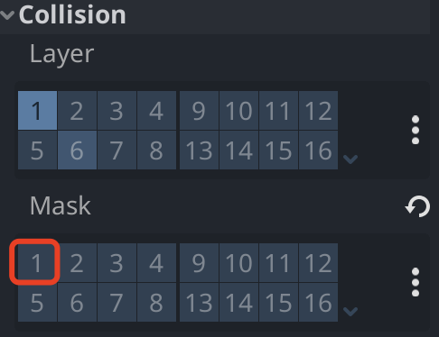

# godot 学习

Godot 是一款通用的 2D 和 3D 游戏引擎，旨在支持各种 的项目。您可以使用它来创建游戏或应用程序，然后可以发布 在桌面或移动设备上，以及在网络上。

## 生命周期

- \_ready()：当节点准备好在场景中使用时。通常用于初始化和准备节点的操作。此时，节点已经在场景树中，并且可以执行初始化的工作。

- \_enter_tree()：当节点首次进入场景树时。通常在这里执行与场景树关联的初始化操作。例如，你可以在这里连接信号或执行其他需要场景树存在的操作。

- \_exit_tree()：当节点从场景树中移除时。通常在这里执行清理和资源释放操作。例如，你可以在这里断开信号连接或释放其他资源。

- \_process(delta)：在每一帧的游戏循环中被调用。这是一个适合进行常规游戏逻辑更新的地方，因为它以每帧的频率被调用。

- \_physics_process(delta)：在每一帧的物理循环中被调用。用于处理与物理相关的逻辑，比如移动、碰撞检测等。通常用于需要与物理引擎交互的游戏逻辑。

- \_draw()：用于自定义绘制节点的外观。在这里，你可以绘制自定义的图形、粒子效果等，以定制节点的外观。这通常用于 2D 节点。

## 第一个 2D 游戏 Demo

创建一个 **Area2D** 节点对象，是一个 Godot 游戏引擎中的类，它代表一个 2D 区域，通常用于处理 2D 空间中的碰撞和交互。**Area2D** 类具有与物理交互和检测相关的方法和属性。

### 创建角色

1. extends

**extends Area2D** 是一种声明，它表示你的脚本是一个继承自 **Area2D** 的自定义类

```gdscript
extends Area2D
```

2. @export

**@export** 是一个装饰器

- 标记变量或属性，以使其在 Godot 编辑器的属性检查器中可见。
- 允许你在编辑器中为这些属性指定值，而不必在脚本中硬编码它们。

```gdscript
@export var speed = 400
```

当节点进入场景树时调用该函数，查找游戏窗口大小的好时机

```gdscript
func _ready():
	screen_size = get_viewport_rect().size
```

3. Input.is_action_pressed()

检查键盘按键，控制角色上下左右

```gdscript
func _process(delta):
	var velocity = Vector2.ZERO
	if Input.is_action_pressed("move_right"):
		velocity.x += 1
	if Input.is_action_pressed("move_left"):
		velocity.x -= 1
	if Input.is_action_pressed("move_down"):
		velocity.y += 1
	if Input.is_action_pressed("move_up"):
		velocity.y -= 1
```

4. AnimatedSprite2D

检测玩家移动，播放动画

```gdscript
	if velocity.length() > 0:
		velocity = velocity.normalized() * speed
		$AnimatedSprite2D.play()
	else:
		$AnimatedSprite2D.stop()
```

> **\$** 是 **get_node()** 的简写。所以在上面的代码中，**\$AnimatedSprite2D.play()** 等于 **get_node("AnimatedSprite2D").play()**

5. 更新位置

```gdscript
func _process(delta):
  position += velocity * delta
  position = position.clamp(Vector2.ZERO, screen_size)
```

6. 选择动画

- AnimatedSprite2D.flip_v 是否垂直翻转
- AnimatedSprite2D.flip_h 是否水平翻转

```gdscript
# 水平方向是否移动
if velocity.x != 0:
  # 选择walk动画
	$AnimatedSprite2D.animation = "walk"
  # 垂直方向不翻转
	$AnimatedSprite2D.flip_v = false
	# 水平方向根据x的值翻转
	$AnimatedSprite2D.flip_h = velocity.x < 0
elif velocity.y != 0:
	$AnimatedSprite2D.animation = "up"
	$AnimatedSprite2D.flip_v = velocity.y > 0
```

7. signal

**signal** 是一种用于创建自定义事件的机制。**signal** 允许你定义和触发自定义事件，以便在游戏中的不同节点之间进行通信和响应。

生命了一个名为 **hit** 的自定义事件，当玩家发生碰撞时，执行 **hit.emit()** 通知响应，为结束游戏做准备。

```gdscript
signal hit
```

8. \_on_body_entered

**\_on_body_entered** 是 **Area2D** 或 **RigidBody2D** 自带的信号处理函数，用于处理物理碰撞事件。

```gdscript
func _on_body_entered(body):
  # 隐藏玩家节点
	hide()
  # 通知hit事件，结束游戏
	hit.emit()
	$CollisionShape2D.set_deferred("disabled", true)
```

为了防止多次出发 hit 事件，发生碰撞之后应该禁用玩家的碰撞。

这里不能直接对 **disabled** 赋值，因为不能在物理回调上更改物理属性，需要使用 **set_deferred** 进行异步更改

```
# 异步执行属性更改，表示碰撞发生
# 必须异步执行，不能在物理回调上更改物理属性
$CollisionShape2D.set_deferred("disabled", true)
$CollisionShape2D.disabled = true
```

### 创建敌人

1. RigidBody2D

2D 物理实体，它不能直接控制，你必须对它施加力（重力、脉冲等），物理模拟将计算由此产生的运动、旋转、对碰撞的反应，并影响其路径中的其他物理物体。

- 添加节点
  - AnimatedSprite2D 包含多个纹理作为动画播放的帧的精灵节点。
  - CollisionShape2D 碰撞检测
  - VisibleOnScreenNotifier2D 检测节点扩展数据块何时在屏幕上可见。

在 RigidBody2D 的 Collision 取消 Mask，将确保敌人节点不会相互碰撞



2. 选择动画

获取动画名，随机播放

```gdscript
extends RigidBody2D

func _ready():
	var mob_types = $AnimatedSprite2D.sprite_frames.get_animation_names()
	$AnimatedSprite2D.play(mob_types[randi() % mob_types.size()])
```

1. VisibleOnScreenNotifier2D

连接 screen_exited 信号，检测节点已经离开屏幕时，删除自己。

```gdscript
func _on_visible_on_screen_notifier_2d_screen_exited():
	queue_free()
```

### 游戏主场景

```gdscript
extends Node

# 向编辑器导出一个变量，在编辑器中设置为 mob 场景
@export var mob_scene: PackedScene
var score

# 结束游戏，连接玩家节点的hit信号
func game_over():
	$ScoreTimer.stop()
	$MobTimer.stop()
	$HUD.show_game_over()

# 游戏开始，连接开始button
func new_game():
	get_tree().call_group("mobs", "queue_free")
	score = 0
	$Player.start($StartPosition.position)
	$StartTimer.start()
	$HUD.update_score(score)
	$HUD.show_message("Get Ready")

func _on_score_timer_timeout():
	score += 1
	$HUD.update_score(score)

func _on_start_timer_timeout():
	$MobTimer.start()
	$ScoreTimer.start()

func _on_mob_timer_timeout():
	# 创建一个Mob场景的新实例
	var mob = mob_scene.instantiate()

	# 在Path2D上选择一个随机位置
	var mob_spawn_location = get_node("MobPath/MobSpawnLocation")
	mob_spawn_location.progress_ratio = randf()

	# 设置敌人的方向垂直于路径方向
	var direction = mob_spawn_location.rotation + PI / 2

	# 将敌人的位置设置为随机位置
	mob.position = mob_spawn_location.position

	# 在方向上添加一些随机性
	direction += randf_range(-PI / 4, PI / 4)
	mob.rotation = direction

	# 为敌人选择速度
	var velocity = Vector2(randf_range(150.0, 250.0), 0.0)
	mob.linear_velocity = velocity.rotated(direction)

	# 通过将其添加到主场景中来生成敌人
	add_child(mob)
```
