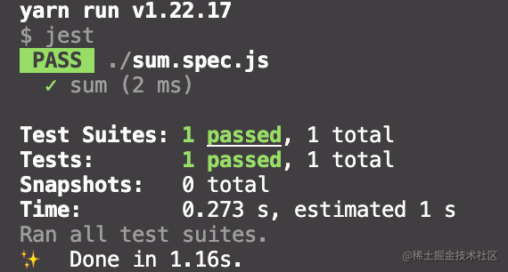
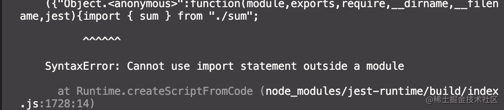
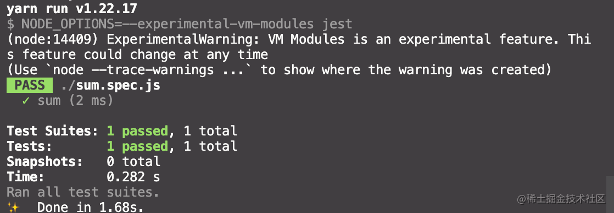
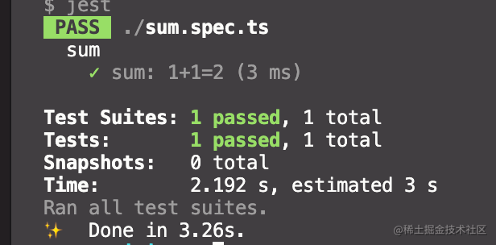

# 初学 jest，如何配置支持 esmodule、ts

## 基础使用

- 安装 jest

```
yarn add jest -D
```

- 配置 package.json

```json
{
  "scripts": {
    "test": "jest"
  },
  "devDependencies": {
    "jest": "^27.5.1"
  }
}
```

- 测试代码

```js
// sum.js
module.exports = function sum(a, b) {
  return a + b;
};

// sum.spec.js
const sum = require("./sum");

test("sum", () => {
  expect(sum(1, 1)).toBe(2);
});
```

- 测试

```
yarn test
```

没有问题



## 配置支持 esmodule

未做任何配置，直接将导入导出改为 esmodule 将会出现这样的错误



[官方文档](https://jestjs.io/docs/ecmascript-modules)

只需要在 package.json 中一点配置即可支持 esmodule

```json
{
  "license": "ISC",
  "type": "module",
  "scripts": {
    "test": "NODE_OPTIONS=--experimental-vm-modules jest"
  },
  "devDependencies": {
    "jest": "^27.5.1"
  }
}
```

允许测试成功，不过会有一个提示说`VM Modules是一个实验特性`



## 配置支持 ts

除了 jest 需要安装`@types/jest` `ts-jest` `typescript`这三个包

```
yarn add ts-jest @types/jest typescript -D
```

- 配置文件`jest.config.js`

```js
module.exports = {
  preset: "ts-jest",
  testEnvironment: "node",
};
```

- 配置`tsconfig.json`

没有 esModuleInterop 属性会又一些提示，也能跑，package 里面正常写`"test": "jest"`就行

```json
{
  "compilerOptions": {
    "esModuleInterop": true
  }
}
```

- 测试代码

```ts
// sum.ts
export function sum(a, b) {
  return a + b;
}

// sum.spec.ts
import { sum } from "./sum";

describe("sum", () => {
  it("sum: 1+1=2", () => {
    expect(sum(1, 1)).toBe(2);
  });
});
```

- 运行测试

```
yarn test
```

完美


