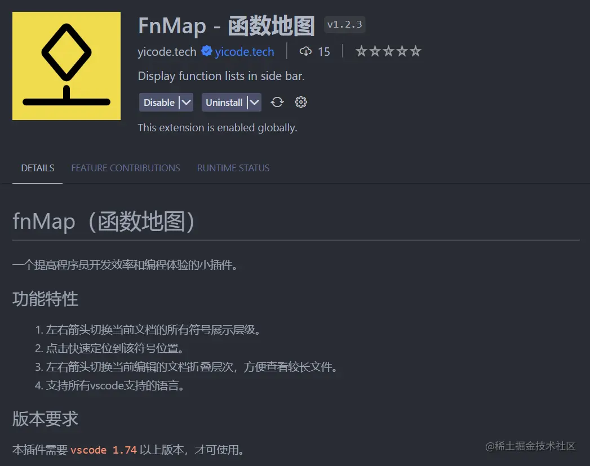
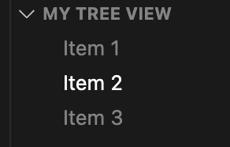
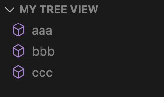

# 利用 chatgpt 开发一个 js 变量树展示插件

有个 chatgpt 之后，写代码真的变得很方便，很多自己不熟悉的代码，直接问 chatgpt 就能得到相对准备的答案，虽然有时候可能不会 100%准确，但只需要少量需改便可以实现想要的效果。chatgpt 可以有效的帮助我们去开发一个不太熟悉的应用。

前几天逛掘金的时候看到一个[FnMap（函数地图），程序员提效神器](https://juejin.cn/post/7259923130733690941)



主要功能就是展示 vue 文件的 script，template，style 结构树，如下图，还是挺好用的。


于是想自己模仿一个自用。有实力可以支持一下作者，原作者做了更好的兼容。因为每个人的代码格式可能会有些不同，我这里实现的只适用于我自己的，并且功能也没有这个优秀。

我之前是没有写过 vscode 插件的，所以直接去问 chatgpt，真的很方便，即使你完全不知道 vscode 插件提供的 api 也没有关系。

好的，开干！

## 过程

首先，直接问 chatgpt：“怎么制作一个 vscode 插件”，跟着回答我们先创建一个 vscode 插件项目。


然后，问 chatgpt：“vscode 插件怎么创建一个侧边工具栏”，下面是 chatgpt 给我们的代码，

```js
const vscode = require("vscode");

// 定义一个树视图提供者
class MyTreeDataProvider {
  getTreeItem(element) {
    return element;
  }

  getChildren() {
    // 返回一个包含树视图项目的数组
    return [
      new vscode.TreeItem("Item 1"),
      new vscode.TreeItem("Item 2"),
      new vscode.TreeItem("Item 3"),
    ];
  }
}

// 激活插件
function activate(context) {
  // 创建树视图
  const myTreeView = vscode.window.createTreeView("myTree", {
    treeDataProvider: new MyTreeDataProvider(),
  });

  context.subscriptions.push(myTreeView);
}

exports.activate = activate;
```

这里因为我们会得到一个错误 “No view is registered with id: myTree”，因为没有在 **package.json** 中配置 **contributes.views**，没关系，直接问。


于是我们在资源管理器下得到了这样一个树结构，很好，很顺利！



没有技巧，直接大白话说出我们的需求：“我想要获取当前文件的方法名设置为 TreeItem”


贴出 chatgpt 给的代码，这里已经实现了将 **函数名** 显示到 **treeItems** 中，需要注意并没有实现 **findMethodNamesInDocument**，也就是解析 **document** 获取方法名这部分代码没有给。没有关系，我们接着问，坚决不写一行代码。

```js
const vscode = require("vscode");

class MyTreeDataProvider {
  getTreeItem(element) {
    return element;
  }

  getChildren() {
    const activeTextEditor = vscode.window.activeTextEditor;

    if (activeTextEditor) {
      const document = activeTextEditor.document;
      const methodNames = findMethodNamesInDocument(document);

      const treeItems = methodNames.map((methodName) => {
        const treeItem = new vscode.TreeItem(methodName);
        treeItem.iconPath = new vscode.ThemeIcon("symbol-method"); // 可选的图标
        return treeItem;
      });

      return treeItems;
    }

    return [];
  }
}

function findMethodNamesInDocument(document) {
  // 在文档中查找方法名的逻辑，例如使用正则表达式
  // 返回一个包含方法名的数组
  const methodNames = []; // 替换为实际的查找逻辑
  return methodNames;
}

export const myTreeView = vscode.window.createTreeView("myExtension", {
  treeDataProvider: new MyTreeDataProvider(),
});
```

直接问：处理 document.getText()获取方法名。chatgpt 给我们代码直接用正则表达式去获取了所有方法名。

```js
function findMethodNames(document) {
  const text = document.getText();
  const methodRegex = /function\s+(\w+)/g; // 此正则表达式匹配函数名，您可以根据需要调整

  const methodNames = [];
  let match;
  while ((match = methodRegex.exec(text))) {
    methodNames.push(match[1]);
  }

  return methodNames;
}
```

很好，已经可以获取到方法名，当然，chatgpt 这里的解析十分的简单，面对稍微复杂一点的情况就完全不行了。但是没关系，解析 document 这件事可以我们后面自己在进行修改。咱先把功能问完，再改逻辑。



简单直接：我想要点击方法名跳转到对应的行数。

这里提一嘴，之所以变成 chatgpt 提供的代码变成了 ts 是因为我把我有问题的 ts 代码直接丢给 chatgpt 修改，所以 chatgpt 后面给我的都是 ts 代码。

这里实现了跳转行的具体代码就是创建了 **MethodTreeItem** ，使用 **vscode.commands.registerCommand** 注册了 **extension.goToMethod**

```ts
import * as vscode from "vscode";

class MyTreeDataProvider implements vscode.TreeDataProvider<MethodTreeItem> {
  private _onDidChangeTreeData: vscode.EventEmitter<
    MethodTreeItem | undefined
  > = new vscode.EventEmitter<MethodTreeItem | undefined>();
  readonly onDidChangeTreeData: vscode.Event<MethodTreeItem | undefined> = this
    ._onDidChangeTreeData.event;

  getTreeItem(element: MethodTreeItem): vscode.TreeItem {
    return element;
  }

  getChildren(
    element?: MethodTreeItem
  ): vscode.ProviderResult<MethodTreeItem[]> {
    if (!element) {
      // Return top-level method names here
      return this.getMethodNames();
    }

    // Return an empty array for now, as we don't have child items
    return [];
  }

  private getMethodNames(): MethodTreeItem[] {
    const activeTextEditor = vscode.window.activeTextEditor;
    const methodItems: MethodTreeItem[] = [];

    if (activeTextEditor) {
      const document = activeTextEditor.document;
      const methodNames = this.findMethodNamesInDocument(document);

      methodNames.forEach((methodName, index) => {
        const treeItem = new MethodTreeItem(methodName, index);
        methodItems.push(treeItem);
      });
    }

    return methodItems;
  }

  private findMethodNamesInDocument(document: vscode.TextDocument): string[] {
    // 在文档中查找方法名的逻辑，例如使用正则表达式

    const text = document.getText();
    const methodRegex = /function\s+(\w+)/g; // 此正则表达式匹配函数名，您可以根据需要调整

    const methodNames: string[] = [];
    let match;
    while ((match = methodRegex.exec(text))) {
      methodNames.push(match[1]);
    }

    // 返回一个包含方法名的数组
    return methodNames;
  }

  refresh(): void {
    this._onDidChangeTreeData.fire(undefined);
  }
}

class MethodTreeItem extends vscode.TreeItem {
  constructor(label: string, lineNumber: number) {
    super(label, vscode.TreeItemCollapsibleState.None);
    this.command = {
      title: "Go to method",
      command: "extension.goToMethod",
      arguments: [lineNumber],
    };
  }
}

export const myTreeView = vscode.window.createTreeView("myTreeView", {
  treeDataProvider: new MyTreeDataProvider(),
});

vscode.commands.registerCommand(
  "extension.goToMethod",
  (lineNumber: number) => {
    if (vscode.window.activeTextEditor) {
      const position = new vscode.Position(lineNumber, 0);
      vscode.window.activeTextEditor.selection = new vscode.Selection(
        position,
        position
      );
      vscode.window.activeTextEditor.revealRange(
        new vscode.Range(position, position),
        vscode.TextEditorRevealType.InCenter
      );
    }
  }
);

export function activate(context: vscode.ExtensionContext) {
  context.subscriptions.push(myTreeView);
}
```
