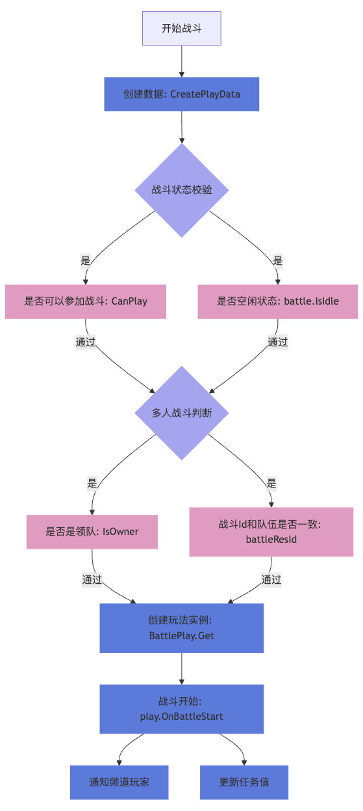

# 战斗系统

## 开始战斗

### BattleStartExecutor

开始战斗接口

```c#
[Executor(CommandId = (int)ExecutorCommand.BattleStart)]
public class BattleStartExecutor : AuthExecutor<TBattleStartInput, TBattleStartOutput>
{
	public BattleStartExecutor(Session session, RequestMessage message) : base(session, message) {}
	private TBattleStartOutput _output = null;
	public override TBattleStartOutput Output => _output;
	protected async override Task<ErrorCode> ExecuteAsync()
	{
		TBattlePlay playData = Input.Play;
		var config = BattleConfig.GetConfig(Input.BattleResId);
		if (config == null)
		{
			return ErrorCode.ConfigNotFound;
		}
		// 创建玩法数据
		playData = await BattlePlay.CreatePlayData(UserId, config, playData);
		var result = await BattleService.Start(UserId, Input.BattleResId, playData);
		if (result.Code != ErrorCode.Success) { return result.Code; }
		_output = result.Data;
		return ErrorCode.Success;
	}
}
```

#### TBattleStartInput

开始战斗接口参数，开启战斗主要用的是BattleResId战斗配置Id

TBattlePlay 是给具体的玩法，如爬塔、环球副本等创建带入具体玩法类时所需要的参数

```c#
public partial class TBattleStartInput
{
	[Key(1)] public int BattleResId;            // 战斗配置Id
	[Key(2)] public TBattlePlay Play;           // 玩法带入
}
// 玩法数据
public partial class TBattlePlay
{
	[Key(1)] public TBattlePata Pata;                           // 爬塔
	[Key(2)] public TBattleHuanqiu Huanqiu;                     // 环球
}
```

#### TBattleStartOutput

开始战斗接口返回数据

```c#
public partial class TBattleStartOutput
{
	[Key(1)] public TBattleRecord Record;       // 战斗录像
	[Key(2)] public TBonusPack BonusPack;       // 奖励及更新道具
	[Key(3)] public TBattle Battle;             // 战斗信息
	[Key(10)] public TBattleBusinessUserData UserData = new TBattleBusinessUserData(); // 用户业务逻辑数据
}

public partial class TBattleBusinessUserData
{
	[Key(1)] public TAdventure Adventure;     // 冒险数据
	[Key(2)] public TPata Pata;               // 爬塔数据
}
```

#### BattlePlay.CreatePlayData

创建玩法数据

爬塔需要当前层数，后面处理爬塔逻辑需要层级的数据

环球需要天气buffId，带入战斗的属性效果

```c#
public static async Task<TBattlePlay> CreatePlayData(int userId, BattleConfig config, TBattlePlay playData)
{
	switch (config.Type)
	{
		// 爬塔
		case BattleType.PATA:
			{
				// 获取起始层数
				var pata = await TPata.Get(userId);
				playData = new TBattlePlay() { Pata = new TBattlePata() { Layer = pata.Layer } };
			}
			break;
		// 环球
		case BattleType.HUANQIU:
			{
				// 根据BattleConfig计算环球今日状态
				var bufferId = THuanqiu.CreateBuffer(config.LevelId);
				playData = new TBattlePlay() { Huanqiu = new TBattleHuanqiu() { BufferResId = bufferId } };
			}
			break;
		default: break;
	}
	return playData;
}
```

#### BattleService.Start

开始战斗函数

```c#
public static async Task<Result<TBattleStartOutput>> Start(int userId, int battleResId, TBattlePlay tPlay)
{
	var result = new Result<TBattleStartOutput>();
	var userInfo = await TUserInfo.Cache.FindKey(userId);
	if (userInfo == null)
	{
		Logger.LogError($"Battle Start Failed. User[{userId}] UserInfo Not Found.");
		result.Code = ErrorCode.DataNotFound;
		return result;
	}
	// 校验是否可以参与战斗
	if (!BattleService.CanPlay(battleResId, userInfo.UserLevel.Level, userInfo.MainLevel))
	{
		Logger.LogError($"Battle Start Failed. User[{userId}] Battle[{battleResId}] Level[{userInfo.UserLevel.Level}] MainLevel[{userInfo.MainLevel}] Not Enough.");
		result.Code = ErrorCode.BattleNotEnoughLevel;
		return result;
	}
	var battle = await GetBattle(userId);
	// 非空闲状态，不可开启战斗
	if (!(battle?.IsIdle ?? true))
	{
		Logger.LogError($"Battle Start Error. User[{userId}] Config[{battleResId}] Battle[{battle.BattleId}] Status[{battle.Status}].");
		result.Code = ErrorCode.Battling;
		return result;
	}
	// 组队相关校验
	var userTeam = await TUserTeam.Get(userId);
	if (userTeam.HasTeam)
	{
		// 有队伍但非领队，无法开始战斗
		if (!userTeam.IsOwner)
		{
			Logger.LogError($"Battle Start Error. User[{userId}] In Team Not Owner.");
			result.Code = ErrorCode.BattleNotTeamOwner;
			return result;
		}
		// 有队伍但战斗Id和队伍不一致，无法开始战斗
		if (battleResId != userTeam.Team.BattleResId)
		{
			Logger.LogError($"Battle Start Error. User[{userId}] In Team BattleResId Different [{battleResId} vs {userTeam.Team.BattleResId}]");
			result.Code = ErrorCode.BattleTeamResIdDiff;
			return result;
		}
	}
	// 创建玩法实例
	var play = await BattlePlay.Get(userId, battleResId, tPlay);
	if (play == null)
	{
		Logger.LogError($"Battle Start Error. User[{userId}] Config[{battleResId}] Not Found.");
		result.Code = ErrorCode.ConfigNotFound;
		return result;
	}
	// 战斗开始
	result = await play.OnBattleStart();
	if (result.Code == ErrorCode.Success)
	{
		// 通知频道玩家
		var channelServerId = await ChatUtils.GetChannelServerId(userId);
		if(channelServerId > 0)
		{
			await ChatChannelService.RemoteNotifyTeamMsgInvalid(channelServerId, userId);
		}
		// 挑战次数+1
		await TaskCenterService.INSTANCE.UpdateTaskValue(userId, ConditionType.BATTLE, TaskValueOpType.Add, 1, (int)play.Type);
	}
	return result;
}
```

- GetBattle 用户战斗数据

```c#
public partial class TBattle
{
	[Key(1)] public int UserId;
	[Key(2)] public TBattleStatus Status;       // 状态
	[Key(3)] public int ResId;                  // BattleConfigId
	[Key(4)] public string BattleId;            // 战斗Id
	[Key(5)] public int RoomId;                 // 房间Id
	[Key(6)] public string RoomToken;           // 房间Token
	[Key(7)] public THost RoomHost;             // 房间服
}
public static async Task<TBattle> GetBattle(int userId) => await TBattle.Get(userId);
```

- BattlePlay.Get 创建玩法实例

根据battleResId获取战斗配置，根据战斗配置类型创建对应的玩法实例

```c#
public static async Task<BattlePlay> Get(int userId, int battleResId, TBattlePlay tPlay)
{
	(var config, var playConfig) = GameConfigs.INSTANCE.GetBattleConfig(battleResId);
	if (config == null) { return null; }
	BattlePlay play = null;
	switch (config.Type)
	{
		// 主线关卡
		case BattleType.MAINLEVEL: { play = new BattlePlayMainLevel(userId, config, tPlay, playConfig); } break;
		// 主线精英关卡
		case BattleType.ELITELEVEL: { play = new BattlePlayEliteLevel(userId, config, tPlay, playConfig); } break;
		// 爬塔
		case BattleType.PATA: { play = new BattlePlayPata(userId, config, tPlay, playConfig); } break;
		// 环球
		case BattleType.HUANQIU: { play = new BattlePlayHuanqiu(userId, config, tPlay, playConfig); } break;
	}
	// 数据初始化
	play.UserTeam = await TUserTeam.Get(userId);
	return play;
}
```

- OnBattleStart 开始战斗

```c#
result = await play.OnBattleStart();
```

#### OnBattleStart

开始战斗函数，根据UserTeam判断是多人战斗还是单人战斗(UserTeam在BattlePlay.Get中设置的)

```c#
public async Task<Result<TBattleStartOutput>> OnBattleStart()
{
	var result = new Result<TBattleStartOutput>() { Data = new TBattleStartOutput() };
	if (UserTeam.HasTeam)
	{
		// 有队伍，多人战斗
		result.Code = await OnTeamBattleStart();
	}
	else
	{
		// 单人战斗
		await OnSingleBattleStart(result);
	}
	// 创建result
	return result;
}
```

#### OnBattleBeforeStart

战斗开始之前，校验是否满足开始条件；

由于BattlePlay.Get时根据玩法返回了不同的子类，这里调用的就是具体玩法类中的OnBattleBeforeStart方法

- 环球

环球需要检查关卡是否解锁，消耗门票和体力

```c#
public override async Task<ErrorCode> OnBattleBeforeStart(bool isTeamBattle = false)
{
	var adventure = await TAdventure.Cache.FindKey(UserId);
	if (adventure == null) { return ErrorCode.DataNotFound; }
	var levelId = LevelConfig.AdventureId;
	// 检查是否解锁关卡
	if (!(levelId < adventure.AdventureId && levelId > 0) || LevelConfig.AdventureId > AdventureConfig.GetLevelMax())
	{
		Logger.LogError($"Battle Start Error. User[{UserId}] HuanqiuLevel[{levelId}] MyLevel[{adventure.AdventureId}].");
		return ErrorCode.HuanqiuLevelNotValid;
	}
	// 检查消耗
	var powerCheckResult = await ItemService.INSTANCE.CheckCost(UserId, Cost);
	if (powerCheckResult.Code != ErrorCode.Success)
	{
		Logger.LogError($"Battle Start Error. User[{UserId}] Ticket Or Power Not Enough.");
		return powerCheckResult.Code;
	}

	return ErrorCode.Success;
}
```

- 爬塔

爬塔中的战斗消耗的不是道具，而是爬塔次数，这里就是校验TPata的次数数据

```c#
public override async Task<ErrorCode> OnBattleBeforeStart(bool isTeamBattle = false)
{
	var tPata = await TPata.Get(UserId);
	// 校验次数
	if (tPata.LeftTimes == 0)
	{
		Logger.LogError($"Battle Start Error. User[{UserId}] Pata[{Layer}] Times Not Enough.");
		return ErrorCode.PataTimesNotEnough;
	}
	return ErrorCode.Success;
}
```

#### OnSingleBattleStart

战斗开始之后，扣除体力消耗等逻辑

- 基类通用逻辑

战斗成功开始，保存战斗信息，广播战斗信息；若有组队则解散队伍，直接开始战斗。

```c#
public virtual async Task<ErrorCode> OnBattleAfterStart(Result<TBattleStartOutput> result, string battleId, RoomConnectionInfo room = null)
{
	// 保存战斗信息
	var battle = await TBattle.Start(UserId, battleId, Config.Id, room);
	// 若组队，立即解散队伍
	if (UserTeam.HasTeam) { await TeamService.OnDisbandTeam(UserId, Config.Id); }
	// 若有房间，广播战斗信息
	if (room != null)
	{
		await BattleService.BroadcastBattleNotification(UserId, TBattleNotificationType.Start, battle);
	}
	return ErrorCode.Success;
}
```

- 爬塔

爬塔在开始战斗之后，扣除爬塔次数，并开始可以扫荡模式，更新爬塔数据

然后执行基类逻辑，最后将爬塔数据返回给客户端

```c#
public override async Task<ErrorCode> OnBattleAfterStart(Result<TBattleStartOutput> result, string battleId, RoomConnectionInfo room = null)
{
	// 扣除次数
	var tPata = await TPata.Get(UserId);
	tPata.LeftTimes = Math.Max(0, tPata.LeftTimes - 1);
	tPata.CanQuick = true;
	await TPata.Cache.AddOrUpdate(tPata);
	// 基类逻辑
	await base.OnBattleAfterStart(result, battleId, room);
	// 返回爬塔数据
	result.Data.UserData.Pata = tPata;
	return ErrorCode.Success;
}
```

- 环球

环球在开始战斗之后，扣除门票和体力

环球没有什么特殊逻辑，直接执行基类逻辑，

最后奖励会广播给客户端

```c#

public override async Task<ErrorCode> OnBattleAfterStart(Result<TBattleStartOutput> result, string battleId, RoomConnectionInfo room)
{
	// 扣除体力
	var powerCostResult = await ItemService.INSTANCE.RemoveCost(UserId, Cost, AssetReason.PowerReduce, $"{(int)Type}-{LevelConfig.Id}");
	if (result != null) { result.Data.BonusPack = powerCostResult.Data; }
	// 基类逻辑
	await base.OnBattleAfterStart(result, battleId, room);
	return ErrorCode.Success;
}
```

#### 战斗开始后附加逻辑

开始战斗的玩家所发布的招募失效，通知频道内的所有玩家

```c#
// 通知频道玩家
var channelServerId = await ChatUtils.GetChannelServerId(userId);
if(channelServerId > 0)
{
	await ChatChannelService.RemoteNotifyTeamMsgInvalid(channelServerId, userId);
}
```

战斗触发任务

```c#
// 挑战次数+1
await TaskCenterService.INSTANCE.UpdateTaskValue(userId, ConditionType.BATTLE, TaskValueOpType.Add, 1, (int)play.Type);
```

## 流程图


