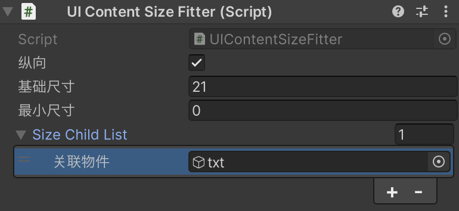
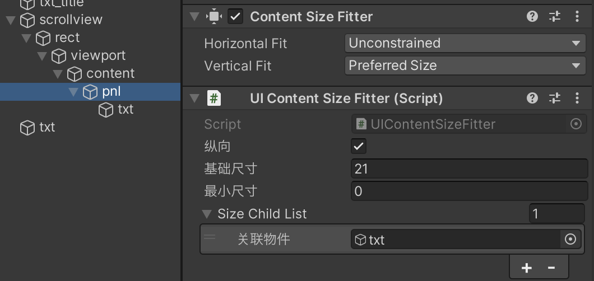
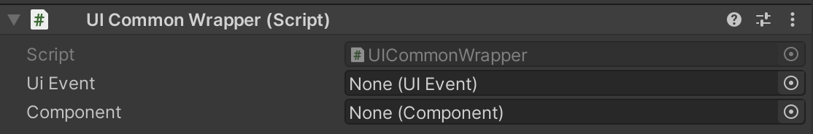
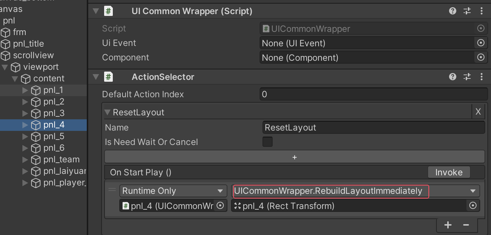

# 预制体相关

## UITextSizeFitter 组件

pnl在的UITextSizeFitter关联txt物体

这个 `UITextSizeFitter` 类是一个用于处理 UI 文本自适应大小的组件。它的主要作用是：

1. **自动调整文本大小**：

   - 配合 `ContentSizeFitter` 组件实现文本内容的自动大小调整
   - 可以处理文本换行和溢出的情况

2. **组件要求**：

   - 需要 `Text` 组件（通过 `RequireComponent` 标记）
   - 需要 `ContentSizeFitter` 组件（通过 `RequireComponent` 标记）

3. **主要功能**：

   - 可以设置文本的最大宽度（`_textFullWidth`）和高度（`_textFullHeight`）
   - 当文本内容改变时，会自动调整大小：
     - 如果是换行模式（`HorizontalWrapMode.Wrap`），调整垂直大小
     - 如果是单行模式，调整水平大小

4. **使用场景**：
   - 当需要文本根据内容自动调整大小时
   - 需要控制文本在固定宽度内自动换行时
   - 需要确保文本显示完整且布局合理时

这个组件通常用于动态文本内容的 UI 元素，比如对话框、提示框等需要自适应内容大小的场景。

## UICommonWrapper 组件

设置ActionSelector调用UICommonWrapper.RebuildLayoutImmediately方法重建布局

UICommonWrapper 是一个通用的 UI 工具组件，它封装了许多常用的 UI 操作功能。主要作用包括：

1. **Transform 相关操作**：

- 设置位置（SetPositionX/Y/Z, SetLocalPositionX/Y）
- 设置缩放（SetLocalScaleX/Y）
- 设置旋转（SetRotationX/Y/Z, SetLocalRotationX/Y/Z, SetEulerAnglesX/Y/Z）

2. **GameObject 激活状态控制**：

- SetActive：控制物体显示/隐藏
- SetActiveInverse：切换物体显示状态
- SetChildActive：控制所有子物体的显示状态

3. **UI 元素属性设置**：

- SetAlpha：设置透明度
- SetColor：设置颜色
- SetWidth/SetHeight：设置宽高
- SetComponentEnable：启用/禁用组件

4. **布局相关**：

- RebuildLayoutImmediately：重建布局
- ForceUpdateCanvases：强制更新画布
- LayoutChildren：布局子物体

5. **实用工具功能**：

- CopyText/PasteText：文本复制粘贴
- PlaySound：播放音效
- PauseMusic：暂停音乐
- SetEscapeEnable：设置返回键功能

6. **对象池操作**：

- ReleasePoolObject：释放对象到对象池

这个组件的主要优势是：

- 提供了统一的接口来处理常见的 UI 操作
- 简化了 UI 编程，减少重复代码
- 方便在 Unity 编辑器中直接调用这些功能
- 提供了事件系统的集成（通过 UIEvent）

通常会将这个组件添加到需要进行 UI 操作的游戏物体上，以便快速访问这些常用功能。

## UICommonWrapper 和 UIContentSizeFitter

`UICommonWrapper.RebuildLayoutImmediately` 和 `UIContentSizeFitter.SetLayout` 虽然都可以重新计算布局，但它们的作用和使用场景是不同的：

1. **UICommonWrapper.RebuildLayoutImmediately**:

- 是Unity内置的布局重建方法
- 强制立即重新计算和应用所有布局组件（包括ContentSizeFitter、LayoutGroup等）
- 是一个通用的布局刷新方法，会触发完整的布局计算流程
- 适用于需要立即更新所有UI布局的场景

2. **UIContentSizeFitter.SetLayout**:

- 是自定义的布局计算方法
- 专门用于计算指定对象及其关联物件的尺寸
- 根据垂直/水平方向、基础尺寸、最小尺寸等特定参数来计算
- 只计算被指定的对象，不会影响其他UI元素
- 更适合于特定的自定义布局需求

主要区别：

- `RebuildLayoutImmediately` 是全局性的布局重建
- `SetLayout` 是针对性的尺寸计算，只处理指定的对象和其关联物件
- `SetLayout` 提供了更多的自定义控制选项（如基础尺寸、最小尺寸等）

选择使用哪个取决于具体需求：

- 如果需要重新计算整个UI布局，使用 `RebuildLayoutImmediately`
- 如果只需要更新特定对象的尺寸，并且需要特定的计算规则，使用 `SetLayout`
