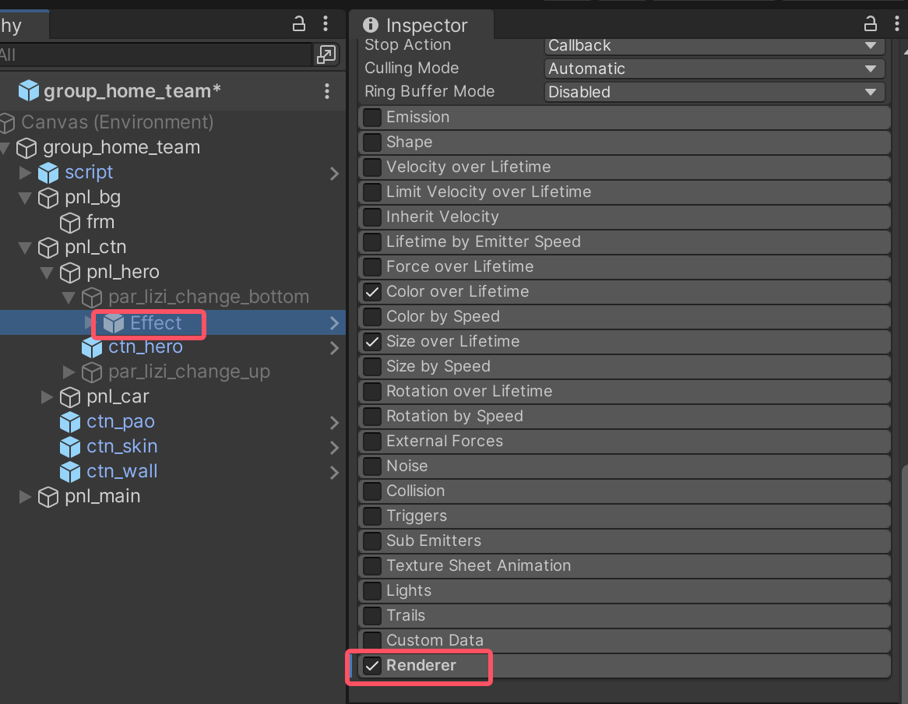
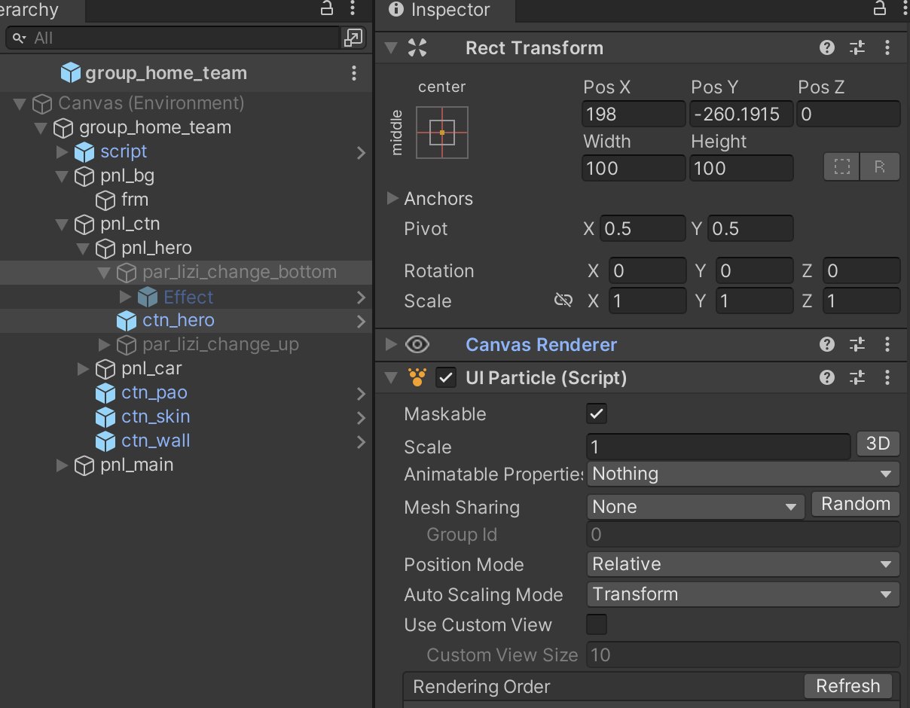
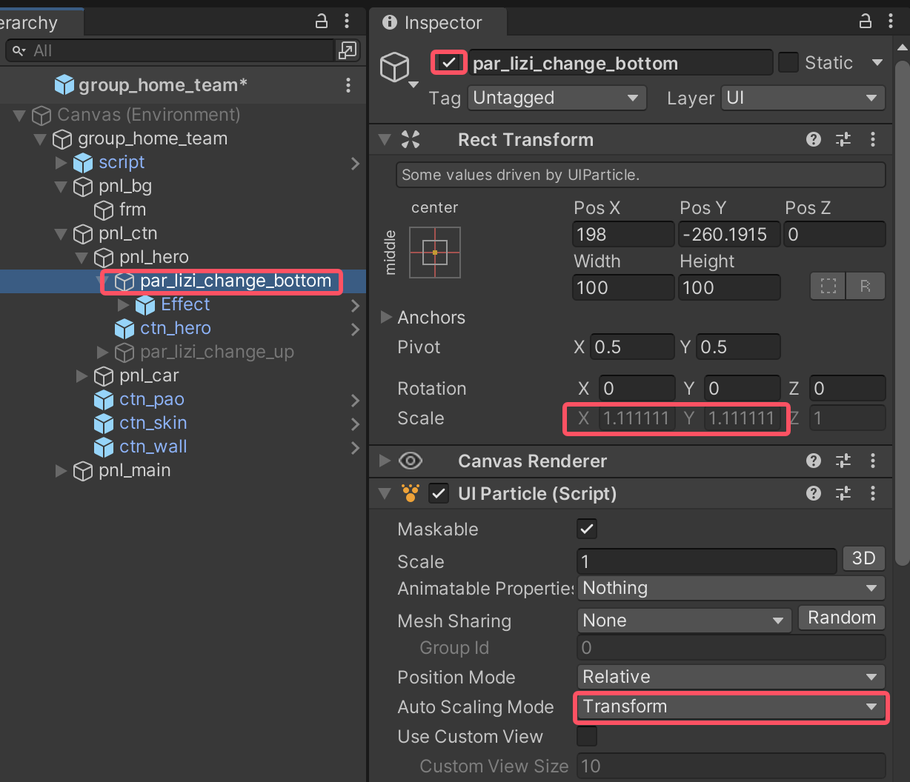
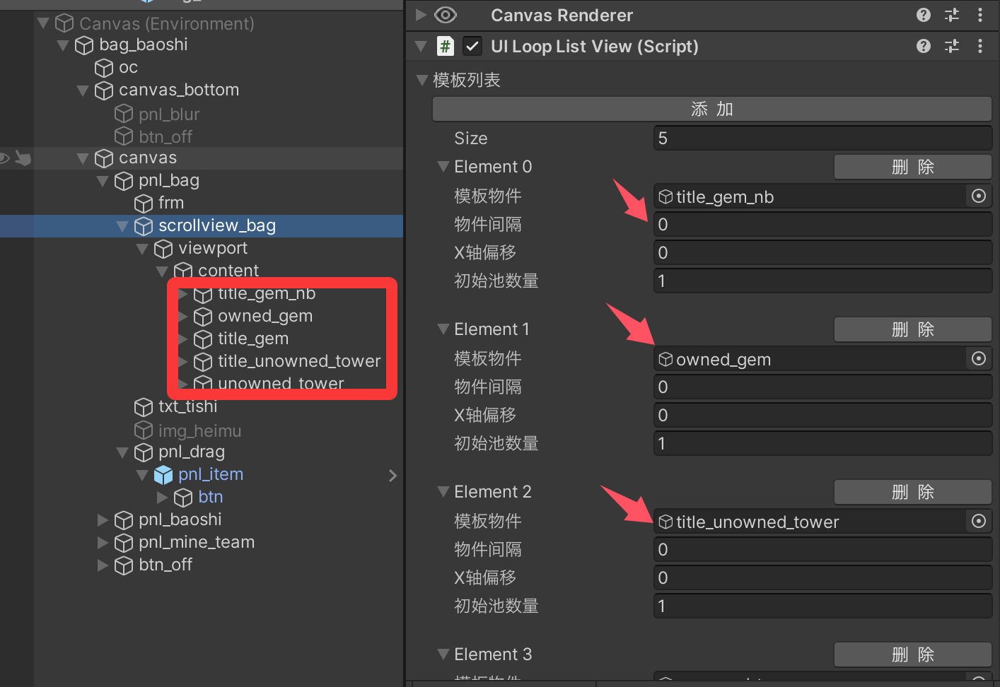

# 预制体相关

## UITextSizeFitter 组件

### 调整文本大小


pnl在的UITextSizeFitter关联txt物体


这个 `UITextSizeFitter` 类是一个用于处理 UI 文本自适应大小的组件。它的主要作用是：

1. **自动调整文本大小**：

   - 配合 `ContentSizeFitter` 组件实现文本内容的自动大小调整
   - 可以处理文本换行和溢出的情况

2. **组件要求**：

   - 需要 `Text` 组件（通过 `RequireComponent` 标记）
   - 需要 `ContentSizeFitter` 组件（通过 `RequireComponent` 标记）

3. **主要功能**：

   - 可以设置文本的最大宽度（`_textFullWidth`）和高度（`_textFullHeight`）
   - 当文本内容改变时，会自动调整大小：
     - 如果是换行模式（`HorizontalWrapMode.Wrap`），调整垂直大小
     - 如果是单行模式，调整水平大小

4. **使用场景**：
   - 当需要文本根据内容自动调整大小时
   - 需要控制文本在固定宽度内自动换行时
   - 需要确保文本显示完整且布局合理时

这个组件通常用于动态文本内容的 UI 元素，比如对话框、提示框等需要自适应内容大小的场景。

### 代码

```c#
using UnityEngine;
using UnityEngine.UI;
using System.Collections;

namespace Game.Core.Framework
{
    [RequireComponent(typeof(Text))]
    [RequireComponent(typeof(ContentSizeFitter))]
    public class UITextSizeFitter : MonoBehaviour
    {
        [SerializeField]
        private float _textFullWidth = 0;

        [SerializeField]
        private float _textFullHeight = 0;

        private Text _uiText;
        public Text uiText
        {
            get
            {
                if (_uiText == null)
                {
                    _uiText = GetComponent<Text>();
                }
                return _uiText;
            }
        }

        private ContentSizeFitter _sizeFitter;
        public ContentSizeFitter sizeFitter
        {
            get
            {
                if (_sizeFitter == null)
                {
                    _sizeFitter = GetComponent<ContentSizeFitter>();
                }
                return _sizeFitter;
            }
        }

        public string text
        {
            set
            {
                var trans = GetComponent<RectTransform>();
                if (_textFullWidth != 0 || _textFullHeight != 0)
                {
                    if (uiText.horizontalOverflow == HorizontalWrapMode.Wrap && trans.sizeDelta.x != _textFullWidth)
                    {
                        trans.sizeDelta = new Vector2(_textFullWidth, _textFullHeight);
                    }
                }
                uiText.text = value;
                if (uiText.horizontalOverflow == HorizontalWrapMode.Wrap)
                {
                    sizeFitter.SetLayoutVertical();
                }
                else
                {
                    sizeFitter.SetLayoutHorizontal();
                }
            }
            get
            {
                return uiText.text;
            }
        }
    }
}
```

## UICommonWrapper 组件

### 重置布局


设置ActionSelector调用UICommonWrapper.RebuildLayoutImmediately方法重建布局


UICommonWrapper 是一个通用的 UI 工具组件，它封装了许多常用的 UI 操作功能。主要作用包括：

1. **Transform 相关操作**：

- 设置位置（SetPositionX/Y/Z, SetLocalPositionX/Y）
- 设置缩放（SetLocalScaleX/Y）
- 设置旋转（SetRotationX/Y/Z, SetLocalRotationX/Y/Z, SetEulerAnglesX/Y/Z）

2. **GameObject 激活状态控制**：

- SetActive：控制物体显示/隐藏
- SetActiveInverse：切换物体显示状态
- SetChildActive：控制所有子物体的显示状态

3. **UI 元素属性设置**：

- SetAlpha：设置透明度
- SetColor：设置颜色
- SetWidth/SetHeight：设置宽高
- SetComponentEnable：启用/禁用组件

4. **布局相关**：

- RebuildLayoutImmediately：重建布局
- ForceUpdateCanvases：强制更新画布
- LayoutChildren：布局子物体

5. **实用工具功能**：

- CopyText/PasteText：文本复制粘贴
- PlaySound：播放音效
- PauseMusic：暂停音乐
- SetEscapeEnable：设置返回键功能

6. **对象池操作**：

- ReleasePoolObject：释放对象到对象池

这个组件的主要优势是：

- 提供了统一的接口来处理常见的 UI 操作
- 简化了 UI 编程，减少重复代码
- 方便在 Unity 编辑器中直接调用这些功能
- 提供了事件系统的集成（通过 UIEvent）

通常会将这个组件添加到需要进行 UI 操作的游戏物体上，以便快速访问这些常用功能。

### 代码

```c#
using UnityEngine;
using UnityEngine.UI;

namespace Game.Core.Framework
{
    public class UICommonWrapper : MonoBehaviour
    {
        [SerializeField]
        private UIEvent _uiEvent;

        [SerializeField]
        private Component _component = null;

        public void SetActive(bool isActive)
        {
            var isLastActive = this.gameObject.activeInHierarchy && this.gameObject.activeSelf;
            if (!isActive && isLastActive)
            {
                FireUIEvent(UIEventType.OnInActive);
            }
            this.gameObject.SetActive(isActive);
            if (this.gameObject.activeInHierarchy && isActive && !isLastActive)
            {
                FireUIEvent(UIEventType.OnActive);
            }
        }

        public void SetActiveInverse(GameObject obj)
        {
            obj = obj == null ? this.gameObject : obj;
            if (obj.activeSelf && obj.activeInHierarchy)
            {
                obj.SetActive(false);
            }
            else
            {
                obj.SetActive(true);
            }
        }

        public void SetChildActive(bool isActive)
        {
            var childCount = this.transform.childCount;
            for (int i = 0; i < childCount; i++)
            {
                var child = this.transform.GetChild(i);
                child.gameObject.SetActive(isActive);
            }
        }

        public void SetLocalPositionX(float posX)
        {
            var position = this.transform.localPosition;
            position.x = posX;
            this.transform.localPosition = position;
        }

        public void SetLocalPositionY(float posY)
        {
            var position = this.transform.localPosition;
            position.y = posY;
            this.transform.localPosition = position;
        }

        public void SetPositionX(float posX)
        {
            var position = this.transform.position;
            position.x = posX;
            this.transform.position = position;
        }

        public void SetPositionY(float posY)
        {
            var position = this.transform.position;
            position.y = posY;
            this.transform.position = position;
        }

        public void SetPositionZ(float posZ)
        {
            var position = this.transform.position;
            position.z = posZ;
            this.transform.position = position;
        }

        public void SetLocalScaleX(float scaleX)
        {
            var scale = this.transform.localScale;
            scale.x = scaleX;
            this.transform.localScale = scale;
        }

        public void SetLocalScaleY(float scaleY)
        {
            var scale = this.transform.localScale;
            scale.y = scaleY;
            this.transform.localScale = scale;
        }

        public void SetRotationX(float rotationX)
        {
            var rotation = this.transform.rotation;
            rotation.x = rotationX;
            this.transform.rotation = rotation;
        }

        public void SetRotationY(float rotationY)
        {
            var rotation = this.transform.rotation;
            rotation.y = rotationY;
            this.transform.rotation = rotation;
        }

        public void SetRotationZ(float rotationZ)
        {
            var rotation = this.transform.rotation;
            rotation.z = rotationZ;
            this.transform.rotation = rotation;
        }

        public void SetLocalRotationX(float rotationX)
        {
            var rotation = this.transform.localRotation;
            rotation.x = rotationX;
            this.transform.localRotation = rotation;
        }

        public void SetLocalRotationY(float rotationY)
        {
            var rotation = this.transform.localRotation;
            rotation.y = rotationY;
            this.transform.localRotation = rotation;
        }

        public void SetLocalRotationZ(float rotationZ)
        {
            var rotation = this.transform.localRotation;
            rotation.z = rotationZ;
            this.transform.localRotation = rotation;
        }

        public void SetEulerAnglesX(float angleX)
        {
            var angle = this.transform.eulerAngles;
            angle.x = angleX;
            this.transform.eulerAngles = angle;
        }

        public void SetEulerAnglesY(float angleY)
        {
            var angle = this.transform.eulerAngles;
            angle.y = angleY;
            this.transform.eulerAngles = angle;
        }

        public void SetEulerAnglesZ(float angleZ)
        {
            var angle = this.transform.eulerAngles;
            angle.z = angleZ;
            this.transform.eulerAngles = angle;
        }

        public void SetLocalEulerAnglesX(float angleX)
        {
            var angle = this.transform.localEulerAngles;
            angle.x = angleX;
            this.transform.localEulerAngles = angle;
        }

        public void SetLocalEulerAnglesY(float angleY)
        {
            var angle = this.transform.localEulerAngles;
            angle.y = angleY;
            this.transform.localEulerAngles = angle;
        }

        public void SetLocalEulerAnglesZ(float angleZ)
        {
            var angle = this.transform.localEulerAngles;
            angle.z = angleZ;
            this.transform.localEulerAngles = angle;
        }

        public void SetAlpha(float alpha)
        {
            var grapic = this.GetComponent<MaskableGraphic>();
            if (grapic != null)
            {
                var color = grapic.color;
                color.a = alpha;
                grapic.color = color;

                return;
            }

            var sprite = this.GetComponent<SpriteRenderer>();
            if (sprite != null)
            {
                var color = sprite.color;
                color.a = alpha;
                sprite.color = color;
            }
        }

        public void SetSpriteRendererAlpha(float alpha)
        {
            var sprite = _component as SpriteRenderer;
            var color = sprite.color;
            color.a = alpha;
            sprite.color = color;
        }

        public void SetColor(string strColor)
        {
            var grapic = this.transform.GetComponent<MaskableGraphic>();
            if (grapic != null)
            {
                grapic.color = GameUtility.GetColor(strColor);
                return;
            }

            var sprite = this.transform.GetComponent<SpriteRenderer>();
            if (sprite != null)
            {
                sprite.color = GameUtility.GetColor(strColor);
            }
        }

        public void ReleaseGamePoolObject(GameObject obj = null)
        {
            obj = obj == null ? this.gameObject : obj;
            GameObjectPool.ReleaseObject(obj);
        }

        public void FireUIEvent(UIEventType eventType)
        {
            _uiEvent?.FireUIEvent(eventType);
        }

        public void PlaySound(string soundName)
        {
            AudioManager.INSTANCE.PlaySound(soundName);
        }

        public void PauseMusic(bool isPause = true)
        {
            AudioManager.INSTANCE.PauseMusic(isPause);
        }

        public void SetEscapeEnable(bool isEnable)
        {
            UIPage.EnableEscape = isEnable;
        }

        public void DisableEscape(bool isDisable)
        {
            UIPage.EnableEscape = !isDisable;
        }

        public void ReleasePoolObject(GameObject obj)
        {
            GameObjectPool.ReleaseObject(obj);
        }

        public void SetWidth(float width)
        {
            var rectTransform = this.GetComponent<RectTransform>();
            if (rectTransform == null)
            {
                return;
            }
            var size = rectTransform.sizeDelta;
            size.x = width;
            rectTransform.sizeDelta = size;
        }

        public void SetHeigth(float height)
        {
            var rectTransform = this.GetComponent<RectTransform>();
            if (rectTransform == null)
            {
                return;
            }
            var size = rectTransform.sizeDelta;
            size.y = height;
            rectTransform.sizeDelta = size;
        }

        public void SyncPosition(Transform targetTransform)
        {
            var transform = this.transform;
            transform.position = targetTransform.position;
        }

        public void CopyText(Text uiText)
        {
            if (uiText == null)
            {
                return;
            }
            GUIUtility.systemCopyBuffer = uiText.text;
        }

        public void PasteText(GameObject objText)
        {
            if (objText == null)
            {
                return;
            }

            var uiInput = objText.GetComponent<InputField>();
            if (uiInput != null)
            {
                uiInput.text = GUIUtility.systemCopyBuffer;
                return;
            }

            var uiText = objText.GetComponent<Text>();
            if (uiText != null)
            {
                uiText.text = GUIUtility.systemCopyBuffer;
                return;
            }
        }

        public void EnableComponent(Component component)
        {
            SetComponentEnable(component, true);
        }

        public void DisableComponent(Component component)
        {
            SetComponentEnable(component, false);
        }

        // Add at v1.0.1.8
        public void LayoutChildren(int activeCount)
        {
            GameUtility.LayoutChildren(this.gameObject, activeCount);
        }

        private void SetComponentEnable(Component component, bool isEnable)
        {
            if (component == null)
            {
                return;
            }
            var behaviour = component as Behaviour;
            if (behaviour == null)
            {
                return;
            }
            behaviour.enabled = isEnable;
        }

        // Add at v1.0.1.8
        public void SetParentByTag(string tag)
        {
            var objParent = GameObject.FindGameObjectWithTag(tag);
            if (objParent == null)
            {
                return;
            }
            this.transform.SetParent(objParent.transform, true);
        }

        public void RebuildLayoutImmediately(RectTransform rectTrans)
        {
            LayoutRebuilder.ForceRebuildLayoutImmediate(rectTrans);
        }

        public void ForceUpdateCanvases()
        {
            Canvas.ForceUpdateCanvases();
        }
    }
}
```

## UICommonWrapper 和 UIContentSizeFitter

`UICommonWrapper.RebuildLayoutImmediately` 和 `UIContentSizeFitter.SetLayout` 虽然都可以重新计算布局，但它们的作用和使用场景是不同的：

1. **UICommonWrapper.RebuildLayoutImmediately**:

- 是Unity内置的布局重建方法
- 强制立即重新计算和应用所有布局组件（包括ContentSizeFitter、LayoutGroup等）
- 是一个通用的布局刷新方法，会触发完整的布局计算流程
- 适用于需要立即更新所有UI布局的场景

2. **UIContentSizeFitter.SetLayout**:

- 是自定义的布局计算方法
- 专门用于计算指定对象及其关联物件的尺寸
- 根据垂直/水平方向、基础尺寸、最小尺寸等特定参数来计算
- 只计算被指定的对象，不会影响其他UI元素
- 更适合于特定的自定义布局需求

主要区别：

- `RebuildLayoutImmediately` 是全局性的布局重建
- `SetLayout` 是针对性的尺寸计算，只处理指定的对象和其关联物件
- `SetLayout` 提供了更多的自定义控制选项（如基础尺寸、最小尺寸等）

选择使用哪个取决于具体需求：

- 如果需要重新计算整个UI布局，使用 `RebuildLayoutImmediately`
- 如果只需要更新特定对象的尺寸，并且需要特定的计算规则，使用 `SetLayout`

## UIParticle 组件

### 介绍

UIParticle 是一个将 Unity 粒子系统用于 UI 的特殊组件。主要功能和特点包括：

1. **UI 粒子渲染**：

   - 允许在 UI Canvas 中无需相机、渲染纹理即可直接渲染粒子效果
   - 使粒子系统可以融入到 UI 层级中，支持 UI 遮罩和排序功能

2. **主要特性**：

   - **遮罩支持**：粒子可以被 UI 遮罩组件遮挡
   - **自动缩放**：提供多种自动缩放模式，适应不同分辨率下的显示效果
   - **位置模式**：支持相对和绝对两种位置模式
   - **网格共享**：可以在多个相同粒子效果间共享模拟结果，提高性能

3. **优化功能**：

   - **粒子系统共享**：可以在多个实例间共享粒子模拟结果，减少计算负担
   - **自定义视图**：解决粒子大小限制引起的显示问题
   - **批量操作**：提供批量控制所有粒子系统的方法（如播放、暂停、停止等）

4. **实际应用**：
   - UI 中的特效（如按钮点击效果、成就解锁特效）
   - 界面装饰元素（如闪光、飘动的粒子背景）
   - 技能或物品效果的预览

总之，这个组件解决了在 Unity UI 系统中使用粒子系统的复杂性，使开发者可以轻松地将粒子特效集成到 UI 中，同时保持良好的性能和视觉一致性。

### 代码

```c#
using System;
using System.Collections.Generic;
using System.Runtime.CompilerServices;
using Coffee.UIParticleInternal;
using UnityEngine;
using UnityEngine.Rendering;
using UnityEngine.Serialization;
using UnityEngine.UI;
using Random = UnityEngine.Random;

[assembly: InternalsVisibleTo("Coffee.UIParticle.Editor")]
[assembly: InternalsVisibleTo("Coffee.UIParticle.PerformanceDemo")]
[assembly: InternalsVisibleTo("Coffee.UIParticle.Demo")]

namespace Coffee.UIExtensions
{
    /// <summary>
    /// Render maskable and sortable particle effect ,without Camera, RenderTexture or Canvas.
    /// </summary>
    [ExecuteAlways]
    [RequireComponent(typeof(RectTransform))]
    [RequireComponent(typeof(CanvasRenderer))]
    public class UIParticle : MaskableGraphic, ISerializationCallbackReceiver
    {
        public enum AutoScalingMode
        {
            None,
            UIParticle,
            Transform
        }

        public enum MeshSharing
        {
            None,
            Auto,
            Primary,
            PrimarySimulator,
            Replica
        }

        public enum PositionMode
        {
            Relative,
            Absolute
        }

        [HideInInspector]
        [SerializeField]
        [Obsolete]
        internal bool m_IsTrail;

        [HideInInspector]
        [FormerlySerializedAs("m_IgnoreParent")]
        [SerializeField]
        [Obsolete]
        private bool m_IgnoreCanvasScaler;

        [HideInInspector]
        [SerializeField]
        [Obsolete]
        internal bool m_AbsoluteMode;

        [Tooltip("Scale the rendering particles. When the `3D` toggle is enabled, 3D scale (x, y, z) is supported.")]
        [SerializeField]
        private Vector3 m_Scale3D = new Vector3(1, 1, 1);

        [Tooltip("If you want to update material properties (e.g. _MainTex_ST, _Color) in AnimationClip, " +
                 "use this to mark as animatable.")]
        [SerializeField]
        internal AnimatableProperty[] m_AnimatableProperties = new AnimatableProperty[0];

        [Tooltip("Particles")]
        [SerializeField]
        private List<ParticleSystem> m_Particles = new List<ParticleSystem>();

        [Tooltip("Particle simulation results are shared within the same group. " +
                 "A large number of the same effects can be displayed with a small load.\n" +
                 "None: Disable mesh sharing.\n" +
                 "Auto: Automatically select Primary/Replica.\n" +
                 "Primary: Provides particle simulation results to the same group.\n" +
                 "Primary Simulator: Primary, but do not render the particle (simulation only).\n" +
                 "Replica: Render simulation results provided by the primary.")]
        [SerializeField]
        private MeshSharing m_MeshSharing = MeshSharing.None;

        [Tooltip("Mesh sharing group ID.\n" +
                 "If non-zero is specified, particle simulation results are shared within the group.")]
        [SerializeField]
        private int m_GroupId;

        [SerializeField]
        private int m_GroupMaxId;

        [Tooltip("Emission position mode.\n" +
                 "Relative: The particles will be emitted from the scaled position.\n" +
                 "Absolute: The particles will be emitted from the world position.")]
        [SerializeField]
        private PositionMode m_PositionMode = PositionMode.Relative;

        [SerializeField]
        [Obsolete]
        internal bool m_AutoScaling;

        [SerializeField]
        [Tooltip(
            "How to automatically adjust when the Canvas scale is changed by the screen size or reference resolution.\n" +
            "None: Do nothing.\n" +
            "Transform: Transform.lossyScale (=world scale) will be set to (1, 1, 1).\n" +
            "UIParticle: UIParticle.scale will be adjusted.")]
        private AutoScalingMode m_AutoScalingMode = AutoScalingMode.Transform;

        [SerializeField]
        [Tooltip("Use a custom view.\n" +
                 "Use this if the particles are not displayed correctly due to min/max particle size.")]
        private bool m_UseCustomView;

        [SerializeField]
        [Tooltip("Custom view size.\n" +
                 "Change the bake view size.")]
        private float m_CustomViewSize = 10;

        private readonly List<UIParticleRenderer> _renderers = new List<UIParticleRenderer>();
        private Camera _bakeCamera;
        private int _groupId;
        private bool _isScaleStored;
        private Vector3 _storedScale;
        private DrivenRectTransformTracker _tracker;

        /// <summary>
        /// Should this graphic be considered a target for ray-casting?
        /// </summary>
        public override bool raycastTarget
        {
            get => false;
            set { }
        }

        /// <summary>
        /// Particle simulation results are shared within the same group.
        /// A large number of the same effects can be displayed with a small load.
        /// None: disable mesh sharing.
        /// Auto: automatically select Primary/Replica.
        /// Primary: provides particle simulation results to the same group.
        /// Primary Simulator: Primary, but do not render the particle (simulation only).
        /// Replica: render simulation results provided by the primary.
        /// </summary>
        public MeshSharing meshSharing
        {
            get => m_MeshSharing;
            set => m_MeshSharing = value;
        }

        /// <summary>
        /// Mesh sharing group ID.
        /// If non-zero is specified, particle simulation results are shared within the group.
        /// </summary>
        public int groupId
        {
            get => _groupId;
            set
            {
                if (m_GroupId == value) return;
                m_GroupId = value;
                if (m_GroupId != m_GroupMaxId)
                {
                    ResetGroupId();
                }
            }
        }

        public int groupMaxId
        {
            get => m_GroupMaxId;
            set
            {
                if (m_GroupMaxId == value) return;
                m_GroupMaxId = value;
                ResetGroupId();
            }
        }

        /// <summary>
        /// Emission position mode.
        /// Relative: The particles will be emitted from the scaled position.
        /// Absolute: The particles will be emitted from the world position.
        /// </summary>
        public PositionMode positionMode
        {
            get => m_PositionMode;
            set => m_PositionMode = value;
        }

        /// <summary>
        /// Particle position mode.
        /// Relative: The particles will be emitted from the scaled position of the ParticleSystem.
        /// Absolute: The particles will be emitted from the world position of the ParticleSystem.
        /// </summary>
        [Obsolete("The absoluteMode is now obsolete. Please use the autoScalingMode instead.", false)]
        public bool absoluteMode
        {
            get => m_PositionMode == PositionMode.Absolute;
            set => positionMode = value ? PositionMode.Absolute : PositionMode.Relative;
        }

        /// <summary>
        /// Prevents the root-Canvas scale from affecting the hierarchy-scaled ParticleSystem.
        /// </summary>
        [Obsolete("The autoScaling is now obsolete. Please use the autoScalingMode instead.", false)]
        public bool autoScaling
        {
            get => m_AutoScalingMode != AutoScalingMode.None;
            set => autoScalingMode = value ? AutoScalingMode.Transform : AutoScalingMode.None;
        }

        /// <summary>
        /// How to automatically adjust when the Canvas scale is changed by the screen size or reference resolution.
        /// <para/>
        /// None: Do nothing.
        /// <para/>
        /// Transform: Transform.lossyScale (=world scale) will be set to (1, 1, 1).
        /// <para/>
        /// UIParticle: UIParticle.scale will be adjusted.
        /// </summary>
        public AutoScalingMode autoScalingMode
        {
            get => m_AutoScalingMode;
            set
            {
                if (m_AutoScalingMode == value) return;
                m_AutoScalingMode = value;

                if (autoScalingMode != AutoScalingMode.Transform && _isScaleStored)
                {
                    transform.localScale = _storedScale;
                    _isScaleStored = false;
                }
            }
        }

        /// <summary>
        /// Use a custom view.
        /// Use this if the particles are not displayed correctly due to min/max particle size.
        /// </summary>
        public bool useCustomView
        {
            get => m_UseCustomView;
            set => m_UseCustomView = value;
        }

        /// <summary>
        /// Custom view size.
        /// Change the bake view size.
        /// </summary>
        public float customViewSize
        {
            get => m_CustomViewSize;
            set => m_CustomViewSize = Mathf.Max(0.1f, value);
        }

        internal bool useMeshSharing => m_MeshSharing != MeshSharing.None;

        internal bool isPrimary =>
            m_MeshSharing == MeshSharing.Primary
            || m_MeshSharing == MeshSharing.PrimarySimulator;

        internal bool canSimulate =>
            m_MeshSharing == MeshSharing.None
            || m_MeshSharing == MeshSharing.Auto
            || m_MeshSharing == MeshSharing.Primary
            || m_MeshSharing == MeshSharing.PrimarySimulator;

        internal bool canRender =>
            m_MeshSharing == MeshSharing.None
            || m_MeshSharing == MeshSharing.Auto
            || m_MeshSharing == MeshSharing.Primary
            || m_MeshSharing == MeshSharing.Replica;

        /// <summary>
        /// Particle effect scale.
        /// </summary>
        public float scale
        {
            get => m_Scale3D.x;
            set => m_Scale3D = new Vector3(value, value, value);
        }

        /// <summary>
        /// Particle effect scale.
        /// </summary>
        public Vector3 scale3D
        {
            get => m_Scale3D;
            set => m_Scale3D = value;
        }

        /// <summary>
        /// Particle effect scale.
        /// </summary>
        public Vector3 scale3DForCalc => autoScalingMode == AutoScalingMode.Transform
            ? m_Scale3D
            : m_Scale3D.GetScaled(canvasScale, transform.localScale);

        public List<ParticleSystem> particles => m_Particles;

        /// <summary>
        /// Paused.
        /// </summary>
        public bool isPaused { get; private set; }

        public Vector3 parentScale { get; private set; }

        public Vector3 canvasScale { get; private set; }

        protected override void OnEnable()
        {
            _isScaleStored = false;
            ResetGroupId();
            UIParticleUpdater.Register(this);
            RegisterDirtyMaterialCallback(UpdateRendererMaterial);

            if (0 < particles.Count)
            {
                RefreshParticles(particles);
            }
            else
            {
                RefreshParticles();
            }

            base.OnEnable();
        }

        /// <summary>
        /// This function is called when the behaviour becomes disabled.
        /// </summary>
        protected override void OnDisable()
        {
            _tracker.Clear();
            if (autoScalingMode == AutoScalingMode.Transform && _isScaleStored)
            {
                transform.localScale = _storedScale;
            }

            _isScaleStored = false;
            UIParticleUpdater.Unregister(this);
            _renderers.ForEach(r => r.Reset());
            UnregisterDirtyMaterialCallback(UpdateRendererMaterial);

            base.OnDisable();
        }

        /// <summary>
        /// Callback for when properties have been changed by animation.
        /// </summary>
        protected override void OnDidApplyAnimationProperties()
        {
        }

        void ISerializationCallbackReceiver.OnBeforeSerialize()
        {
        }

        void ISerializationCallbackReceiver.OnAfterDeserialize()
        {
#pragma warning disable CS0612 // Type or member is obsolete
            if (m_IgnoreCanvasScaler || m_AutoScaling)
            {
                m_IgnoreCanvasScaler = false;
                m_AutoScaling = false;
                m_AutoScalingMode = AutoScalingMode.Transform;
            }

            if (m_AbsoluteMode)
            {
                m_AbsoluteMode = false;
                m_PositionMode = PositionMode.Absolute;
            }
#pragma warning restore CS0612 // Type or member is obsolete
        }

        /// <summary>
        /// Play the ParticleSystems.
        /// </summary>
        public void Play()
        {
            particles.Exec(p => p.Simulate(0, false, true));
            isPaused = false;
        }

        /// <summary>
        /// Pause the ParticleSystems.
        /// </summary>
        public void Pause()
        {
            particles.Exec(p => p.Pause());
            isPaused = true;
        }

        /// <summary>
        /// Unpause the ParticleSystems.
        /// </summary>
        public void Resume()
        {
            isPaused = false;
        }

        /// <summary>
        /// Stop the ParticleSystems.
        /// </summary>
        public void Stop()
        {
            particles.Exec(p => p.Stop());
            isPaused = true;
        }

        /// <summary>
        /// Start emission of the ParticleSystems.
        /// </summary>
        public void StartEmission()
        {
            particles.Exec(p =>
            {
                var emission = p.emission;
                emission.enabled = true;
            });
        }

        /// <summary>
        /// Stop emission of the ParticleSystems.
        /// </summary>
        public void StopEmission()
        {
            particles.Exec(p =>
            {
                var emission = p.emission;
                emission.enabled = false;
            });
        }

        /// <summary>
        /// Clear the particles of the ParticleSystems.
        /// </summary>
        public void Clear()
        {
            particles.Exec(p => p.Clear());
            isPaused = true;
        }

        /// <summary>
        /// Get all base materials to render.
        /// </summary>
        public void GetMaterials(List<Material> result)
        {
            if (result == null) return;

            for (var i = 0; i < _renderers.Count; i++)
            {
                var r = _renderers[i];
                if (!r || !r.material) continue;
                result.Add(r.material);
            }
        }

        /// <summary>
        /// Refresh UIParticle using the ParticleSystem instance.
        /// </summary>
        public void SetParticleSystemInstance(GameObject instance)
        {
            SetParticleSystemInstance(instance, true);
        }

        /// <summary>
        /// Refresh UIParticle using the ParticleSystem instance.
        /// </summary>
        public void SetParticleSystemInstance(GameObject instance, bool destroyOldParticles)
        {
            if (!instance) return;

            var childCount = transform.childCount;
            for (var i = 0; i < childCount; i++)
            {
                var go = transform.GetChild(i).gameObject;
                if (go.TryGetComponent<Camera>(out var cam) && cam == _bakeCamera) continue;
                if (go.TryGetComponent<UIParticleRenderer>(out var _)) continue;

                go.SetActive(false);
                if (destroyOldParticles)
                {
                    Misc.Destroy(go);
                }
            }

            var tr = instance.transform;
            tr.SetParent(transform, false);
            tr.localPosition = Vector3.zero;

            RefreshParticles(instance);
        }

        /// <summary>
        /// Refresh UIParticle using the prefab.
        /// The prefab is automatically instantiated.
        /// </summary>
        public void SetParticleSystemPrefab(GameObject prefab)
        {
            if (!prefab) return;

            SetParticleSystemInstance(Instantiate(prefab.gameObject), true);
        }

        /// <summary>
        /// Refresh UIParticle.
        /// Collect ParticleSystems under the GameObject and refresh the UIParticle.
        /// </summary>
        public void RefreshParticles()
        {
            RefreshParticles(gameObject);
        }

        /// <summary>
        /// Refresh UIParticle.
        /// Collect ParticleSystems under the GameObject and refresh the UIParticle.
        /// </summary>
        private void RefreshParticles(GameObject root)
        {
            if (!root) return;
            root.GetComponentsInChildren(true, particles);
            for (var i = particles.Count - 1; 0 <= i; i--)
            {
                var ps = particles[i];
                if (!ps || ps.GetComponentInParent<UIParticle>(true) != this)
                {
                    particles.RemoveAt(i);
                }
            }

            for (var i = 0; i < particles.Count; i++)
            {
                var ps = particles[i];
                var tsa = ps.textureSheetAnimation;
                if (tsa.mode == ParticleSystemAnimationMode.Sprites && tsa.uvChannelMask == 0)
                {
                    tsa.uvChannelMask = UVChannelFlags.UV0;
                }
            }

            RefreshParticles(particles);
        }

        /// <summary>
        /// Refresh UIParticle using a list of ParticleSystems.
        /// </summary>
        public void RefreshParticles(List<ParticleSystem> particleSystems)
        {
            // Collect children UIParticleRenderer components.
            // #246: Nullptr exceptions when using nested UIParticle components in hierarchy
            _renderers.Clear();
            var childCount = transform.childCount;
            for (var i = 0; i < childCount; i++)
            {
                var child = transform.GetChild(i);
                if (child.TryGetComponent(out UIParticleRenderer uiParticleRenderer))
                {
                    _renderers.Add(uiParticleRenderer);
                }
            }

            // Reset the UIParticleRenderer components.
            for (var i = 0; i < _renderers.Count; i++)
            {
                _renderers[i].Reset(i);
            }

            // Set the ParticleSystem to the UIParticleRenderer. If the trail is enabled, set it additionally.
            var j = 0;
            for (var i = 0; i < particleSystems.Count; i++)
            {
                var ps = particleSystems[i];
                if (!ps) continue;

                var mainEmitter = ps.GetMainEmitter(particleSystems);
                GetRenderer(j++).Set(this, ps, false, mainEmitter);

                // If the trail is enabled, set it additionally.
                if (ps.trails.enabled)
                {
                    GetRenderer(j++).Set(this, ps, true, mainEmitter);
                }
            }
        }

        internal void UpdateTransformScale()
        {
            _tracker.Clear();
            canvasScale = canvas.rootCanvas.transform.localScale.Inverse();
            parentScale = transform.parent.lossyScale;
            if (autoScalingMode != AutoScalingMode.Transform)
            {
                if (_isScaleStored)
                {
                    transform.localScale = _storedScale;
                }

                _isScaleStored = false;
                return;
            }

            var currentScale = transform.localScale;
            if (!_isScaleStored)
            {
                _storedScale = currentScale.IsVisible() ? currentScale : Vector3.one;
                _isScaleStored = true;
            }

            _tracker.Add(this, rectTransform, DrivenTransformProperties.Scale);
            var newScale = parentScale.Inverse();
            if (currentScale != newScale)
            {
                transform.localScale = newScale;
            }
        }

        internal void UpdateRenderers()
        {
            if (!isActiveAndEnabled) return;

            for (var i = 0; i < _renderers.Count; i++)
            {
                var r = _renderers[i];
                if (r) continue;

                RefreshParticles(particles);
                break;
            }

            var bakeCamera = GetBakeCamera();
            for (var i = 0; i < _renderers.Count; i++)
            {
                var r = _renderers[i];
                if (!r) continue;

                r.UpdateMesh(bakeCamera);
            }
        }

        internal void ResetGroupId()
        {
            _groupId = m_GroupId == m_GroupMaxId
                ? m_GroupId
                : Random.Range(m_GroupId, m_GroupMaxId + 1);
        }

        protected override void UpdateMaterial()
        {
        }

        /// <summary>
        /// Call to update the geometry of the Graphic onto the CanvasRenderer.
        /// </summary>
        protected override void UpdateGeometry()
        {
        }

        private void UpdateRendererMaterial()
        {
            for (var i = 0; i < _renderers.Count; i++)
            {
                var r = _renderers[i];
                if (!r) continue;
                r.maskable = maskable;
                r.SetMaterialDirty();
            }
        }

        internal UIParticleRenderer GetRenderer(int index)
        {
            if (_renderers.Count <= index)
            {
                _renderers.Add(UIParticleRenderer.AddRenderer(this, index));
            }

            if (!_renderers[index])
            {
                _renderers[index] = UIParticleRenderer.AddRenderer(this, index);
            }

            return _renderers[index];
        }

        private Camera GetBakeCamera()
        {
            if (!canvas) return Camera.main;
            if (!useCustomView && canvas.renderMode != RenderMode.ScreenSpaceOverlay && canvas.rootCanvas.worldCamera)
            {
                return canvas.rootCanvas.worldCamera;
            }

            if (_bakeCamera)
            {
                _bakeCamera.orthographicSize = useCustomView ? customViewSize : 10;
                return _bakeCamera;
            }

            // Find existing baking camera.
            var childCount = transform.childCount;
            for (var i = 0; i < childCount; i++)
            {
                if (transform.GetChild(i).TryGetComponent<Camera>(out var cam)
                    && cam.name == "[generated] UIParticle BakingCamera")
                {
                    _bakeCamera = cam;
                    break;
                }
            }

            // Create baking camera.
            if (!_bakeCamera)
            {
                var go = new GameObject("[generated] UIParticle BakingCamera");
                go.SetActive(false);
                go.transform.SetParent(transform, false);
                _bakeCamera = go.AddComponent<Camera>();
            }

            // Setup baking camera.
            _bakeCamera.enabled = false;
            _bakeCamera.orthographicSize = useCustomView ? customViewSize : 10;
            _bakeCamera.transform.SetPositionAndRotation(new Vector3(0, 0, -1000), Quaternion.identity);
            _bakeCamera.orthographic = true;
            _bakeCamera.farClipPlane = 2000f;
            _bakeCamera.clearFlags = CameraClearFlags.Nothing;
            _bakeCamera.cullingMask = 0; // Nothing
            _bakeCamera.allowHDR = false;
            _bakeCamera.allowMSAA = false;
            _bakeCamera.renderingPath = RenderingPath.Forward;
            _bakeCamera.useOcclusionCulling = false;

            _bakeCamera.gameObject.SetActive(false);
            _bakeCamera.gameObject.hideFlags = UIParticleProjectSettings.globalHideFlags;

            return _bakeCamera;
        }
    }
}

```

### 问题

#### 关闭粒子系统中的 Randerer 组件

> 问题描述：父级添加了UIParticle组件后，会导致子物体的粒子系统Partivle System上的Randerer 组件被关闭

如图：



这个问题确实是 UIParticle 组件的一个常见 bug。这是因为 UIParticle 组件在工作时，它会自动关闭粒子系统中的 Renderer 组件，以便自己接管渲染工作。

解决方法：

1. **正常行为确认**：

   - 这实际上是 UIParticle 组件的预期行为，而不是真正的 bug
   - UIParticle 需要禁用原始粒子系统的 Renderer，因为它会通过 UI 系统渲染粒子

2. **解决方案**：

   - 在添加子粒子系统后，调用 UIParticle 的 `RefreshParticles()` 方法刷新粒子列表
   - 确保 UIParticle 组件正确识别并管理子粒子系统

3. **最佳实践**：

   - 先创建完整的粒子层级结构
   - 然后再添加 UIParticle 组件
   - 或者在运行时通过代码添加粒子系统后，手动调用 `RefreshParticles()`

4. **备选方法**：
   如果你确实需要两种渲染器同时工作，可以考虑：
   - 分开结构：将需要普通渲染的粒子系统和需要 UI 渲染的粒子系统放在不同的父级下
   - 在代码中手动控制 UIParticle 管理的粒子列表，不包括那些需要保持原始渲染器的粒子系统

这种行为是 UIParticle 组件的工作方式，因为它需要接管粒子系统的渲染，以便将粒子集成到 UI 系统中。

#### 物体Scale缩放问题

> 问题描述：物体添加了UIParticle组件后，会导致自身的Scale变化并且锁定

如图：当物体隐藏时，Scale没有问题，当显示时，Scale发生变化并且被锁定




这个现象是由于 UIParticle 组件的 "Auto Scaling Mode" 设置为 "Transform" 造成的。我看到您的截图中，UIParticle 组件的 Auto Scaling Mode 设置为 "Transform"。

原因解释：

1. **Auto Scaling Mode: Transform** 的工作原理：

   - 当物体激活时，UIParticle 会自动调整物体的 Transform 缩放，以确保粒子效果在不同分辨率的 Canvas 下显示一致
   - 它会自动计算并应用补偿比例，以抵消父级 Canvas 的缩放影响

2. **为什么会变成 1.11111**：

   - 这个值 (1.11111) 其实是 UI 缩放的补偿值
   - 它是 Canvas 的 scale 值的倒数（大约是 0.9 的倒数）
   - 目的是确保粒子在 UI 中的大小保持一致，不受 Canvas 缩放的影响

3. **解决方法**：

   - 如果您不希望这种自动缩放行为，可以将 UIParticle 组件上的 "Auto Scaling Mode" 改为 "None"
   - 或者改为 "UIParticle"，这样它会调整内部的 scale 属性而不是 Transform 的 localScale

4. **最佳选择取决于需求**：
   - "None"：粒子会受到 Canvas 缩放的影响，可能在不同分辨率下看起来不一样
   - "Transform"：保持视觉一致性，但会更改 Transform 的 localScale（您看到的问题）
   - "UIParticle"：保持视觉一致性，不更改 Transform 的 localScale，而是通过内部参数调整

如果您希望保持 Transform 的 scale 值为 1，但仍然希望粒子效果正确显示，建议将 Auto Scaling Mode 改为 "UIParticle" 或 "None"（根据您的具体需求）。

## UI Loop List View

在ScrollView物体中，使用LoopList去生成滚动的子物体时，如果无法生成出item_1/2/3之类名称的子物体，并且ScrollView的内部还包含默认名称的子物体时，说明在UI Loop List View组件中的模版列表没有添加此物体。


