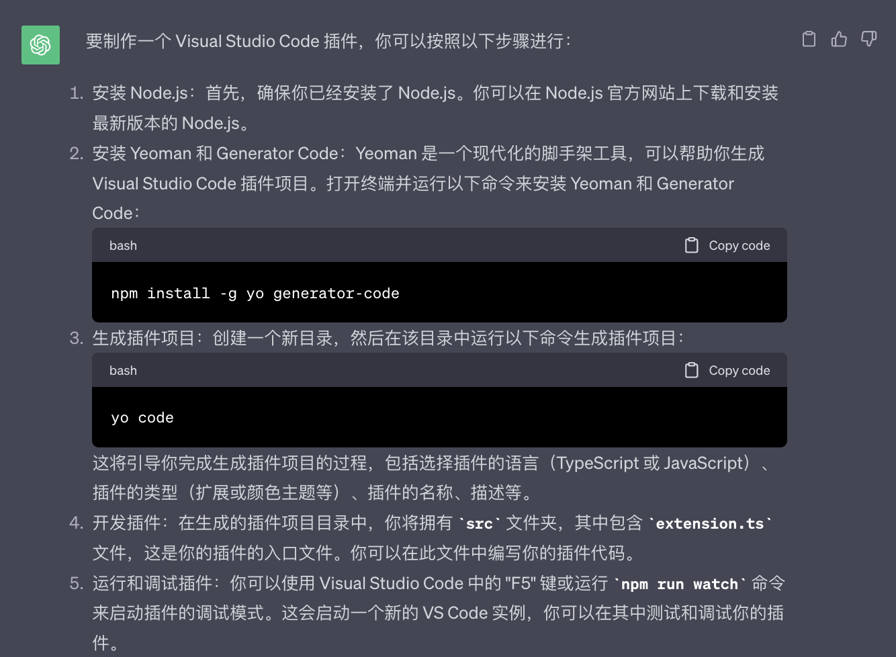
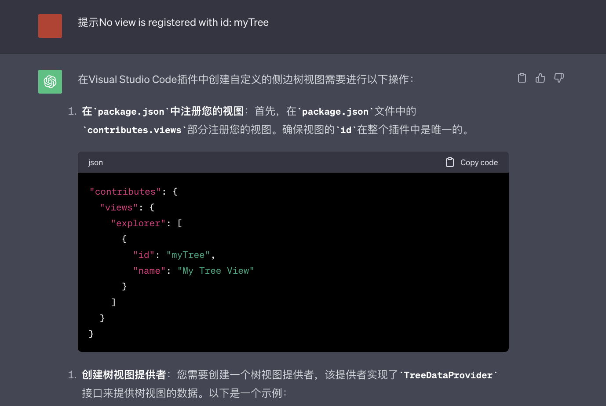
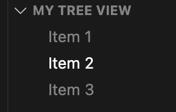
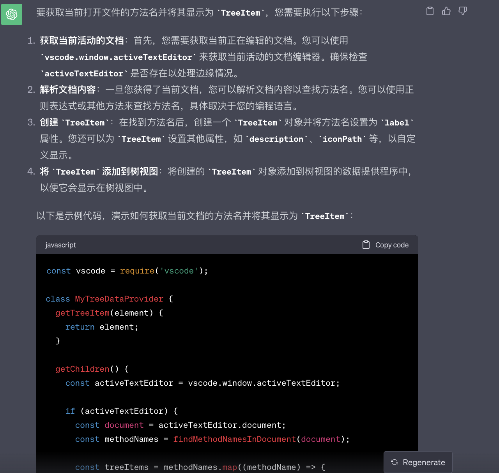
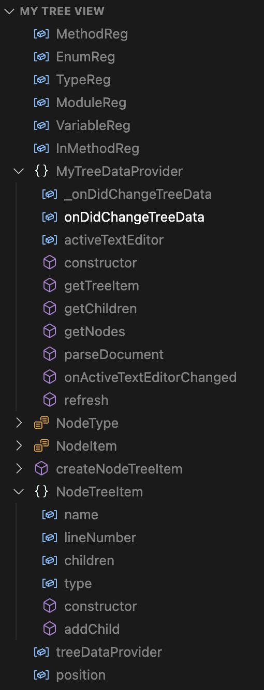

# 利用 chatgpt 开发一个 vscode 插件

有了 chatgpt 之后，写代码真的变得很方便，很多自己不熟悉的代码，直接问 chatgpt 就能得到相对准备的答案，虽然有时候可能不会 100%准确，但只需要少量需改便可以实现想要的效果。chatgpt 可以有效的帮助我们去开发一个不太熟悉的应用。

前几天逛掘金的时候看到一个[FnMap（函数地图），程序员提效神器](https://juejin.cn/post/7259923130733690941)，主要功能就是展示 vue 文件的 script，template，style 结构树，如下图，还是挺好用的。

<script setup>
  import fnMap1 from "./images/fn_map.png"
  import fnMap2 from "./images/fn_map1.png"

</script>


于是想自己模仿一个自用。有实力可以支持一下作者，原作者做了更好的兼容。因为每个人的代码格式可能会有些不同，我这里只是简单的实现了一下基础功能，并且没有去兼容不同的情况，只适用于我自己的代码结构，功能没有原作者优秀。

我之前是没有写过 vscode 插件的，所以直接去问 chatgpt，真的很方便，即使你完全不知道 vscode 插件提供的 api 也没有关系。

好的，开干！

[github 源码 vsce-simple-tools](https://github.com/shellingfordly/vsce-simple-tools)
[插件下载](https://marketplace.visualstudio.com/items?itemName=shellingfordly.simple-tools)

## 过程

首先，直接问 chatgpt：“怎么制作一个 vscode 插件”，跟着回答我们先创建一个 vscode 插件项目。



然后，问 chatgpt：“vscode 插件怎么创建一个侧边工具栏”，下面是 chatgpt 给我们的代码，

```js
const vscode = require("vscode");

// 定义一个树视图提供者
class MyTreeDataProvider {
  getTreeItem(element) {
    return element;
  }

  getChildren() {
    // 返回一个包含树视图项目的数组
    return [
      new vscode.TreeItem("Item 1"),
      new vscode.TreeItem("Item 2"),
      new vscode.TreeItem("Item 3"),
    ];
  }
}

// 激活插件
function activate(context) {
  // 创建树视图
  const myTreeView = vscode.window.createTreeView("myTree", {
    treeDataProvider: new MyTreeDataProvider(),
  });

  context.subscriptions.push(myTreeView);
}

exports.activate = activate;
```

这里因为我们会得到一个错误 “No view is registered with id: myTree”，因为没有在 **package.json** 中配置 **contributes.views**，没关系，直接问。



于是我们在资源管理器下得到了这样一个树结构，很好，很顺利！



没有技巧，直接大白话说出我们的需求：“我想要获取当前文件的方法名设置为 TreeItem”



贴出 chatgpt 给的代码，这里已经实现了将 **函数名** 显示到 **treeItems** 中，需要注意并没有实现 **findMethodNamesInDocument**，也就是解析 **document** 获取方法名这部分代码没有给。没有关系，我们接着问，坚决不写一行代码。

```js
const vscode = require("vscode");

class MyTreeDataProvider {
  getTreeItem(element) {
    return element;
  }

  getChildren() {
    const activeTextEditor = vscode.window.activeTextEditor;

    if (activeTextEditor) {
      const document = activeTextEditor.document;
      const methodNames = findMethodNamesInDocument(document);

      const treeItems = methodNames.map((methodName) => {
        const treeItem = new vscode.TreeItem(methodName);
        treeItem.iconPath = new vscode.ThemeIcon("symbol-method"); // 可选的图标
        return treeItem;
      });

      return treeItems;
    }

    return [];
  }
}

function findMethodNamesInDocument(document) {
  // 在文档中查找方法名的逻辑，例如使用正则表达式
  // 返回一个包含方法名的数组
  const methodNames = []; // 替换为实际的查找逻辑
  return methodNames;
}

export const myTreeView = vscode.window.createTreeView("myExtension", {
  treeDataProvider: new MyTreeDataProvider(),
});
```

直接问：处理 document.getText()获取方法名。chatgpt 给我们代码直接用正则表达式去获取了所有方法名。

```js
function findMethodNames(document) {
  const text = document.getText();
  const methodRegex = /function\s+(\w+)/g; // 此正则表达式匹配函数名，您可以根据需要调整

  const methodNames = [];
  let match;
  while ((match = methodRegex.exec(text))) {
    methodNames.push(match[1]);
  }

  return methodNames;
}
```

很好，已经可以获取到方法名，当然，chatgpt 这里的解析十分的简单，面对稍微复杂一点的情况就完全不行了。但是没关系，解析 document 这件事可以我们后面自己在进行修改。咱先把功能问完，再改逻辑。


简单直接：我想要点击方法名跳转到对应的行数。

这里提一嘴，之所以变成 chatgpt 提供的代码变成了 ts 是因为我把我有问题的 ts 代码直接丢给 chatgpt 修改，所以 chatgpt 后面给我的都是 ts 代码。

创建 **MethodTreeItem** 类继承 vscode.ThemeIcon，使用 **vscode.commands.registerCommand** 注册 **extension.goToMethod** 实现跳转函数名

```ts
// 返回vscode.TreeItem改成返回MethodTreeItem实例
methodNames.forEach((methodName, index) => {
  const treeItem = new MethodTreeItem(methodName, index);
  methodItems.push(treeItem);
});

class MethodTreeItem extends vscode.TreeItem {
  constructor(label: string, lineNumber: number) {
    super(label, vscode.TreeItemCollapsibleState.None);
    this.command = {
      title: "Go to method",
      command: "extension.goToMethod",
      arguments: [lineNumber],
    };
  }
}

// 注册跳转
vscode.commands.registerCommand(
  "extension.goToMethod",
  (lineNumber: number) => {
    if (vscode.window.activeTextEditor) {
      const position = new vscode.Position(lineNumber, 0);
      vscode.window.activeTextEditor.selection = new vscode.Selection(
        position,
        position
      );
      vscode.window.activeTextEditor.revealRange(
        new vscode.Range(position, position),
        vscode.TextEditorRevealType.InCenter
      );
    }
  }
);
```

光是注册跳转事件是无法实现跳转的，原因是我们还没有与 TreeView 关联，直接询问 chatgpt：无法跳转到函数名。

在 **package.json** 文件中注册 **extension.goToMethod** 命令

```json
"contributes": {
  "commands": [
    {
      "command": "extension.goToMethod",
      "title": "Go to Method"
    }
  ]
}
```

继续问 chatgpt：除了跳转到函数名的行数之外，还想要将光标定位到对应的方法名或者变量名上。

这里和上面注册跳转是一样的，只是将 **charIndex** 传给**Position**

```ts
vscode.commands.registerCommand(
  "extension.goToMethod",
  (lineNumber: number, charIndex: number) => {
    if (vscode.window.activeTextEditor) {
      const position = new vscode.Position(lineNumber, charIndex);
      vscode.window.activeTextEditor.selection = new vscode.Selection(
        position,
        position
      );
      vscode.window.activeTextEditor.revealRange(
        new vscode.Range(position, position),
        vscode.TextEditorRevealType.InCenter
      );
    }
  }
);
```

只需在创建 **MethodTreeItem** 实例的时候把计算好的 **charIndex** 传给 **this.command**，细心的朋友应该能发现，上面 chatgpt 给的代码传入的 **lineNumber** 是错的，它直接将 **methodNames** 数组中元素的下标直接给传过去了，这样跳转的行数是错误的。不过没关系，我们自己处理一下就好了，也可以直接给 chatgpt 说你传错了，让它修改。

document 获取具体行数的方法

```ts
const line = document.positionAt(match.index).line;
```

我想一行行去解析，就也用不到了，直接告诉 chatgpt 我想要一行行解析 **document**，并且判断出 **function**、**class**、**var/let/const**等变量名

```ts
function parseDocument(document: vscode.TextDocument): MethodTreeItem[] {
  const outline: MethodTreeItem[] = [];
  let currentFunction: MethodTreeItem | null = null;
  let isInsideClass = false;

  for (let lineIndex = 0; lineIndex < document.lineCount; lineIndex++) {
    const line = document.lineAt(lineIndex);
    const lineText = line.text.trim();

    if (lineText.startsWith("class ")) {
      // 类定义
      const className = lineText.substring(6, lineText.length - 1).trim();
      const classItem = new MethodTreeItem(
        className,
        lineIndex,
        vscode.TreeItemCollapsibleState.Collapsed
      );
      outline.push(classItem);
      currentFunction = classItem;
      isInsideClass = true;
    } else if (lineText.startsWith("function ") && lineText.endsWith("{")) {
      // 函数定义
      const functionName = lineText.substring(9, lineText.length - 1).trim();
      const functionItem = new MethodTreeItem(functionName, lineIndex);
      if (isInsideClass) {
        currentFunction?.children.push(functionItem);
      } else {
        outline.push(functionItem);
      }
      currentFunction = functionItem;
    } else if (
      lineText.startsWith("var ") ||
      lineText.startsWith("let ") ||
      lineText.startsWith("const ")
    ) {
      // 变量定义
      const variableName = lineText.split(" ")[1].replace(";", "").trim();
      const variableItem = new MethodTreeItem(variableName, lineIndex);
      if (isInsideClass) {
        currentFunction?.children.push(variableItem);
      } else {
        outline.push(variableItem);
      }
    }
  }
  return outline;
}
```

其实到这里已经差不多可以不用问 chatgpt 了，已经可以自己进行一些修改就可以实现大概的功能了。

告诉 chatgpt：用 startsWith 是不严谨的，声明之前可能还有关键字。

得到一些正则表达式。

```ts
// 匹配类定义
const classRegex = /class\s+([\w\d_]+)(?:\s+extends\s+([\w\d_]+))?/;

// 匹配函数定义
const functionRegex = /function\s+([\w\d_]+)\s*\(/;

// 匹配变量定义
const variableRegex = /(const|var|let)\s+([\w\d_]+)(?=\s*=?[^=])/;

// 匹配 interface 或 type 定义
const interfaceTypeRegex = /(interface|type)\s+([\w\d_]+)/;
```

## 修改

现在我们稍微修改一下代码。

### NodeTreeItem

首先，继承 **vscode.TreeItem** 的类需要添加一些属性

- name 变量名
- lineNumber 在代码中的行数
- children 子变量(function 和 class 的内部变量)
- type 记录变量的类型

```ts
class NodeTreeItem extends vscode.TreeItem {
  name: string = "";
  lineNumber: number = 0;
  children: NodeTreeItem[] = [];
  type: NodeType = NodeType.Empty;

  constructor(config: NodeItem) {
    super(config.name);
    this.name = config.name;
    this.lineNumber = config.lineNumber;
    this.type = config.type;
    this.iconPath = new vscode.ThemeIcon(config.type);

    this.command = {
      title: "Go to method",
      command: "extension.goToMethod",
      arguments: [config.lineNumber, config.charIndex],
    };
  }

  addChild(item: NodeTreeItem) {
    if (this.children.findIndex((child) => child.name === item.name) === -1) {
      this.children.push(item);
    }
  }
}
```

### NodeType

用于显示 **vscode.ThemeIcon** 图标

- Empty 空
- Variable 变量、内部属性
- Method 函数
- Enum 枚举
- Type 类型
- Module 类
- InMethod 内部函数

```ts
enum NodeType {
  Empty = "empty",
  Variable = "symbol-variable",
  Method = "symbol-method",
  Enum = "symbol-enum",
  Type = "symbol-value",
  Module = "symbol-module",
  InMethod = "symbol-method",
}
```

### 正则规则

正则表达式匹配属性

```ts
const MethodReg = /function\s+([\w\d_]+)\s*\(/;
const EnumReg = /enum\s+([\w\d_]+)\s*\{/;
const TypeReg = /(interface|type)\s+([\w\d_]+)/;
const ModuleReg = /class\s+([\w\d_]+)(?:\s+extends\s+([\w\d_]+))?/;
const VariableReg = /^\s*(?:(const|var|let|private|public|static|readonly)\s+)*\s*([\w]+)\?*\s*[:=]\s*[^;]/;
const InMethodReg = /\s*(private|public|static)?\s*(\w+)\(([^)]*)\):*\s*([^;]*)\s{/;
```

### parseDocument

其次，最重要的文档解析

逐行解析 **document**，**tabCount** 用于记录缩进，判断函数体是否结束；**methodStack** 用于记录一个模块(function/class/enum/type)的局部空间，生成二级树；

创建 **NodeTreeItem** 实例，如果存在函数体，则添加到子节点中，否则直接添加；

当实例的类型不为 **Variable** 属性或者变量时，记录当前的缩进。

当遇到 **}** 并且缩进相同时，pop 出 **methodStack** 记录的模块。

```ts
class MyTreeDataProvider {
  private parseDocument(document: vscode.TextDocument): NodeTreeItem[] {
    const itemList: NodeTreeItem[] = [];
    const tabCount: number[] = [];
    const methodStack: NodeTreeItem[] = [];

    for (let index = 0; index < document.lineCount; index++) {
      const text = document.lineAt(index).text;
      const item = createNodeTreeItem(text, index);
      if (item) {
        if (methodStack.length > 0) {
          methodStack[methodStack.length - 1]?.addChild(item);
        } else {
          itemList.push(item);
        }

        if (item.type !== NodeType.Variable) {
          const count = text.match(/\S/)?.index || 0;
          tabCount.push(count);
          methodStack.push(item);
        }
      }

      if (text.includes("}")) {
        const count = text.match(/\S/)?.index || 0;
        if (count === tabCount[tabCount.length - 1]) {
          methodStack.pop();
          tabCount.pop();
        }
      }
    }

    return itemList.map((item) => {
      if (item.children.length > 0) {
        item.collapsibleState = vscode.TreeItemCollapsibleState.Collapsed;
      }
      return item;
    });
  }
}
```

最终达到效果，就是本项目文件的属性树。当然，这样的判断并不严谨，兼容性并不强，只能用于学习或者自己修改使用。对于一些特殊的格式就会出问题。



如果感兴趣的话可以关注本项目[vsce-simple-tools](https://github.com/shellingfordly/vsce-simple-tools)。

有实力的朋友可以支持一下原作者[FnMap（函数地图），程序员提效神器](https://juejin.cn/post/7259923130733690941)
