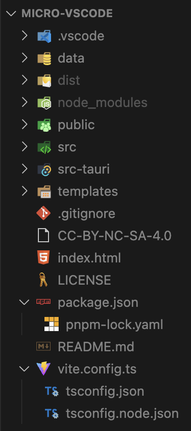
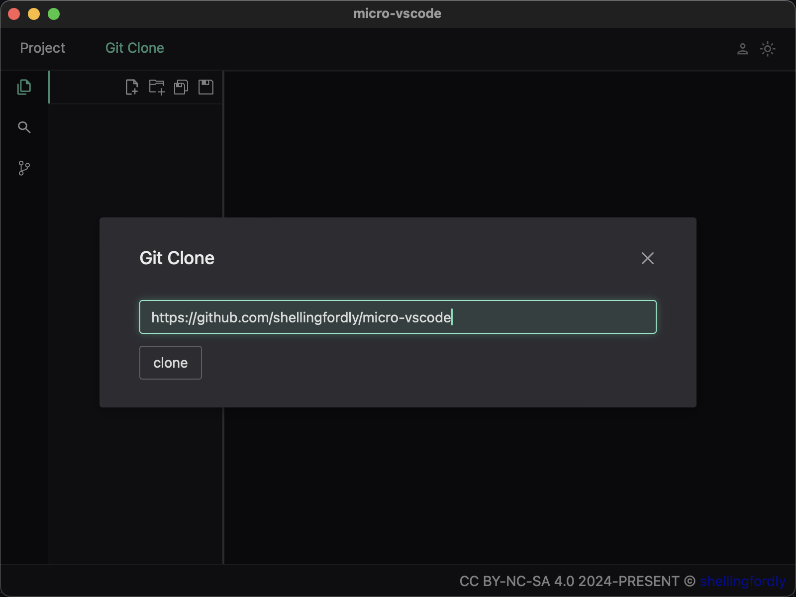
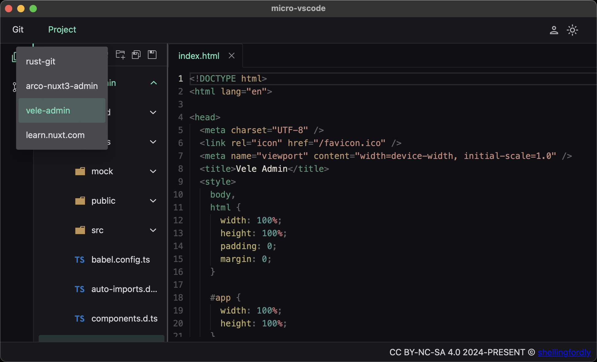
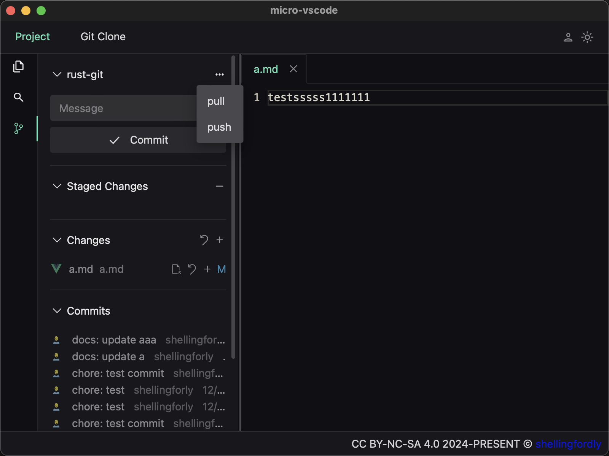
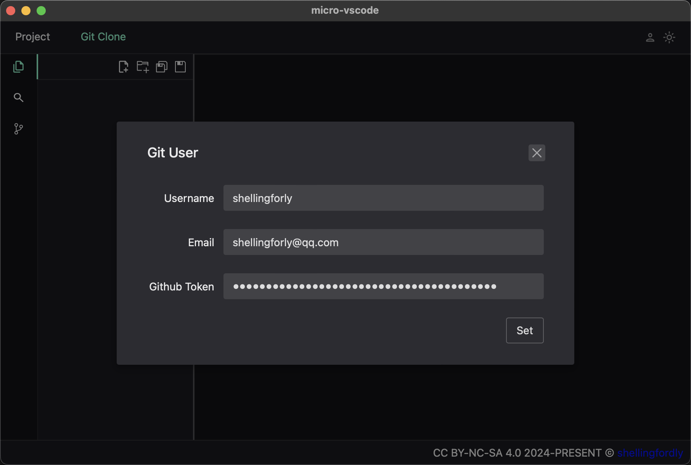
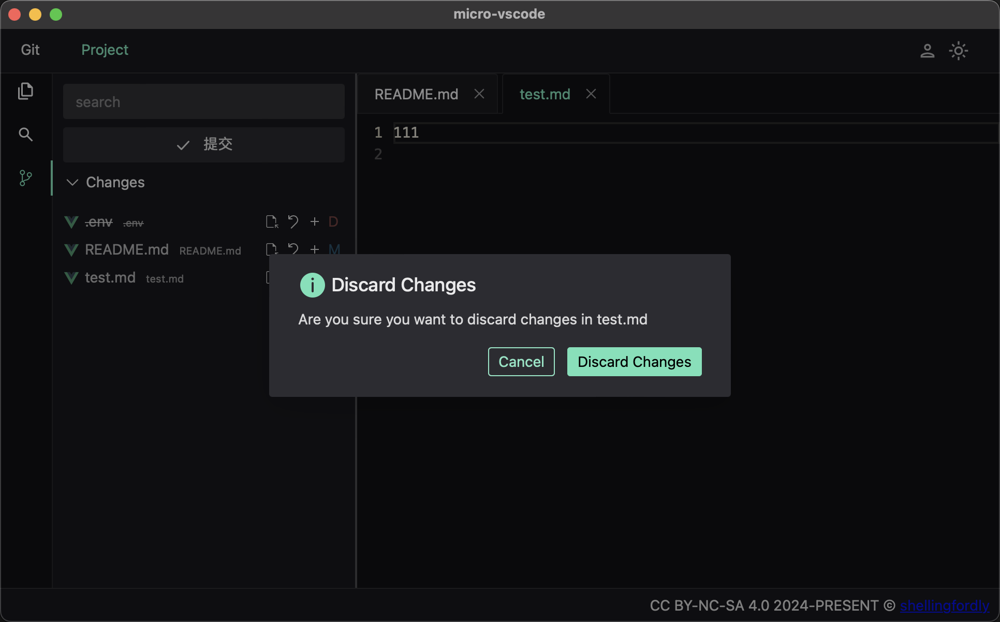
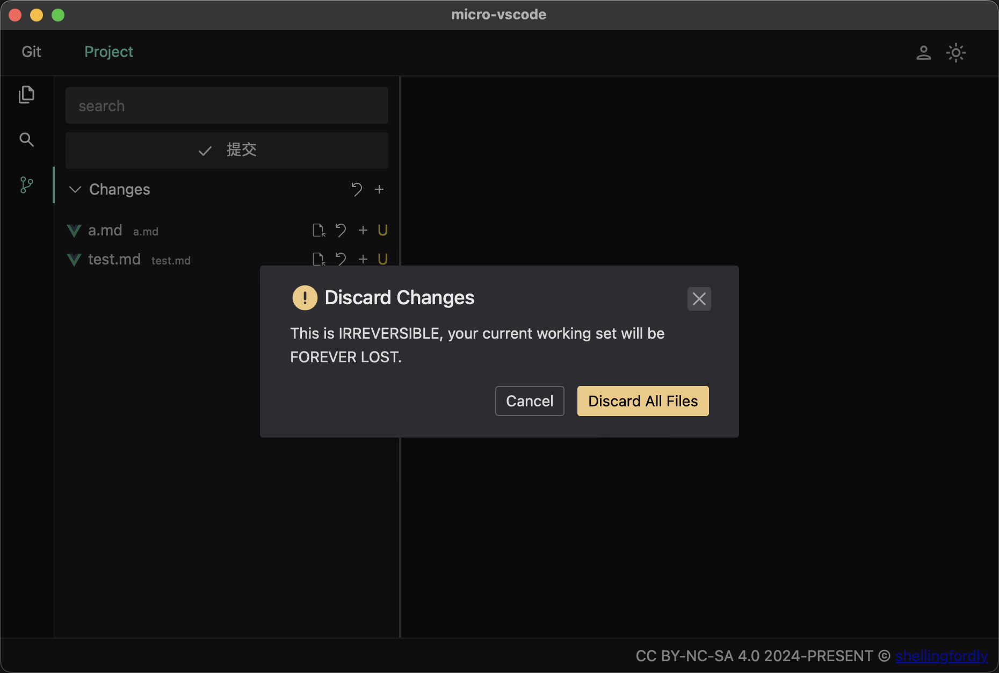
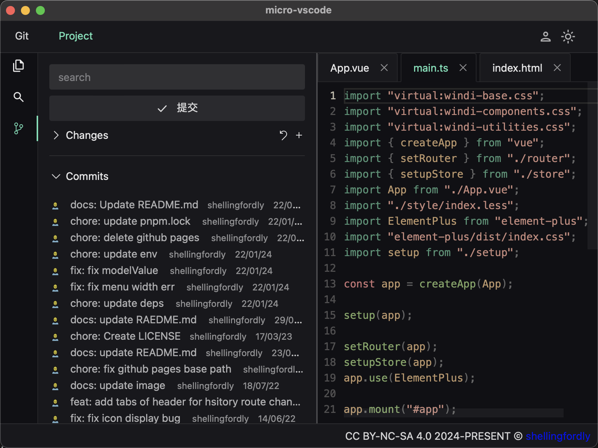

# 用 Tauri 写一个 micro vscode

## 前言

Tauri 是一个构建适用于所有主流桌面和移动平台的轻快二进制文件的框架。开发者们可以集成任何用于创建用户界面的可以被编译成 HTML、JavaScript 和 CSS 的前端框架，同时可以在必要时使用 Rust、Swift 和 Kotlin 等语言编写后端逻辑。

- 对于开发者而言，Tauri 有三个主要优势：
  - 构建应用所需的可靠基础
  - 使用系统原生 webview（网页视图）带来的更小打包体积
  - 使用任何前端技术和多种语言绑定带来的灵活性

详情可到官方文档[What is Tauri](https://beta.tauri.app/guides/)查看。

Tauri 的 2.0 版本支持了移动端，如今 Tauri 已经发布到了[tauri-v2.0.0-beta.8](https://github.com/tauri-apps/tauri/tree/tauri-v2.0.0-beta.8)版本。Tauri 2.0 不仅仅是移动。以下是将包含的一些功能：

- 强大的插件：许多 Tauri API 已转向使用 Tauri 插件系统。这使我们能够使 Tauri 代码更加模块化、更易于维护，但也使我们能够使插件系统更强大，以便开发人员构建自己的插件。
- 插件的 Swift 和 Kotlin 绑定：现在您可以在 Swift 和 Kotlin 中编写特定于平台的代码。Tauri 从 1.0 版本开始就在 Rust 和 JavaScript 代码之间架起了一座桥梁。借助 Tauri 2.0，插件开发人员将能够使用 Swift 和 Kotlin 编写代码，以便与他们正在开发的系统更紧密地集成。
- 支持 iOS 和 Android：您将能够构建 Tauri 应用程序并在 iOS 和 Android 上运行它们。

详情可以到官方[Tauri 2.0 路线图](https://beta.tauri.app/blog/roadmap-to-tauri-2-0/)查看。

## Tauri demo

项目地址[micro-vscode](https://github.com/shellingfordly/micro-vscode)

### 创建项目

详情参考官方文档[Create a Project](https://beta.tauri.app/guides/create/)

```bash
pnpm create tauri-app --beta

cd my-tauri-app
npm install
npm run tauri dev
```

### 目录结构

如下图，其实和普通的 vite 项目没什么区别，就是多了一个 `src-tauri` 的文件夹，存放服务端的代码。



## 客户端

### git clone



### 查看项目



### 编辑文件

使用 `Cmd + S` 保存


### git add and commit

使用 `github token` 提交，需要在 user 中设置


### git pull and push



### discard changes

- discard file changes


- discard all changes


### 获取提交日志


### 设置 git config 的 username 和 email

- 设置 username
- 设置 email
- 设置 gitHub token



## 服务端

服务端使用 rust 写的，其实我几乎不懂 rust，这个项目的 rust 代码都是 chatgpt 帮我写的

## TodoList

1. 未实现

- [ ] 读取本地文件系统
- [ ] 新建文件/文件夹
- [ ] 搜索文件内容
- [ ] 通过文件名搜索文件

2. 已实现

- [x] 实现 git 的基本操作，类似 vscode 的 git 工具
  - git config 设置 user/email 和 github token
  - git add 添加文件
  - git commit 提交
  - git pull 拉取更新
  - git push 推送更新，使用 github token 提交
  - discard changes 撤销(单/所有)文件修改
  - git log 查看所有 commit
  - git show commit 查看提交的具体修改内容
- [x] 文件夹目录结构
  - 显示目录树
    - 文件/文件夹图标
    - 使用 vscode-icons 图标(未全部移植)
    - 实现打开/关闭文件夹
  - 显示文件切换 Tab
    - 是否编辑图标提示
    - 关闭文件
- [x] 文件编辑器
  - 使用 monaco editor，具有 vscode 的基本功能
  - 文件编辑、保存(保存全部)功能
  - 暂时只支持 html/js/json/ts/vue 的代码高亮

## 更新功能

### git add/commit/pull/push

更新 **git add/commit/pull/push** 到 git 工具栏内部，添加 **changes** 文件 list 和 **Staged Changes**文件 list，可以撤销 **add** 文件和撤销修改。


### discard changes

更新 git 功能到工具栏，列举发生改变的文件，展示更改状态，打开改变文件和放弃修改。



撤销所有文件更改



### git log

获取 git 提交日志



### git show commit

点击日志查看修改文件，与 git 命令行查看内容一致，vscode 的文件修改对比有点复杂，暂时未实现。


## 写在最后

这是就是一个学习向的 Tauri Demo， 完全是我的第一个 Tauri 应用。

感兴趣的话可以关注项目地址[micro-vscode](https://github.com/shellingfordly/micro-vscode)，持续不定期更新功能。
