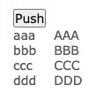

## 某些特殊情况下，非响应式数据改变也能被页面响应

非响应式变量改变时页面是无法重新渲染的，如果在响应式数据改变的时候，改变了非响应式的变量，此时页面会同时重新渲染新数据。但是只限于数组和对象的改变，普通字符串不渲染。

### 数组

- 数组的 push/pop 或者是直接[index]赋值的方式都是会触发的

template 代码

```html
<div>
  <button @click="push">Push</button>
  <ul>
    <li v-for="item in list1" :key="item">{{ item }}</li>
  </ul>
  <ul>
    <li v-for="item in list2" :key="item">{{ item }}</li>
  </ul>
</div>
```

ts 代码

```ts
setup(){
 const list1 = ref<string[]>(["aaa", "bbb", "ccc"]);
  const list2 = ["AAA", "BBB", "CCC"];

  function push() {
    list1.value.push("ddd");
    list2.push("DDD");
  }

  return { list1, list2, push }
}
```

点击 Push，页面同时渲染了 list1 和 list2




### 对象

- 对象的属性修改/新增也是会触发页面渲染的

template 代码

```html
<button @click="modify">modify</button>
<div>{{ obj1 }}</div>
<div>{{ obj2 }}</div>
```

ts 代码

```ts
setup(){
  const obj1 = reactive({
    key: "obj1 key",
  });
  const obj2 = {
    key: "obj2 key",
  };

  function modify() {
    obj1.key = "modify obj1 key";
    obj2.key = "modify obj2 key";
  }

  return { obj1, obj2, modify };
}
```

点击修改 obj1 和 obj2 的 key 后，页面都渲染了


### 字符串

- 修改普通字符串后，页面没有渲染
- 数字/Boolean 和字符串的效果一样

template 代码

```html
<button @click="modify">modify</button>
<div>value1 ====== {{ value1 }}</div>
<div>value2 ====== {{ value2 }}</div>
```

js 代码

```ts
setup() {
  const value1 = ref("使用ref声明的value1");
  let value2 = "普通字符串value2";

  function modify() {
    value1.value = "修改value1";
    value2 = "修改value2";
  }

  return { value1, value2, modify };
},

```

点击修改后页面只有 ref 声明的变量重新渲染了，普通声明的变量并没有重新渲染


