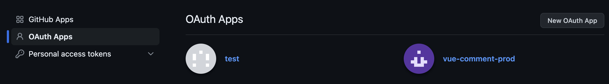
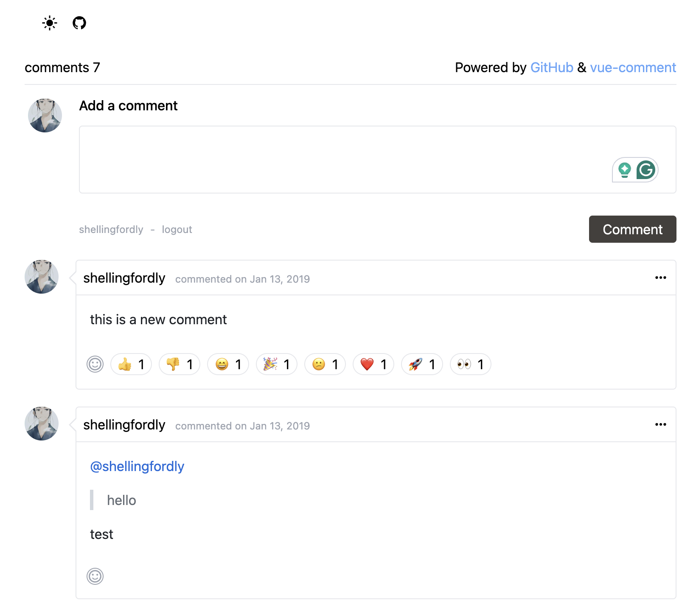
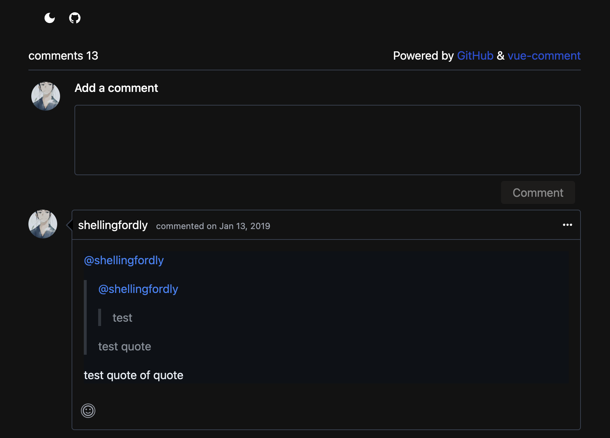

## 获取 Github 验证

### 创建 Github OAuth App

在 github 中，找到 Setting -> Developer Settings -> OAuth Apps -> New OAuth App



获取到 `client_id` 和 `client_secret` 设置到 env 中

- github_author 表示你的用户名
- github_repo 表示你要讲评论挂到哪个仓库的 issue 下

```
// .env
VITE_CLIENT_ID=replace_me
VITE_CLIENT_SECRET=replace_me
VITE_GITHUB_AUTHOR=replace_me
VITE_GITHUB_REPO=replace_me
```

### 获取 Github 的 Access Token

1. 第一步，请求用户用户的 Github 身份，获取 code

[github docs](https://docs.github.com/en/apps/oauth-apps/building-oauth-apps/authorizing-oauth-apps#1-request-a-users-github-identity)

直接调用`https://github.com/login/oauth/authorize`并传入对应的参数即可

```ts
function loginAuthorize() {
  const url = "https://github.com/login/oauth/authorize";

  window.location.href = formatUrl(url, {
    client_id: this.clientId,
    redirect_uri: window.location.href,
    scope: "public_repo",
    state: this.repo,
  });
}
```

- client_id
- redirect_uri 授权后重定向的 URL
- scope 授权[范围](https://docs.github.com/en/apps/oauth-apps/building-oauth-apps/scopes-for-oauth-apps)
- state 随机字符串

2. 用户同意验证，通过 code 获取 access_token

`authorize` 验证成功之后 github 会返回我们传过去的`redirect_uri`并且带着一个`code`参数，拿到这个 code 之后我们就可以去获取 github 的`access_token`

由于 github 不在支持 cors，详情查看[access_token api does not support cors](https://github.com/isaacs/github/issues/330)，直接访问`https://github.com/login/oauth/access_token`是无法成功的。这里我们使用[cors-anywhere](https://github.com/Rob--W/cors-anywhere)进行代理。

```ts
const GITHUB_ACCESS_TOKEN = useLocalStorage("GITHUB_ACCESS_TOKEN", "");

async function getAccessToken(code: string) {
  try {
    const data = await this.fetch(
      "https://cors-anywhere.azm.workers.dev/https://github.com/login/oauth/access_token",
      {
        headers: {
          Accept: "application/json",
        },
      }
    ).post({
      client_id: this.clientId,
      client_secret: this.clientSecret,
      code,
      redirect_uri: window.location.href,
    });

    if (data.access_token) GITHUB_ACCESS_TOKEN.value = data.access_token;
    return true;
  } catch (error) {
    console.error("Error[getAccessToken]: ", error);
  }

  return false;
}
```

3. 设置 token

有了 access_token 之后就很简单了，只需要直接去请求 Github 提供的对应接口就可以。

当然，每个请求都需要设置`Authorization`

```ts
function fetch(url: string, config?: RequestInit) {
  return useFetch(url, {
    headers: {
      Authorization: "token " + this.githubToken,
      Accept: "application/vnd.github.v3+json",
    },
    ...config,
  });
}
```

## 使用 Issue 评论

### 创建 Issue

TODO

目前没有做创建 Issue，需要手动创建第一个 Issue

### 获取 Issue Id

这里的 `issueId` 是数字 1，也就是仓库的第一个 issue。我们需要获取到另一个 `issueNodeId`，它是一个字符串 id，之后提交 comment 的时候需要用到这个 issueNodeId。

```ts
async function getIssue(issueId: number) {
  const { data } = await this.fetch("https://api.github.com/graphql").post({
    query: getIssueQuery({
      owner: this.author,
      repo: this.repo,
      issueId,
    }),
  });

  this.issueNodeId = data.repository.issue.id;
}
```

### 获取评论

- owner: 仓库作者
- repo: 仓库名
- issueId: 数字 id
- perPage: 评论数量

```ts
async function getComments(pageInfo: Partial<GithubCommentPageInfo>) {
  const { data } = await this.fetch("https://api.github.com/graphql").post({
    variables: {
      owner: this.author,
      repo: this.repo,
      issueId: 1,
      perPage: 10,
    },
    query: getCommentsQuery(pageInfo),
  });

  return data.repository.issue.comments as GithubCommentResult;
}
```

### 创建评论

创建评论需要使用到我们在 `getIssue` 中获取到的 `issueNodeId`（字符串 Id）

[github add comment docs](https://developer.github.com/v4/mutation/addcomment/)

```ts
async function createComment(content: string, id: string) {
  const issueNodeId = this.issueNodeId || id;

  return this.fetch("https://api.github.com/graphql").post({
    variables: {
      issueNodeId,
      content,
    },
    query: this.apiQueryMap.post,
  });
}
```

### 编辑评论

[github update issue comment docs](https://developer.github.com/v4/mutation/updateissuecomment/)

```ts
async function editorComment(
  commentId: string,
  content: string
): Promise<GithubResult<GithubCommentItem>> {
  const result = await this.fetch("https://api.github.com/graphql").post({
    variables: {
      commentId,
      content,
    },
    query: this.apiQueryMap.editor,
  });

  if (result.errors && result.errors.length) {
    return {
      data: null,
      error: {
        message: result.errors[0].message,
        type: result.errors[0].type,
      },
    };
  } else {
    return {
      data: result.data.updateIssueComment.issueComment,
      error: null,
    };
  }
}
```

### 删除评论

[github delete issue comment docs](https://developer.github.com/v4/mutation/deleteissuecomment/)

```ts
async function deleteComment(commentId: string): Promise<GithubResult> {
  const result = await this.fetch("https://api.github.com/graphql").post({
    variables: {
      commentId,
    },
    query: this.apiQueryMap.delete,
  });

  if (result.errors && result.errors.length) {
    return {
      data: null,
      error: {
        message: result.errors[0].message,
        type: result.errors[0].type,
      },
    };
  } else {
    return {
      data: result.data,
      error: null,
    };
  }
}
```

### 爱心/点赞/踩等等评论操作

1. 添加爱心/点赞/踩等等

[github add reaction docs](https://docs.github.com/en/graphql/reference/mutations#addreaction)

```ts
async function reactionComment(
  commentId: string,
  content: GithubCommentReactionType
) {
  return this.fetch("https://api.github.com/graphql").post({
    variables: {
      commentId,
      content,
    },
    query: this.apiQueryMap.reaction,
  });
}
```

2. 取消爱心/点赞/踩等等

TODO

## Preview

- light mode



- dark mode


