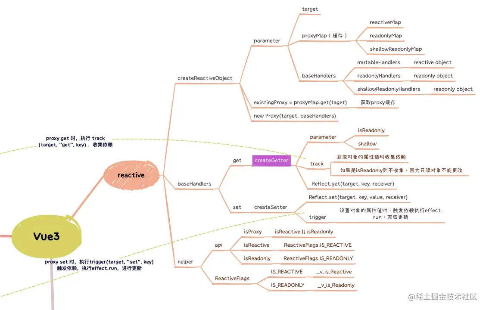

# reactive 实现原理

最近[mini-vue](https://github.com/cuixiaorui/mini-vue)挺火的，已经到 5.9k 的 star 了。

看来大家都很卷，我也不能落后，这是我学习之后实现的[mini-vue](https://github.com/shellingfordly/mini-vue)，包含了 mini-vue 代码的实现，学习笔记和一些思考。

后续我会持续更新学习笔记和思维导图

## reactive 思维导图



## createReactiveObject

> 创建响应式对象

- 参数
  - target 目标对象
  - proxyMap 缓存 map
  - baseHandlers 处理对象
- 步骤
  - 获取已经存在的代理对象，性能优化
  - 创建代理对象，设置缓存

```ts
function createReactiveObject(target, proxyMap, baseHandlers) {
  const existingProxy = proxyMap.get(taget);

  // 使用缓存优化
  if (existingProxy) {
    return existingProxy;
  }

  const proxy = new Proxy(taget, baseHandlers);
  proxyMap.set(taget, proxy);

  return proxy;
}
```

## baseHandlers

1. mutableHandlers

> reactive 的处理对象，非只读 isReadonly = false，非浅响应 shallow = false

```ts
const get = createGetter();
const set = createSetter();

export const mutableHandlers = {
  get,
  set,
};
```

2. readonlyHandlers

> readonly 的处理对象，只读 isReadonly = true，非浅响应 shallow = false

```ts
const readonlyGet = createGetter(true);

export const readonlyHandlers = {
  get: readonlyGet,
  set(target, key) {
    // 不能更改
    console.warn(`${target} of ${key} can't be setted, it's a readonly object`);
    return true;
  },
};
```

3. shallowReadonlyHandlers

> shallowReadonly 的处理对象，只读 isReadonly = true，浅响应 shallow = true，set 与 readonlyHandlers 一致

```ts
const shallowReadonlyGet = createGetter(true, true);

export const shallowReadonlyHandlers = Object.assign({}, readonlyHandlers, {
  get: shallowReadonlyGet,
});
```

### createGetter

> 生成 get 函数

```ts
function createGetter(isReadonly = false, shallow = false) {
  return (target, key, receiver) => {
    if (key === ReactiveFlags.IS_REACTIVE) {
      // 判断是否为 readonly 对象
      return !isReadonly;
    } else if (key === ReactiveFlags.IS_READONLY) {
      // 判断是否为 reactive 对象
      return isReadonly;
    }

    // 如果不是只读对象，收集依赖
    // 只读对象不能更改，所以不需要收集
    if (!isReadonly) {
      track(target, "get", key);
    }

    // 获取属性值
    const res = Reflect.get(target, key, receiver);

    // 只对最外层最响应式，不执行嵌套对象的响应式转换
    if (shallow) {
      return res;
    }

    // 执行嵌套对象的响应式转换
    if (isObjectOrArray(res)) {
      return isReadonly ? readonly(res) : reactive(res);
    }
    return res;
  };
}
```

### createSetter

> 生成 set 函数

```ts
function createSetter() {
  return (target, key, value, receiver) => {
    // 设置属性值
    const res = Reflect.set(target, key, value, receiver);

    // 触发 依赖
    trigger(target, "set", key);
    return res;
  };
}
```

## 工具函数

- isProxy 判断是否是 reactive 或者 readonly 类型
- isReactive 是否是 reactive 类型
- isReadonly 是否是 readonly 类型
