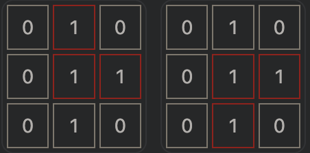
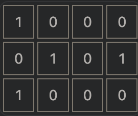
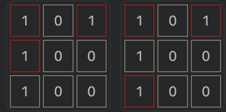

# 3128. 直角三角形

给你一个二维 boolean 矩阵 grid 。

请你返回使用 grid 中的 3 个元素可以构建的 直角三角形 数目，且满足 3 个元素值 都 为 1 。

注意：

- 如果 grid 中 3 个元素满足：一个元素与另一个元素在 同一行，同时与第三个元素在 同一列 ，那么这 3 个元素称为一个 直角三角形 。这 3 个元素互相之间不需要相邻。

示例 1：



> 输入：grid = [[0,1,0],[0,1,1],[0,1,0]]
>
> 输出：2
>
> 解释：
>
> 有 2 个直角三角形。

示例 2：



> 输入：grid = [[1,0,0,0],[0,1,0,1],[1,0,0,0]]
>
> 输出：0
>
> 解释：
>
> 没有直角三角形。

示例 3：



> 输入：grid = [[1,0,1],[1,0,0],[1,0,0]]
>
> 输出：2
>
> 解释：
>
> 有两个直角三角形。

## 方法一: 暴力解法

### 思路

遍历找到每个为 1 的坐标，再找到此坐标能形成的直角三角形，由于每个坐标都收到同行同列的影响，因此并不会出现重复计算的情况。

遍历 grid 数据，记录为 1 的坐标，同时 hMap 记录每一行为 1 的下标，以及 1 的个数；lMap 记录每一列为 1 的下标，以及 1 的个数。

遍历所有为 1 的下标位置，获取此行为 1 的数量，此列为 1 的数量，排除当前位置的同行同列，将数量相乘即是三角形的数量

### 代码

- 执行用时分布: 843ms 击败 6.67%
- 复杂度分析: 消耗内存分布 169.55MB 击败 6.67%

```ts
export function numberOfRightTriangles(grid: number[][]): number {
  const arr: [number, number][] = [];
  const hMap: any = {};
  const lMap: any = {};

  for (let i = 0; i < grid.length; i++) {
    hMap[i] = { length: 0 };
    for (let j = 0; j < grid[i].length; j++) {
      if (!lMap[j]) lMap[j] = { length: 0 };
      if (grid[i][j] == 1) {
        hMap[i][j] = true;
        hMap[i].length++;
        lMap[j][i] = true;
        lMap[j].length++;
        arr.push([i, j]);
      }
    }
  }

  let count = 0;
  for (let i = 0; i < arr.length; i++) {
    const h = arr[i][0];
    const l = arr[i][1];
    let hl = hMap[h].length;
    let ll = lMap[l].length;
    if (hMap[h][l]) hl--;
    if (lMap[l][h]) ll--;
    count += hl * ll;
  }
  return count;
}
```
